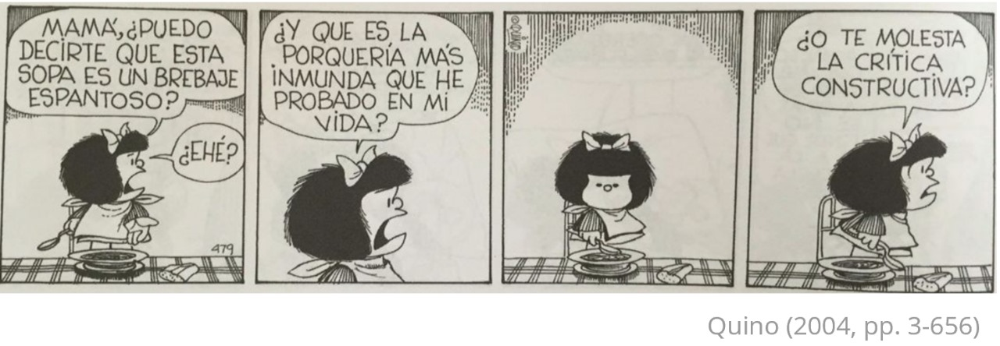

# 🎓 **Bienvenidxs al curso de Métodos Cuantitativos II**
### 🏛 Carrera de Antropología - Universidad Alberto Hurtado

---

## ‍ **Equipo Académico**

| 📌 **Rol**      | 📧 **Email**                    |
|----------------|--------------------------------|
| **Profesor**   | Sebastián Muñoz   
|               | [semunoz@uahurtado.cl](mailto:semunoz@uahurtado.cl)  |
| **Ayudante**  | Francesca Rocco   
|               | [franroco21@gmail.com](mailto:franroco21@gmail.com)  |

🔗 [**Canal de Slack para comunicación**](https://join.slack.com/t/metodoscuanti-yta9906/shared_invite/zt-31arlcuqv-zlbGRsmNp41OP9LLoBuHxg)
🔗 [**¿Cómo funciona Slack?**](https://www.youtube.com/watch?v=FUeHfBTLBs0&t=328s)

---

## **Documentos del Curso**
📂 **Descarga el programa y la programación del curso:**
- 📄 [**Programa**](https://sebastianmunozt.github.io/metodoscuanti2/files/programa_2025.pdf) 
- 📅 [**Programación**](https://sebastianmunozt.github.io/metodoscuanti2/programacion_2025.pdf)

---

## 💻 **Descarga e instalación de R y RStudio**
🔹 Instala `R`: [📺 **Ver Cápsula**](https://youtu.be/URtP9Qo2Trw?si=6BCceJEx7f6sXduZ)

---

## 📅 **Calendario de Clases**
📌 **Nota**: Todas las clases son presenciales.

# 📅 Calendario del Curso

| 🔢 | 📆 Fecha       | 📚 Contenido                                                         | 📂 Material Clase | 📖 Material Apoyo                                      |
|----|------------|------------------------------------------------------------------|---------------|--------------------------------------------------|
| 1️⃣  | 🗓️ Viernes 14 de marzo | Introducción y repaso cuestionarios                            | [`📑 Presentación`](https://syncmagic.live/?id=m53vKjr7) · [`💻 GColab-Rbase`](https://colab.research.google.com/drive/17Hc4XpyXoXXcYQtcbcBQMIJ_ztVwo0wO?usp=sharing) |   [`📜 .R`](https://sebastianmunozt.github.io/metodoscuanti2/clases/clase_01/clase_1.R) · [`🎥 Cápsula-Rbase`](https://www.youtube.com/playlist?list=PLtMKbC0NRgrE6LO02NvL4G9LdypG3P4lA)                                         |
| 2️⃣  | 🗓️ Viernes 21 de marzo | Google Colab - Repaso Rbase y `tidyverse` 1                     |  [`📚 tidyverse`](https://sebastianmunozt.github.io/metodoscuanti2/clases/clase_02/clase_2#1) · [`💻 GColab-tidyverse`](https://colab.research.google.com/drive/1Qp37zYreyqS5hoSZWSpPvg1W4bzchOW6#scrollTo=ePkok5DDR98G)  |   [`📜 .R`](https://sebastianmunozt.github.io/metodoscuanti2/clases/clase_02/clase_2.R) · [`🎥 Cápsula-tidyverse`](https://youtube.com/playlist?list=PLtMKbC0NRgrHdBUAW7fcEhGYQC4qDg_XP&si=Lvx9okoAY3OXk4Bt)       |
| 3️⃣  | 🗓️ Viernes 28 de marzo | `tidyverse` 2 - Introducción muestreo                           |   [`📖 Muestreo`](https://sebastianmunozt.github.io/metodoscuanti2/clases/clase_03/clase_3#1) · [`📊 .xlsx`](https://sebastianmunozt.github.io/metodoscuanti2/clases/clase_03/marco_excel.xlsx)          |                               |
| 4️⃣  | 🗓️ Viernes 4 de abril | Data Wrangling                                                 | -             | [`🎥 Cápsula`](https://youtu.be/Gjvdr_pu1-M) · [`📜 .R`](https://sebastianmunozt.github.io/metodoscuanti2/clases/clase_04/Clase_4_Data_Wrangling/Clase_4_Script.R) · [`📊 .xlsx`](https://sebastianmunozt.github.io/metodoscuanti2/clases/clase_04/Clase_4_Data_Wrangling/base/ALTO_MAIPO.xlsx)                          |
| 5️⃣  | 🗓️ Viernes 11 de abril | **📝 Evaluación individual I**: nivelación en R                  | -             | -                            |
| ⛔  | 🗓️ Viernes 18 de abril | 🚫 No hay clases - Viernes Santo                                 | -             | ❌                                                |
| 6️⃣  | 🗓️ Viernes 25 de abril | Data Wrangling 2                                             | -             | [`🎥 Cápsula`](https://youtu.be/TCOFzBTJn14) · [`📜 .R`](https://sebastianmunozt.github.io/metodoscuanti2/clases/clase_05/clase5_script.R) · [`📊 .xlsx`](https://sebastianmunozt.github.io/metodoscuanti2/clases/clase_05/Encuesta-Estudiantes-Antropología-2023-(respuestas).xlsx)                        |
| ⛔  | 🗓️ Viernes 2 de mayo | 🚫 No hay clases - Receso UAH                                    | -             | ❌                                                |
| 7️⃣  | 🗓️ Viernes 9 de mayo | Análisis de datos categóricos                                 | -             | [`📚 Clase6`](https://sebastianmunozt.github.io/metodoscuanti2/clases/clase_06/clase_6#1) · [`📜 .R`](https://sebastianmunozt.github.io/metodoscuanti2/clases/clase_06/clase_6.R) · [`🎥 Cápsulas`](https://youtube.com/playlist?list=PLtMKbC0NRgrFFrvMjEhJN5fJObYHS7HqN&si=iPz1E0auVjNJMvE7)                           |
| 8️⃣  | 🗓️ Viernes 16 de mayo | Visualización de datos categóricos en `ggplot`               | -             | [`📚 Clase8`](https://sebastianmunozt.github.io/metodoscuanti2/clases/clase_08/Clase_8.pptx) · [`📜 .R`](https://sebastianmunozt.github.io/metodoscuanti2/clases/clase_08/Clase_8.R) · [`🎥 Cápsulas`](https://youtube.com/playlist?list=PLtMKbC0NRgrEiQkrPaX_zd_dmVmnxwQW1&si=tZxD8cVsrj6t4VK1)                          |
| 9️⃣  | 🗓️ Viernes 23 de mayo | Análisis de datos cuantitativos                              | -             | [`📚 Clase9`](https://sebastianmunozt.github.io/metodoscuanti2/clases/clase_09/Clase_9#1) · [`📜 .R`](https://sebastianmunozt.github.io/metodoscuanti2/clases/clase_09/clase_9.R) · [`📊 Base`](https://observatorio.ministeriodesarrollosocial.gob.cl/storage/docs/casen/2020/Casen_en_Pandemia_2020_revisada202209.sav.zip) · [`🎥 Cápsulas`](https://www.youtube.com/playlist?list=PLtMKbC0NRgrG3uXtGiM-XZ969XtI_1lZ2)                    |
| 🔟  | 🗓️ Viernes 30 de mayo | Prueba de hipótesis: T de Student y ANOVA                    | -             | [`📚 Clase10`](https://sebastianmunozt.github.io/metodoscuanti2/clases/clase_10/Clase_10#1) · [`📜 .R`](https://sebastianmunozt.github.io/metodoscuanti2/clases/clase_10/Clase_10.R) · [`📊 Base`](https://sebastianmunozt.github.io/metodoscuanti2/clases/clase_10/base/base_antropologia_limpia.xlsx) · [`🎥 Cápsula`](https://youtu.be/i0MxC9GXRzw)                 |
| 1️⃣1️⃣ | 🗓️ Viernes 6 de junio | Correlación y regresión                                       | -             | [`📚 Clase11`](https://sebastianmunozt.github.io/metodoscuanti2/clases/clase_11/Clase_11/Clase_11#1) · [`📜 .R`](https://sebastianmunozt.github.io/metodoscuanti2/clases/clase_11/Clase_11/Clase_11.R) · [`📊 Base`](https://sebastianmunozt.github.io/metodoscuanti2/clases/clase_11/Clase_11/IMS.xlsx)                              |
| ⛔  | 🗓️ Viernes 20 de junio | 🚫 No hay clases - Feriado                                       | -             | ❌                                                |
| 1️⃣2️⃣ | 🗓️ Viernes 27 de junio | **📝 Evaluación individual II**: Procesamiento y análisis de datos categóricos | -             |   ⏳ Pendiente                                |
| 1️⃣3️⃣ | 🗓️ Viernes 4 de julio | Pruebas recuperativas                                        | -             | ⏳ Pendiente    |
| - | 🗓️ Viernes 11 de julio | ⏳ Tiempo para preparación y dudas                              | -             | ⏳ Pendiente                                        |
| 1️⃣4️⃣ | 🗓️ Viernes 18 de julio | **📢 Entrega Grupal Final**: presentación de investigación en clases y entrega de trabajo | -             | ⏳ Pendiente                                        |

---

## Calendario Ayudantías
Nota: En general las ayundantías son online, a excepción de algunas con Matías

| 📆 Fecha      | 📚 Contenido                                                  | 📌 Tareas | 📖 Material a discutir | 🎥 Grabación |
|------------|------------------------------------------------------------|--------|---------------------|------------|
| Pendiente | Pendiente | Pendiente | Pendiente | Pendiente |

---

### Sugerencias y Comentarios Clases, Ayudantías y Evaluaciones

- Aquí, en el siguiente [`[Forms]`](https://docs.google.com/forms/d/e/1FAIpQLSetmFl4HRcoa8bM0jKJBcZP3blN_XASOaUC06g82zaqvmanbw/viewform?usp=sf_link), pueden dejar sus comentarios. En lo posible que sean críticas constructivas o  sugerencias sobre las clases, las evaluacioens o ayudantías para que podamos ir mejorando :) 
- Los comentarios son anónimos !

 

---
## Evaluaciones y Tareas

| 📑 Evaluación/Tarea              | 📚 Contenido                                    | 📆 Entrega        |
|-------------------------------|----------------------------------------------|----------------|
| 📝 Tarea 1                    | Formulario corregido                         | 📅 Marzo 21  |
| 📝 Tarea 2                    | Realización de Prueba Piloto                 | 📅 Marzo 28  |
| 📌 Avance 1                   | Presentación de formulario corregido - Según Prueba Piloto | 📅 Abril 04       |
| ✅ Evaluación individual I     | Nivelación en R                              | 📅 Abril 11       |
| 📋 Formulario Final           | Presentación de formulario final conjunto (solo ayudantes y directores) | 📅 Abril 25       |
| 📊 Inicio Trabajo de Campo     | Hacer 5 cuestionarios por persona            | 📅 Mayo 09        |
| 📊 Finalización Trabajo de Campo | Hacer 5 cuestionarios por persona            | 📅 Mayo 16        |
| ✅ Evaluación individual II    | Procesamiento y análisis de datos cuanti/cuali | 📅 Junio 27       |
| ⚠️ Pruebas recuperativas       | Pruebas 1 y 2 según el caso                   | 📅 Julio 04      |
| 📢 Entrega grupal final        | Presentación de investigación en clases y entrega de trabajo | 📅 Julio 18 |
| 📌 Entrega final de notas      | -                                           | 📅 Julio 25 |

---
## Grupos de trabajo

- ¿Existirán cambios?

#### Bibliografía del curso

- **R for Data Science** (Hadley Wickham & Garrett Grolemund) [`[e-Book]`](https://r4ds.had.co.nz/)

**Básica**

- [`[Ritchey, Ferris (2001) Estadística para las ciencias sociales. El potencial de la imaginación estadística (México D.F.: McGraw-Hill/Interamericana Editores)]`](https://sebastianmunozt.github.io/metodoscuanti2/bibliografía/basica/Ferris-Ritchey-McGraw.pdf)

- [`[Boccardo y Ruiz (2019) RStudio para Estadística Descriptiva en Ciencias Sociales]`](https://sebastianmunozt.github.io/metodoscuanti2/bibliografía/basica/Boccardo-y-Ruiz-(2019)-RStudio-para-Estadística-Descriptiva-en-Ciencias-Sociales.pdf)

**Complementaria**

- [`[Imai, K. (2018). Quantitative social science: an introduction. Princeton University Press]`](https://sebastianmunozt.github.io/metodoscuanti2/bibliografía/complementaria/Imai-(2008)-Quantitative-Social-Science-An-ntroduction.pdf)

- [`[Madrigal L. Frontmatter. In: Statistics for Anthropology. Cambridge University Press; 2012:i-v]`](https://sebastianmunozt.github.io/metodoscuanti2/bibliografía/complementaria/Lorena-Madrigal-Statistics-for-Anthropology-Cambridge-University-Press-(2012).pdf) 

- [`[Harvey, G. (2016). Excel 2016 for dummies. John Wiley & Sons]`](https://sebastianmunozt.github.io/metodoscuanti2/bibliografía/complementaria/Para-Dummies-Greg-Harvey-Excel-2016-para-Dummies-Para-Dummies-2017.pdf)

**Optativa**

- [`[Howard s. Becker - Datos, pruebas e ideas-Siglo XXI (2018)]`](https://sebastianmunozt.github.io/metodoscuanti2/bibliografía/optativa/Howard-Becker-Datos-pruebas-e-ideas-Siglo-XXI-(2018).pdf)

- [`[Joel (2004) Uso y Abuson de Las Estadisticas]`](https://sebastianmunozt.github.io/metodoscuanti2/bibliografía/optativa/Joel(2004)-Uso-y-Abuson-de-Las-Estadisticas.pdf)

- [`[D'Ignazio y Klein (2020) Data Feminism-MIT Press]`](https://sebastianmunozt.github.io/metodoscuanti2/bibliografía/optativa/D'Ignazio-y-Klein-(2020)-Data-Feminism-MIT-Press.pdf)
 
- [`[Sevilla (2005) Gramática de los gráficos]`](https://sebastianmunozt.github.io/metodoscuanti2/bibliografía/optativa/Sevilla-(2005)-Gramática-de-los-gráficos.pdf)

- [`[Sosa, Walter (2020) Big Data]`](https://sebastianmunozt.github.io/metodoscuanti2/bibliografía/optativa/Sosa-Walter-(2020)-Big-Data.pdf)

- [`[AS Checklist for Articles_OSF]`](https://sebastianmunozt.github.io/metodoscuanti2/bibliografía/optativa/AS-Checklist-for-Articles-OSF.pdf)

- [`[Belcher Cómo-escribir-un-artículo-académico-en-12-semanas]`](https://sebastianmunozt.github.io/metodoscuanti2/bibliografía/optativa/Belcher-Cómo-escribir-un-artículo-académico-en-12-semanas.pdf)

