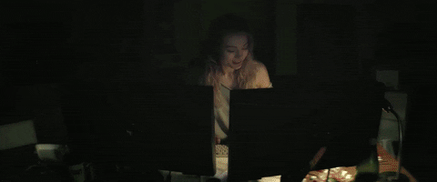
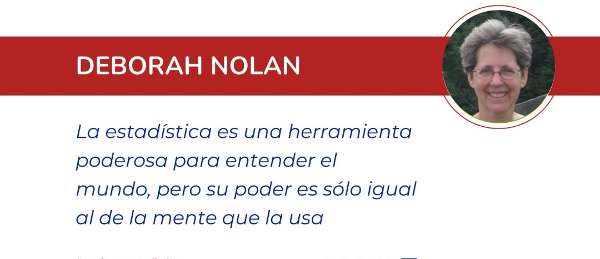
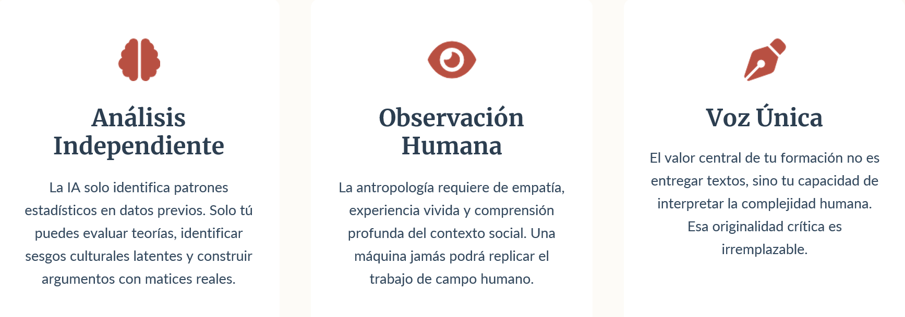
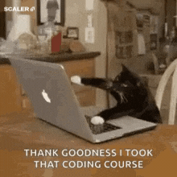

class: center 

```{r xaringan-themer, include=FALSE, warning=FALSE}
library(xaringanthemer)
style_duo_accent(primary_color = "#035AA6", secondary_color = "#03A696")

```


# Bienvenidos/as

¿Qué les pareció el curso M.C. I?
Críticas, comentarios, opiniones

---
#	FORMALIDADES DEL CURSO

## Elementos de horario de entrada y participación

-	Participación en clases será evaluada y se reconoce como gravitante para la incorporación de contenidos en del curso.
-	ASISTENCIA:  
  + mínimo 70% asistencia en actividades lectivas. En total son 26 clases considerando separadamente los dos bloques del día (martes 13:00 a 14:20 y martes 14:30 a 15:50). Para aprobar deberá asistir al menos a **18 bloques**, aceptando **8 inasistencias**. 
  + Debe llegar puntual, no se reconocerá asistencia luego de 20 minutos de inicio de cada bloque. Asistencia se evaluará en el item de participación en clases. 
  + Se pasará lista al inicio de la clase.
  + Mínimo asistencia a 3 ayudantías. Sino se realizará prueba recuperativa. 
  
---

##Flexibilidad (limitada)

- Personas con **9 o 10** inasistencias podrán a optar a una prueba recuperativa si tienen un promedio mayor a **5,5** en evaluaciones individuales. La prueba será individual e incluye todos los contenidos del curso. Con nota superior a **4,0** podrán aprobar el curso en términos de asistencia. 
-	En el caso específico de todos los trabajos, por **cada día de atraso** en una entrega se descontarán **0,25** puntos de la nota final.

---
class: inverse

## Tutorías

-	Espacios para orientar y acompañar pedagógicamente el desarrollo de los diseños de investigación que se elaboran en el curso. 
- Podrán solicitar tutorías con los profesores o con la ayudante los grupos que se hayan inscrito en torno a un tema específico a trabajar durante el curso. 
- Para **ser atendidos en tutoría**, cada grupo debe **enviar por correo electrónico los puntos que desea tratar con 48 horas de anticipación**. De no contarse con un listado específico de temas – incluso a nivel de aproximación - a tratar, no se atenderá en tutoría.

- Horario de atención estudiantes: **Miércoles/Jueves desde 16:00**

---

## Temas importantes!

-	La inasistencia a las evaluaciones y el no cumplimiento en la entrega de trabajos en las fechas programadas, solo podrá ser justificada mediante presentación de certificado médico a la Coordinación de Académica de la Carrera con un plazo de **3 días hábiles** luego de finalizado el periodo cubierto por la certificación médica.
-	Otras situaciones como labores de cuidado o temas laborales deberán ser comunicadas a la Coordinación Académica con la debida anticipación


---

## ¿Qué hacer con las clases/evaluaciones si hay movilizaciones, paros, tomas, etcétera?

- Clases: propuesta clase por medio la hacemos online, considerando asistencia. 
- Evaluaciones: reprogramar? (problema de acumulación)
- Recuperativas: ajustar un horario común. Si no coincide con otra materia, se cuenta asistencia.

---

class: center 

# Foco del curso

 


---

# Foco del curso

- Levantamiento de datos: Pre-Test (curso) y encuesta (la carrera).

--

- Uso de R

--

- Limpieza, transformación y preparación de datos

--

- Análisis y visualización de datos categóricos 

--

- Análisis y visualización datos cuantitativos

--

- Reflexión sobre lo que es hacer investigación cuantitativa

--

- Desarrollo de un proyecto de investigación empírico 


---


class: inverse

#Evaluaciones 


| Actividad evaluativa | Breve descripción | Modalidad | Fecha | Ponderación |
|----------------------|-------------------|-----------|-------|-------------|
| 📝 Tarea 1: Formulario corregido | Formulario corregido (Googleforms) según comentarios del profesor (1er semestre) | Grupal | 25-08 | - |
| 📝 Tarea 2: Realización de Prueba Piloto | Prueba piloto con compañerxs del curso | Grupal | 01-09 | - |
| Avance 1: Entrega del formulario corregido | Entrega del formulario corregido considerando sugerencias y observaciones de compañerxs, para posterior aplicación | Grupal | 08-09 | 5% |
| Evaluación Individual 1 | Prueba presencial individual: aspectos básicos de programación en R y tidyverse | Individual | 22-09 | 25% |


---
| Actividad evaluativa | Breve descripción | Modalidad | Fecha | Ponderación |
|----------------------|-------------------|-----------|-------|-------------|
| Evaluación Individual 2 | Prueba presencial R procesamiento y análisis de datos cuanti/cuali | Individual | 24-10 | 30% |
| Participación/Asistencia Individual | Incluye participación y asistencia a clases; realización de trabajos; participación y asistencia en ayudantías. | Individual |   |10% |
| Examen: Trabajo final 70% escrito/30% presentación | Entrega de documento Final. Incorpora trabajo de campo realizado, procesamientos estadísticos relevantes y gráficos. Se exponen resultados. | Grupal | 01-12 | 30% |


---
## Investigación empírica
- Continuar desarrollo de investigación anterior
- Ojalá conservar los grupos. Si alguien quiere cambiar, digamelo al finalizar la clase.
- ¿Qué se hará?: 
  + Corregir el cuestionario, Aplicar el cuestionario, Bajar la base de datos, Corregirla/Limpiarla, Analizarla y visualizarla, Escribir un texto y Presentar trabajo de investigación (mitad del trabajo ya hecho!) 

- **Próxima clase**: entregar el formulario corregido por grupo!

---

## Directorxs de proyecto (Grupo Coordinador): 
### _, , _


- *Avance 1*: formulario corregido: Operacionalizar variables independientes (Rendimiento académico, Estrés) y sociodemográficas (5%)
- *Avance 2*: Entrega grupal intermedia: Procesamiento y análisis básicos (10%)
- *Velar por*: (a) correcto desempeño de trabajo de campo, que se desarrolle en tiempo y forma, (b) correcta estructura de la encuesta final (10%)
- *Presentación de trabajo final* (15%): documento con variables sociodemográficas e independientes, posibles cruces con variables de interés. 
- Tareas extras:
  + Poder ayudar, junto con ayudante, en temas metodológicos y R. 

---
## Ideas

- Buscar ayudantes mujeres o diversidades
- 2 promedios más altos "referencia" en CV
- Si existe alguna duda/propuesta sobre la programación la podemos conversar.




---

class: center, inverse

 

---


## Premisas

.pull-left[
- Todas las preguntas son válidas, no hay preguntas tontas, aunque puedas ser graciosas
- R puede ser complejo, no tenga miedo a equivocarse y no se frustre. 
- Aprenda a interpretar los códigos en lenguaje cotidiano.
- Utilice las ayudantías y tutorías. 
- Puede utilizar:
  + https://chat.openai.com/ 
  + https://rtutor.ai/
  + su duda entre comillas más *stackoverflow* en Google]
  
<div class="center">
  
</div>


---

## Uso de IA

*Socio de Discusión*: Utilízar IA como "caja de resonancia" para debatir y explorar ideas antropológicas, siempre que las reflexiones finales sean suyas.

*Revisión y Estilo*: Emplear la IA para revisar la ortografía, la gramática y mejorar la claridad de textos que hayan redactado ustedes íntegramente.

*Identificación de Literatura*: Úsenla para identificar y mapear fuentes bibliográficas académicas (las cuales deberán leer y analizar directamente). Ej: elicit.com

*Apoyo a la Comprensión*: Apóyate en ella para generar resúmenes iniciales o traducir textos complejos que faciliten tu inmersión en la lectura original.


---

## Uso de IA: Riesgos y el Impacto Profesional

*Errores y alucinaciones*: La IA tergiversa teorías sociológicas y antropológicas, generando malentendidos graves en contextos académicos.

*Superficialidad*: Borra su voz única, sus experiencias vividas y su perspectiva diversa, produciendo textos genéricos y sin vida.

*Des-habilidades (De-skilling)*: EEl uso excesivo atrofia su capacidad neuronal para leer críticamente, analizar fenómenos complejos y estructurar argumentos propios.

*Vacíos de preparación*: los deja sin las herramientas analíticas reales que exigen los posgrados y el trabajo real en su futura carrera.

---

## Uso de IA: Responsabilidad y Desarrollo

Su desarrollo profesional está en juego.

Depender excesivamente de la IA como un atajo cognitivo genera una dependencia que puede limitar su crecimiento intelectual y profesional como antropólogx.

Debemos asumir la responsabilidad total de nuestro propio aprendizaje. Las herramientas digitales están diseñadas para asistir los procesos, pero nunca para sustituir su capacidad innata y necesaria de pensar por si mismxs.

---

## Habilidades críticas

<div class="center">
  
</div>

---

## Ayudantías

- ajustar una ayudantía, día y horario a conveniencia de ustedes: instalar programa y revisar si funciona

---

# Próxima clase
- Cada grupo deberá entregar el martes los formularios corregidos en gforms
- Cada grupo deberá presentar en clases sus errores y soluciones.
  + ¿Qué preguntas se entendía? y ¿cuáles no?
  + ¿Qué alternativas se entendía? y ¿cuáles no?
  + Sugerencias generales

---
class: inverse, center, middle

# Programación

https://github.com/sebastianmunozt/metodoscuanti2

---

# Uso de Github y Ucampus

- GitHub: plataforma de desarrollo colaborativo para alojar proyectos utilizando el sistema de control de versiones Git.
- Utilidad: Permite a los usuarios seguir y contribuir a los proyectos de su interés.
- En nuestro caso tendrá los materiales, fechas y grupos del curso. 
- Seguiremos utilizando UCAMPUS para informaciones puntuales, correo (entre docentes, estudiantes y ayudante) y envio de tareas y evaluaciones. 

---

class: inverse, center


 

## Dudas?