---
output:
  xaringan::moon_reader:
    css: ["xaringan-themer.css", "custom.css"]  # Se añade custom.css aquí
    nature:
      slideNumberFormat: "%current%"
      highlightStyle: github
      highlightLines: true
      ratio: 16:9
      countIncrementalSlides: true
      font-family: "Outfit, Arial, sans-serif"
---


```{r xaringan-themer, include=FALSE, warning=FALSE}
library(xaringanExtra)
library(xaringanthemer)
style_mono_accent(
  base_color = "black",
  header_font_google = google_font("Josefin Sans"),
  text_font_google   = google_font("Montserrat", "300", "300i"),
  code_font_google   = google_font("Fira Mono"), 
  base_font_size = "25px", # Ajuste del tamaño global de la fuente
)

# Crear un archivo CSS para personalizar inverse y citas
css_code <- "
.inverse strong { color: #b0b0b0 !important; } /* Texto en negrita en gris */
.inverse em { color: #b0b0b0 !important; } /* Texto en cursiva en gris */
.inverse a { color: #b0b0b0 !important; text-decoration: underline; } /* Enlaces en gris */
.inverse a:hover { color: #d0d0d0 !important; } /* Color más claro al pasar el mouse */

/* 🔹 Citas normales */
blockquote {
  color: #555555 !important;  /* Texto en gris oscuro */
  font-style: italic;
  font-size: 1.2em;  /* Aumenta el tamaño */
  border-left: 5px solid #999999; /* Borde lateral gris */
  padding-left: 15px;
  margin-left: 20px;
}

/* 🔹 Citas en inverse */
.inverse blockquote {
  color: #bbbbbb !important;  /* Texto más claro */
  border-left: 4px solid #d0d0d0;
}
"

writeLines(css_code, "custom.css") # Guarda el CSS en un archivo


```

class: slideInRight, fadeOutLeft, middle, inverse


## repaso & tidyverse
- Métodos cuantitativos 2
- Prof. Sebastián Muñoz

---


class: slideInRight, fadeOutLeft, middle

## Repaso

.pull-left[
- ¿para qué sirve `<-` ?
- ¿para qué sirve `c()` ?
- ¿cuáles son las partes de una función?
- ¿qué indican los corchetes `[]`?]


---
class: slideInRight, fadeOutLeft, middle

## Tipos de objetos: vector, data.frame, matrix
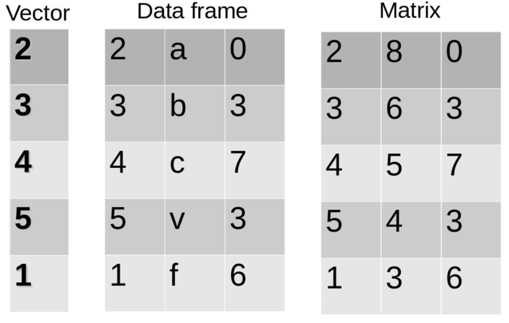

---

class: slideInRight, fadeOutLeft, middle

## dentro de un data frame

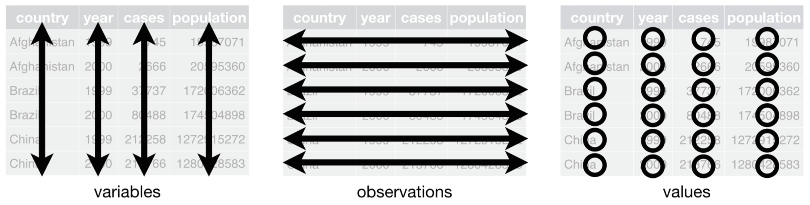


---

class: slideInRight, fadeOutLeft, middle

## `tidyverse`

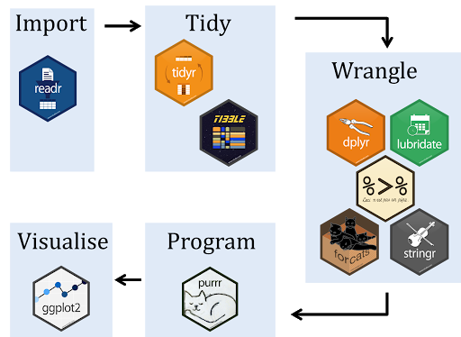

---
class: slideInRight, fadeOutLeft, middle

## `tidyverse` como un dialécto

- en el camino de saber aprender el lenguaje de r, aprender a hablar con los computadores.
- `tidyverse`: un argot que modifica algunas formas de Rbase. 

### ¿Qué tiene que ver esto con la antropología?
- además de desarrollar competencias específicas
- propuesta:pensar la relación con los computadores
- marco: discusiones de la antropología contemporánea sobre relaciones humanos y no-humanos: 
  + dioses
  + naturaleza
  + animales
  + tecnologías, tecnologías digitales. 

  
  
---
class: slideInRight, fadeOutLeft, middle

## Etnografía del mundo digital: 


.pull-left[
  + saber hablar con los computadores, yo y Rrancesca como sus informantes clave.

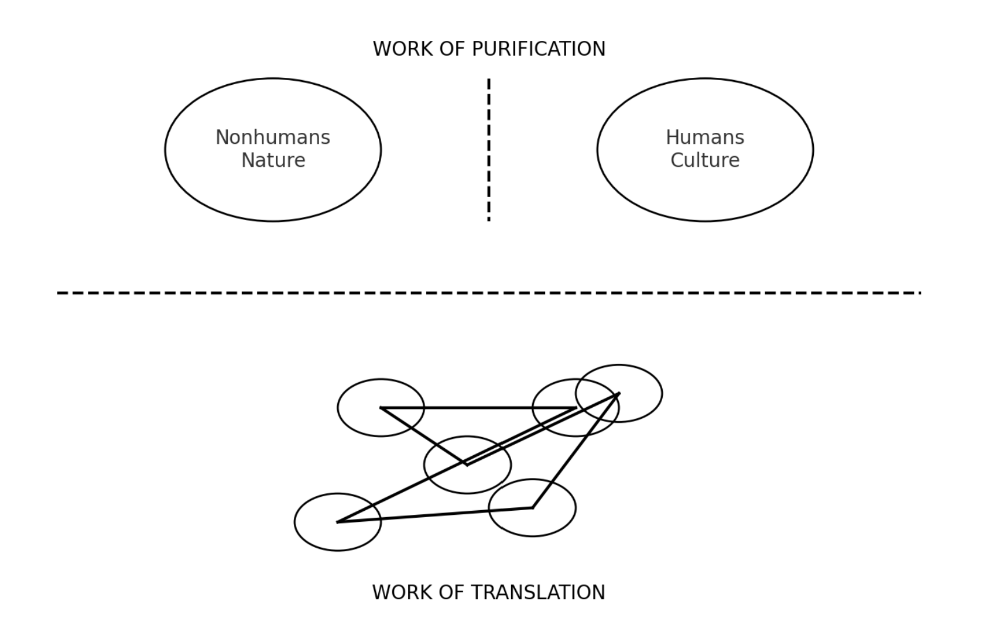

]

.pull-right[
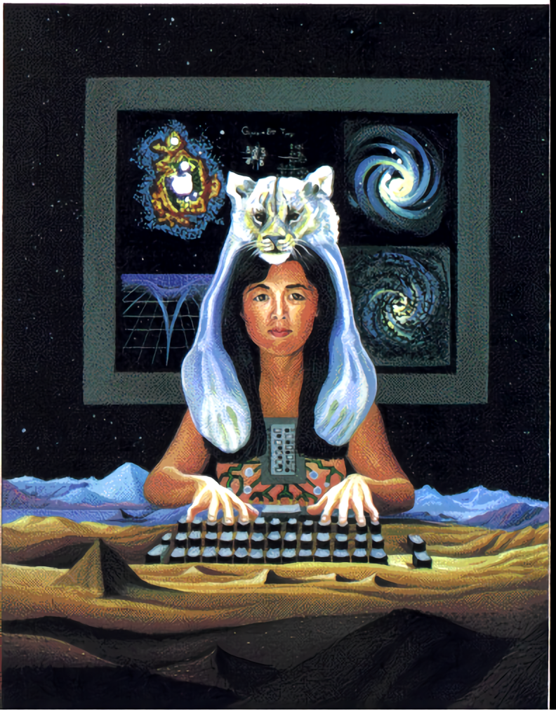 ]
  


---
class: slideInRight, fadeOutLeft, middle

## ¿Cuál será la relación que establecermos con las máquinas?

.pull-left[

]


.pull-right[
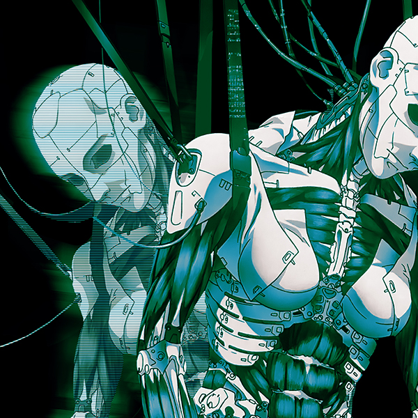 ]


---
class: slideInRight, fadeOutLeft, middle

## Programación
- Darles instrucciones a los computadores (nuestros "esclavos")
- IA: los computadores aprenden (¿se independizarán?)
- **ChatGpt**: democratiza la programación adaptándola al *lenguaje natural* (humano) con una base de datos gigante. 
  + pueden hablar directamente en su celular
  

<div align="center">
  
</div>

  


---
class: slideInRight, fadeOutLeft, middle

## A quienes les interese estos temas:

https://lalulula.tv/cine/100076/donna-haraway-cuentos-para-la-supervivencia-terrenal

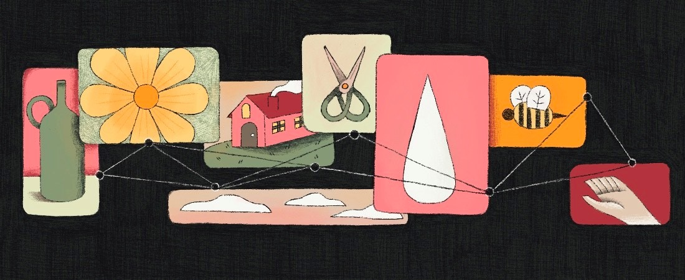


---
class: slideInRight, fadeOutLeft, middle


## el pipe `%>%`
.pull-left[


]

.pull-right[
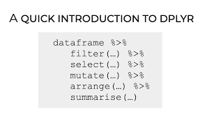 ]


---
class: slideInRight, fadeOutLeft, middle


## `dplyr`

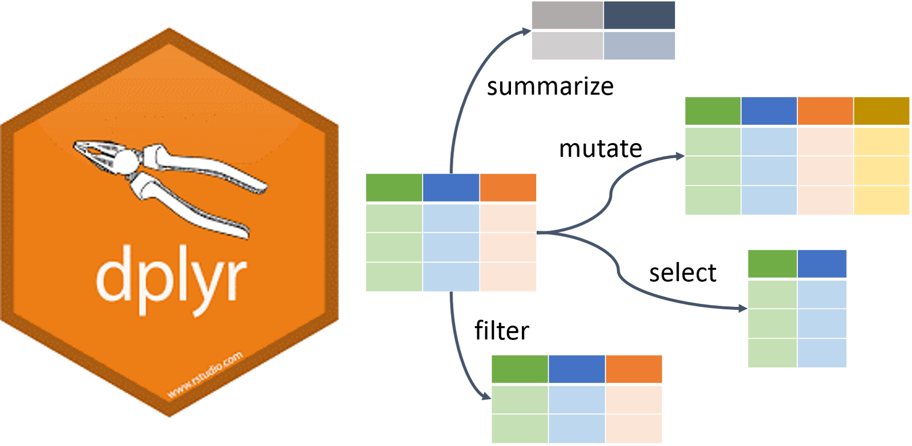


---
class: slideInRight, fadeOutLeft, middle

## `select ()`


---
class: slideInRight, fadeOutLeft, middle, center
background-image: url("img/select2.png")


---
class: slideInRight, fadeOutLeft, middle


## `filter ()`


---
class: slideInRight, fadeOutLeft, middle
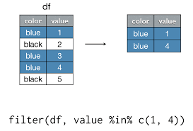


---
class: slideInRight, fadeOutLeft, middle

## Operadores 
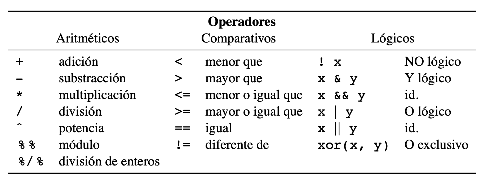

- `%in%`: lo que está dentro de...

---

class: slideInRight, fadeOutLeft, middle

## `mutate()`
 


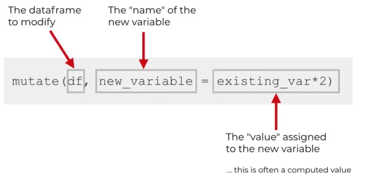

---

class: slideInRight, fadeOutLeft, middle

## `group_by()` + `summarize()` 
 


---

class: slideInRight, fadeOutLeft, middle

## Resumen

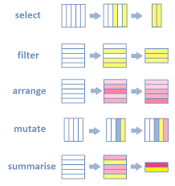 


---
class: slideInRight, fadeOutLeft, middle

## Entonces...

.pull-left[
- Si en mi en la base de datos de mi encuesta, quisiera: 
  + trabajar sólo con las mujeres ¿qué función utilizaría?
  + trabajar sólo con las variables que me interesan por ser el foco de mi grupo (e.g. solo las de "política" o "lectura")
  + hacer una tabla de la media y la mediana de la edad por sexo.
  + recodificar los ingresos en 3 grupos: altos, medios, bajos]

.pull-right[

 

]


---
class: slideInRight, fadeOutLeft, middle

## `pacman::p_load()`

- Resume las funciones library() e install.packages()
optimiza esta relación entre ambas pues solo las aplica cuando son necesarias (if requiere()), es decir, ¡no te reinicia R si ya está instalada la librería!

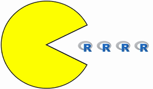


---
class: slideInRight, fadeOutLeft, middle

background-image: url("img/fly1.jpg")
background-size: cover

# Vamos a la práctica