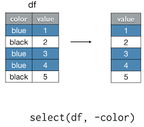

```{r xaringan-themer, include=FALSE, warning=FALSE}

pacman::p_load(xaringan,xaringanthemer )
style_duo_accent(primary_color = "#035AA6", secondary_color = "#03A696")

```


class: inverse, middle

## Repaso

.pull-left[
- ¿para qué sirve *<-* ?
- ¿para qué sirve *c()* ?
- ¿cuáles son las partes de una función?
- ¿qué indican los corchetes *[]*?]


---

## Tipos de objetos: vector, data.frame, matrix


---

class: center, middle

## dentro de un data frame


---

class: center, middle 

## tidyverse


---

## tidyverse como un dialécto

- en el camino de saber aprender el lenguaje de r, aprender a hablar con los computadores.
- tidyverse: un argot que modifica algunas formas de Rbase. 

### ¿Qué tiene que ver esto con la antropología?
- además de desarrollar competencias específicas
- propuesta:pensar la relación con los computadores
- marco: discusiones de la antropología contemporánea sobre relaciones humanos y no-humanoS: 
  + dioses
  + naturaleza
  + animales
  + tecnologías, tecnologías digitales. 

  
  
---


## Etnografía del mundo digital: 


.pull-left[
  + saber hablar con los computadores, yo y Gino como sus informantes clave.


]

.pull-right[
 ]
  


---

## ¿Cuál será la relación que establecermos con las máquinas?

.pull-left[

]


.pull-right[
 ]


---

## Programación
- Darles instrucciones a los computadores (nuestros "esclavos")
- IA: los computadores aprenden (¿se independizarán?)
- **ChatGpt**: democratiza la programación adaptándola al *lenguaje natural* (humano) con una base de datos gigante. 
  + pueden hablar directamente en su celular
  

<div align="center">
  
</div>

  


---

## A quienes les interese estos temas:

https://lalulula.tv/cine/100076/donna-haraway-cuentos-para-la-supervivencia-terrenal


---
class: center, middle

##el pipe %>% 
.pull-left[


]

.pull-right[
 ]


---


class: center

##dplyr


---
class:center, middle
## select ()





---

class:center, middle
## filter ()


---
class: inverse, center, middle

## Operadores 


- %in%: lo que está dentro de...

---

class:center

## Mutate
 


---

class: center, middle

## Group_by + summarize 
 


---

class: center

## Resumen


 


---
## Entonces...

.pull-left[
- Si en mi en la base de datos de mi encuesta, quisiera: 
  + trabajar sólo con las mujeres ¿qué función utilizaría?
  + trabajar sólo con las variables que me interesan por ser el foco de mi grupo (e.g. solo las de "política" o "lectura")
  + hacer una tabla de la media y la mediana de la edad por sexo.
  + recodificar los ingresos en 3 grupos: altos, medios, bajos]

.pull-right[

 

]


---
class: center, middle

## pacman::p_load

- Resume las funciones library() e install.packages()
optimiza esta relación entre ambas pues solo las aplica cuando son necesarias (if requiere()), es decir, ¡no te reinicia R si ya está instalada la librería!


---
class: inverse

background-image: url("img/fly1.jpg")
background-size: cover

# Vamos a la práctica