```{r xaringan-themer, include=FALSE, warning=FALSE}

pacman::p_load(xaringan,xaringanthemer )
style_duo_accent(primary_color = "#035AA6", secondary_color = "#03A696")

```


background-image: url("img/1.png")
background-size: 95%


---

# Muestreo


---

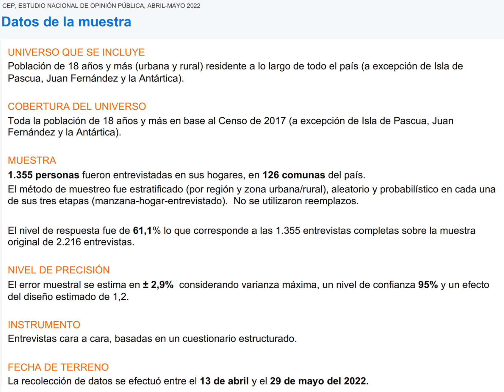

---

class: inverse, middle

## ¿Cómo 1355 puede representar a 14.000.000 (CENSO 2017)?

= 0.01%

¿Cómo es que con tan pocos casos se pueda intentar decir lo que pasa en todo Chile?

---

background-image: url("img/4.png")
background-size: cover
class: inverse, center, middle

## Formas de seleccionar para “representar” totalidad

---

class: inverse, middle
- Al preparar una sopa, uno saca una pequeña cucharada para ver el nivel general de sal y aliños. ¿Por qué una pequeña cucharada puede “representar” la totalidad?
- ¿Pero si la cucharada se saca de un lugar que no está bien revuelto?
- ¿Cómo seleccionar para que la pequeña parte (la “muestra”) represente a la totalidad (la “población”)?]


---

## ¿Qué es el Muestreo?
.pull-left[

- Es el procedimiento mediante el cual se selecciona una muestra de una población con el fin de conocer características de esa población.
- Población: conjunto de elementos del cual queremos extraer información ubicado en un tiempo y espacio determinado.
- Muestra: unidades de observación concretas desde las cuales extraeremos la información para conocer a la población origen de la muestra.]

.pull-right[

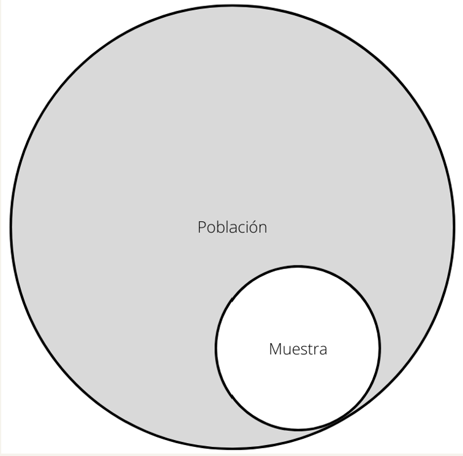]

---
class: inverse

## ¿Por qué estudiamos muestras y no poblaciones?
- Recursos: estudiar una muestra es más rápido y económico.
- Precisión: Una muestra puede ser más precisa en la estimación de los valores poblacionales que un CENSO.
- ¿Cómo se explica esta paradoja?
  - Errores ajenos al muestreo 
  - Errores del muestreo 

---

class: middle

## Conceptos claves de muestreo
- Hay dos tipos de muestreos: **probabilísticos** y **no probabilísticos**.
- El fin de un muestreo probabilístico es utilizar información de una muestra representativa para explorar, describir o explicar las propiedades de la población origen de la muestra. 
- ¿Cómo logramos esto?....


---

class: middle

.pull-left[
- **Estadística inferencial**: conjunto de procedimientos estadísticos que permiten generalizar los resultados de la muestra a la población origen de la muestra. 
- **Estimación**: procedimiento de inferencia que utiliza datos muestrales (estadísticos) para estimar un parámetro poblacional. 
- **Parámetro poblacional**: valor desconocido de la población que es estimado por un valor conocido de la muestra.
- **Estadístico**: valor calculado a partir de los valores muestrales con el propósito de estimar el valor de un parámetro en la población ]


.pull-right[
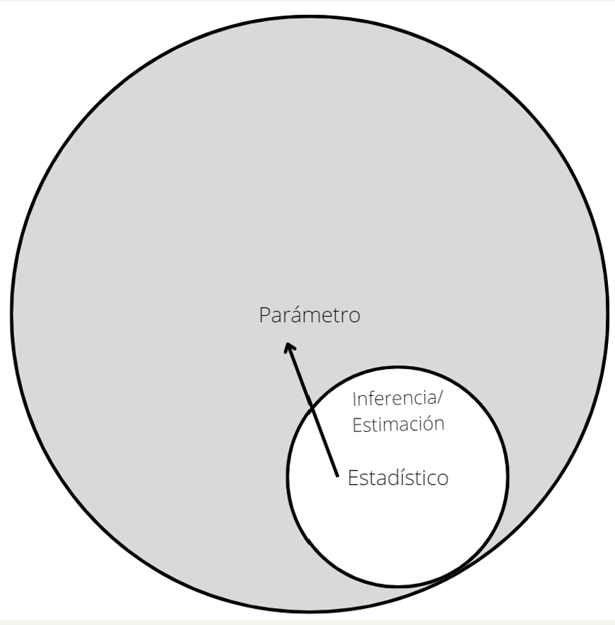]

---
background-image: url("img/muestreo.png")
background-size: cover
class: middle


## Muestra: 
- *“no es cualquier parte de la población”*
- Metafóricamente: “es una maqueta de la población en las que están reproducidos sus atributos a una escala menor”. 
- **Representatividad**: la cualidad de reproducir a escala los atributos de la población y en consecuencia permitir inferir a la población origen de la muestra


---

class: middle

## ¿Qué sustenta a la representatividad
- El teorema del límite central → La distribución de medias muestrales extraídas de forma aleatoria de una población se aproxima a la distribución normal a medida que aumenta el tamaño de la muestra.
- La ley de los grandes números → la diferencia entre el estadístico muestral y el parámetro poblacional tiende a 0 cuando el tamaño de la muestra tiende al infinito.


---
background-image: url("img/7.png")
background-size: 80%


---
## Distribución Normal
- Saco aleatoriamente distintas muestras gran cantidad de esas muestras se acercarán a la curva normal.

.pull-left[
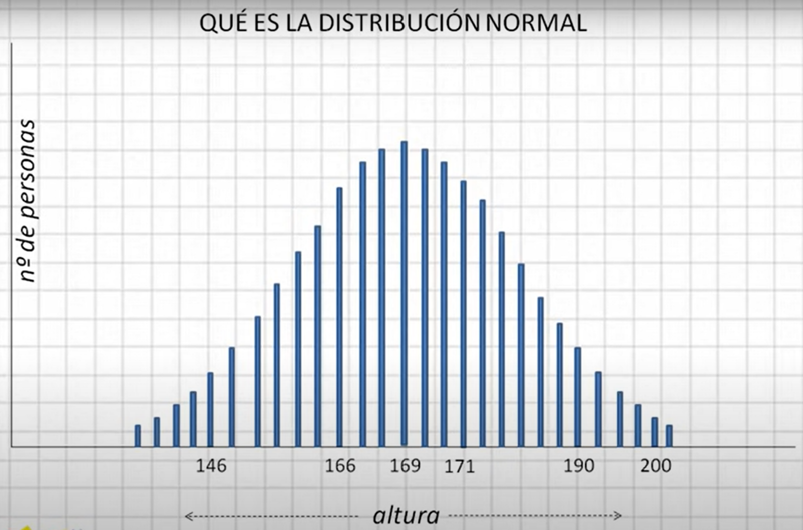]

.pull-right[
- Ej. 
- Media de Altura muestra 1; 
- Media altura muestra 2; 
- Media muestra…
- Media muestra N
- Se organizarán en una curva normal]

---

background-image: url("img/9.png")
background-size: 80%


---

class: middle

## Distribución teórica de variables continuas.
- Es una distribución simétrica (moda, mediana y media coinciden).
- Permite comparar otras distribuciones respecto a la forma de ésta.
- Casi todo el mundo está en el medio.


---
class: inverse,  middle

## Supuesto Normalidad
- La estadística paramétrica involucra supuestos de normalidad en la distribución muestral de los valores de interés (ej: la media).
- Esto es importante para calcular áreas bajo la curva → significación estadística (probabilidad de que la relación que se encuentra en la muestra se encuentra en la población).
- El supuesto de normalidad suele cumplirse cuando n>30 casos, aún si la distribución de la variable de interés no es normal en la muestra o la población.


---
background-image: url("img/10.png")
background-size: 80%


---

# ¿Qué errores se imaginan más allá del estadístico?


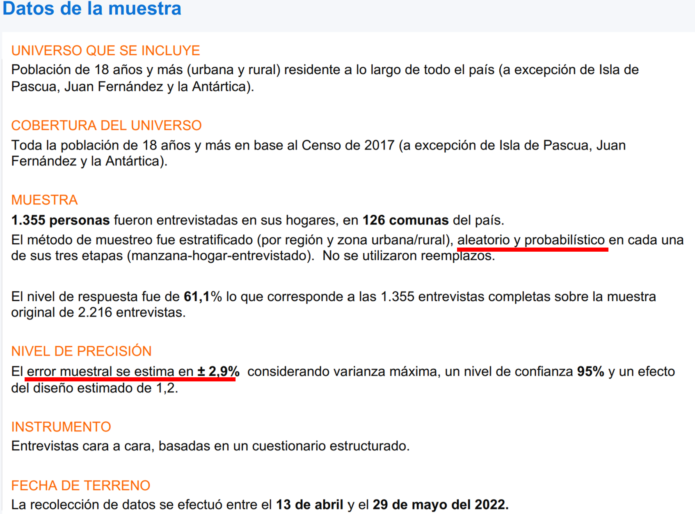

---

| Tipo de Error                | Descripción                                                                                           | Cómo Afecta la Investigación                                                                                   | Específico de |
|------------------------------|-------------------------------------------------------------------------------------------------------|---------------------------------------------------------------------------------------------------------------|---------------|
| Error de muestreo            | Se produce por la naturaleza de la inferencia. Es la diferencia entre el parámetro poblacional y el estadístico muestral al extraer una muestra aleatoria. | - Disminuye con muestras grandes.<br>- Aumenta con la dispersión de variables (poblaciones heterogéneas). | Muestreos     |
| Errores ajenos al muestreo (errores sistemáticos) | Se originan en el proceso de recogida y almacenamiento de información.                                  | - Errores por no observación: Unidades de la población objetivo no observadas completamente.<br>- Errores de medición: Pueden incluir errores de operacionalización y efecto del entrevistador. | Todas las etapas de la investigación |
---

class: center, middle

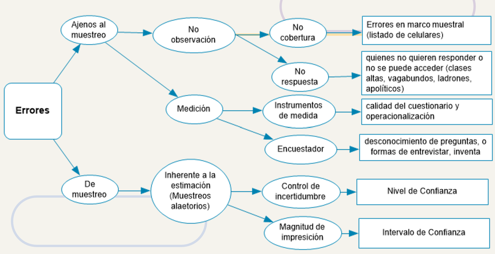


---
class: inverse

## Cómo se diseña una muestra
- Primer paso: definición del marco muestral.
    - El ‘marco muestral’ son los insumos utilizados para identificar cada una de las unidades de muestreo.
    - Permite enumerar las unidades de muestreo para su posterior selección.
    - Suelen ser: listados de individuos (clientes etc.); listados de manzanas, distritos, mapas y planos.


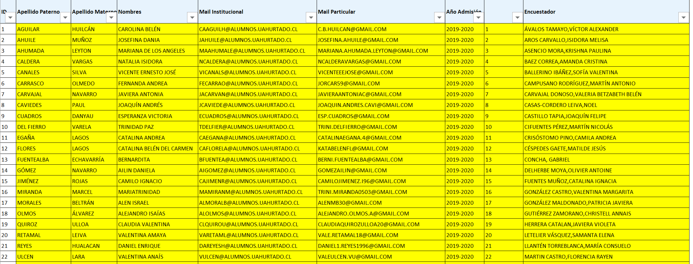

---
class:  middle

## En lo posible se busca que el marco:
  - Sea completo.
  - Esté actualizado.
  - No debe incluir unidades que no correspondan a la población que se analiza.
  - Debe contener información suplementaria que ayude a localizar a las unidades seleccionadas.
  - Debe ser fácil de utilizar.
  - El marco muestral es CLAVE: la muestra recogida sólo podrá considerarse representativa de la población que está comprendida en el marco muestral.


---
class: middle, inverse

## Definimos entonces:
- **Población/Universo**: agregado de elementos respecto del cual se recaba información.  
- **Población objetivo**: es una parte de la población, excluye elementos de difícil acceso o que son muy caros de encuestar.
- **Población marco**: es una parte de la población objetivo; se excluyen los elementos que no son encuestados por marco insuficiente o falta de cobertura.
- **Población de encuesta**: es una parte de la población marco; se excluyen los distintos tipos de no respuesta.


---
class: center, middle


## ¿Cómo se calcula el tamaño de la muestra?

.pull-left[
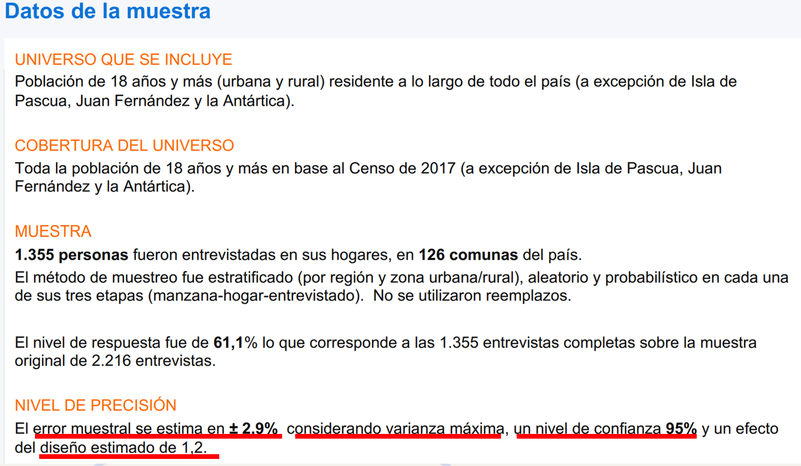]

.pull-right[
- Nivel de confianza de 95%
- Error de estimación +- 2.9%
- Varianza máxima: 0.5
- Efecto diseño: 1.2]

---
class: middle

## Algunos conceptos claves:
- **Intervalo de Confianza (IC)**: Rango de valores que tiene una cierta probabilidad conocida de contener el verdadero valor del parámetro de la población (ej: {56; 67} o {35%; 52%}): valor se mueve entre X e Y.
- **Nivel de Confianza**: Es la probabilidad 1- α que es la proporción de veces que el intervalo de confianza realmente contiene el parámetro de población. Lo elige el/la investigador/a generalmente 90%, 95% o 99%: con cuánta confianza mi muestra está en el IC?
- **El error máximo de estimación**: Nos indica el mayor error que podemos cometer por predecir la proporción poblacional con una proporción muestral (ej: 2%): cuánto error estoy dispuesto admitir?


---
## ¿Cuántos casos son necesarios?
- Cálculo del tamaño de la muestra mediante MAS (muestreo aleatorio simple).
- La fórmula incorpora el tamaño de la población, la varianza, el error máximo de estimación, y el nivel de confianza deseado…
.pull-left[
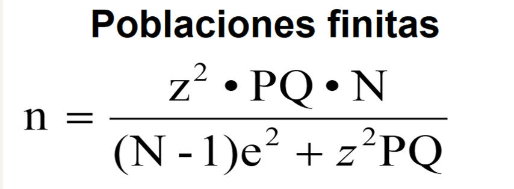]

.pull-right[
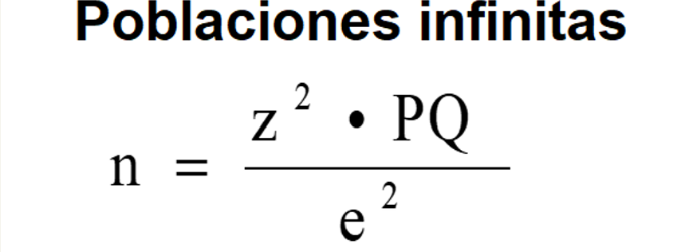]


- N: Tamaño de población
- e: Error máximo admisible (mitad de IC) 
- PQ: Variación poblacional (0.5 * 0.5; máxima)
- z: Coeficiente de confianza (asociado a NC, áreas bajo la curva normal) 

Población/Universo mayor a 10.000

---


## Ejercicio: Considerando muestras infinitas
- a) ¿Cuántos casos se necesitan para una muestra aleatoria simple con un error de 5% y un nivel de confianza de 90% y una varianza máxima?
- b) ¿Cuántos casos se necesitan para una muestra aleatoria simple con un error de 2% y un nivel de confianza de 95% y una varianza máxima?

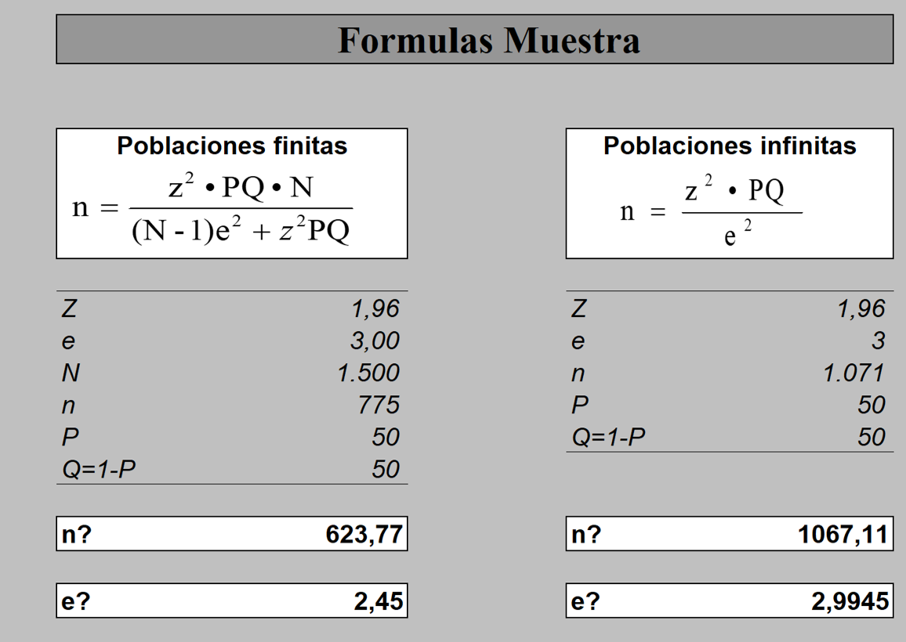


---

## Comparación entre Muestreo Probabilístico y No Probabilístico

| Característica                                  | Muestreo Probabilístico                                                                     | Muestreo No Probabilístico                                                                |
|-------------------------------------------------|---------------------------------------------------------------------------------------------|-------------------------------------------------------------------------------------------|
| Probabilidad de selección                       | Todos los elementos tienen una probabilidad conocida y distinta de 0 de ser seleccionados.  | Desigual probabilidad de selección entre las unidades de la población.                   |
| Permite inferencias                             | Sí, permite la inferencia estadística a la población general.                               | Limitado, no se prioriza para inferencia estadística directa a la población general.      |
| Costo y complejidad                             | Más caro y complejo debido al diseño y análisis necesario.                                  | Más barato y simple, ideal para estudios exploratorios o cuando los recursos son limitados.|
| Precisión                                       | Más preciso, gracias a la aleatoriedad y representatividad de la muestra.                  | Menos preciso, puede estar sesgado por la selección no aleatoria.                         |
| Uso                                             | Ideal cuando se busca generalizar los resultados a toda la población.                      | Utilizado por conveniencia, recursos limitados o cuando la inferencia no es lo central.   |


---

class:  middle, inverse

## Muestreos Probabilísticos

Muestreo Aleatorio Simple (MAS)
- La selección se realiza de un listado de la población asignándole igual probabilidad a cada elemento.
- Se caracteriza por:
    - Cada unidad tiene una probabilidad igual de participar en la selección.
    - La selección es totalmente aleatoria.
    - Todas las posibles muestras tienen igual probabilidad de ser elegidas.

---

class: middle

## Selección Aleatoria
- Por lo general, la selección aleatoria se hace computacionalmente. También existen tablas de números aleatorios.
- Como el MAS exige un listado exhaustivo, es imposible utilizarlo en poblaciones de magnitud elevada. Por ejemplo, es imposible hacer un MAS en todo Chile.

---

## Listado de estudiantes de Antropología Universidad Alberto Hurtado: 220 personas


---
class: center, middle


---

## Ventajas y Desventajas del Muestreo Aleatorio Simple

| Ventajas                                 | Desventajas                                                        |
|------------------------------------------|--------------------------------------------------------------------|
| Facilidad de los cálculos estadísticos   | Requiere listar y enumerar a todas las unidades de la población   |
| Elevada probabilidad de ser representativo | Resulta monótono y arduo en muestras grandes                      |
|                                          | La dispersión de la muestra hace que los costos sean elevados     |


---

class:  middle

## Muestreo Sistemático
- Es una variante del MAS. Se elige un punto de arranque aleatorio y se seleccionan casos en forma sucesiva según un intervalo numérico convencional.
- Sólo la primera unidad de la muestra se elige al azar.
- Los restantes elementos de la muestra se eligen sumando el coeficiente de elevación que es igual a N/n hasta llegar al n requerido.
- En trabajo en terreno es mucho más práctico que un MAS.

---
class: center, middle


---
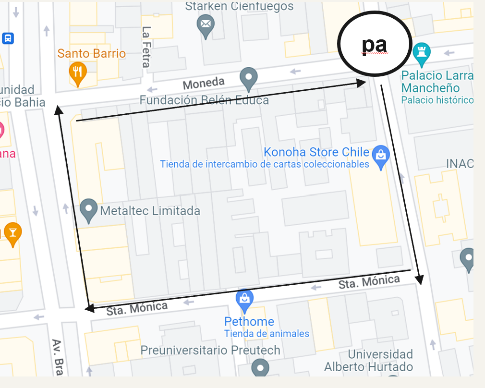

---
class: middle

## Muestreo Estratificado
- Se caracteriza por la utilización de información auxiliar para mejorar la eficiencia en la selección de elementos y mejorar la precisión de las estimaciones.
- La información auxiliar corresponde a variables de estratificación que dividen a la población en estratos.
- Las variables de estratificaciones más utilizadas son edad, sexo, clase social, ocupación. Esto se debe a que tienden a estar recogidas en los marcos muestrales (como el CENSO).


---

class: center, middle

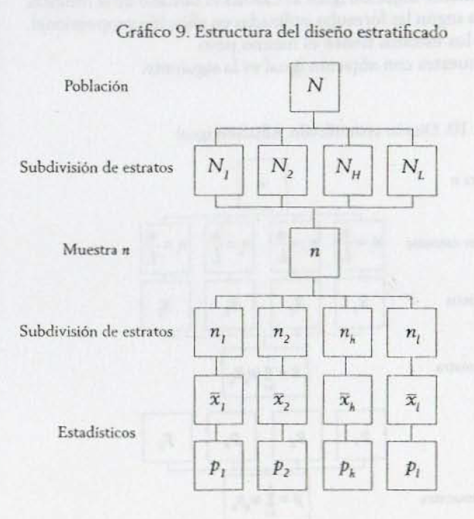

---

## Muestreo Estratificado
- ¿Qué es un estrato? → Los estratos son grupos homogéneos de elementos por lo que no es preciso seleccionar un número elevado de casos para representar al estrato.
- Mientras más homogéneo sea el estrato, más precisa será la estimación.
- Las varianza entre los estratos es máxima y al interior de cada estrato es mínima.
- El fin es lograr que el estrato esté representado en la muestra.
- Logrará estimaciones más precisas siempre que:
    - Las variables de estratificación están relacionadas con los objetivos de la investigación.
    - De no ser así, no tendría sentido (se lograría una precisión similar a si no se hubiera estratificado).

---

class: center, middle


---

## Muestreo por Conglomerados

.pull-left[
- ¿Qué es un conglomerado? → conjunto de elementos con valores diferentes entre sí en la variable medida.
- Diferencias con el ME:
  - La lógica es inversa. El error disminuye en la medida que aumenta la heterogeneidad de cada uno de los conglomerados.
  - Se extrae una muestra aleatoria de conglomerados (no una muestra al interior de cada estrato).
  - La unidad de muestreo es el conglomerado y no el individuo.]

.pull-right[
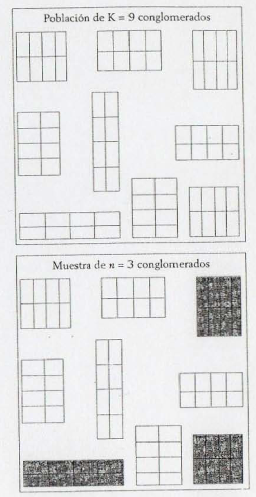]
---
class: center, middle

## Muestreo Polietápico
- El MC da paso comúnmente a los muestreos polietápicos….
- Son diseños complejos caracterizados por la selección de muestras en etapas sucesivas.
- Cada etapa requiere su propio marco muestral. Hay así unidades primarias de muestreo (UPM), unidades secundarias de muestreo (USM), etc.
- La versión más sencilla tiene 2 etapas:
    - Se seleccionan los conglomerados (unidades de muestreo primarias).
    - Se elige mediante MAS a los miembros de la población a observar al interior de los conglomerados previamente seleccionados.
- Es el más típico muestreo nacional → por ejemplo, muestreo polietápico estratificado por conglomerados.

---
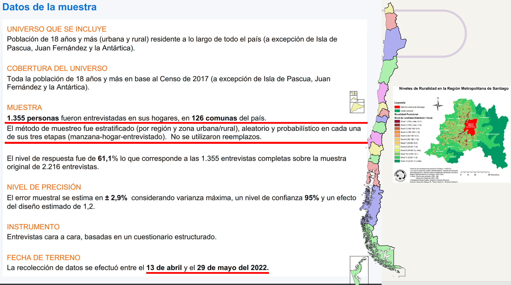


---
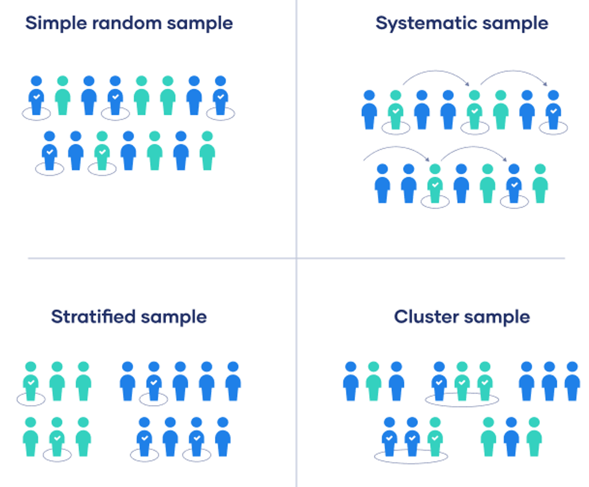

---

## Ejemplo 1: Encuesta Electoral
- Paso 1: estratifico región y urbano/rural
- Paso 2: Selecciono Manzanas aleatoriamente
- Paso 3: Hago un listado de casas (construyo el marco muestra) y voy seleccionando Casas de una manzana de forma sistemática. Toco el timbre cada 3 casas
- Paso 4: 
 - Hago un listado de los miembros del hogar mayores de 18: Juan, Antonia, Carla, José.
 - Luego selecciono de forma aleatoria: Último que está de cumpleaños, Tabla kish

---

##Ejemplo 2:Percepciones sobre la desigualdad social en Santiago
Paso 1: estratifico manzanas por nivel socioeconómico
Paso 2: Selecciono Manzanas aleatoriamente
Paso 3: Hago un listado de casas (construyo el marco muestra) y voy seleccionando Casas de una manzana de forma sistemática. Toco el timbre cada 3 casas
Paso 4: 
 - Hago un listado de los miembros del hogar mayores de 18: José Pablo, María Ignacia, Trini, Jose Miguel.
- Luego selecciono de forma aleatoria: Último que está de cumpleaños, Tabla kish

---


## Muestreos No Probabilísticos

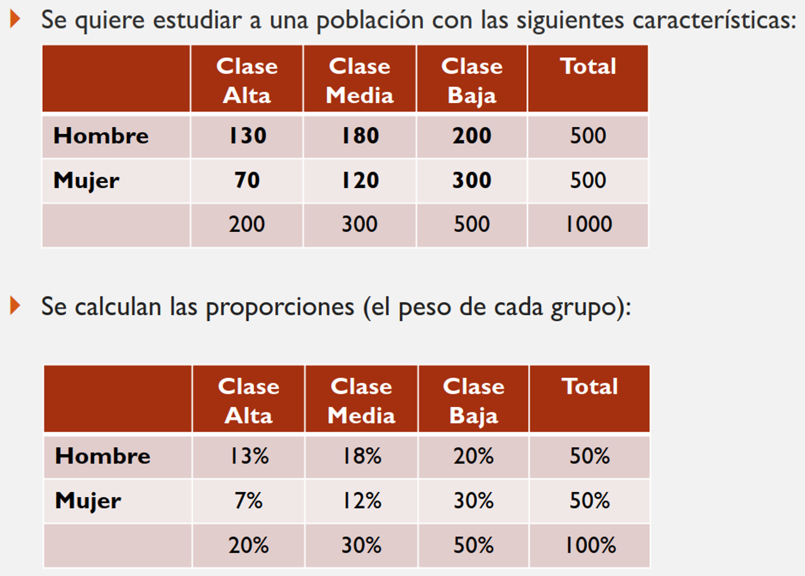

## Muestreo por Cuotas
- Es un muestreo no probabilístico muy utilizado. Intenta alcanzar grados mínimos de representatividad de un modo más simple.
- Procedimiento:
    - Se define una matriz con las características básicas de la población que interesa representar y se establece la proporción en que cada una de ellas existe.
    - Luego se determina el n total deseado (en base a criterios de factibilidad y estadísticos) y se distribuye entre cada una de las celdas (cuotas) de manera proporcional.
    - Finalmente, se le señala a los encuestadores que alcancen la cuota (es decir, que busquen un cierto número de encuestados que cumplan los requisitos de cada cuota).


---

class: center, middle

## Sirve el excel?


---

class: center, middle

## Sirve el excel?


---

class: center, middle

## Sirve el excel?


---

## Ejercicio en clases


Instrucción
- Revise el marco muestral entregado y trate de identificar qué tipo de muestreo podría ser.


