---
output:
  xaringan::moon_reader:
    css: ["xaringan-themer.css", "custom.css"]  # Se añade custom.css aquí
    nature:
      slideNumberFormat: "%current%"
      highlightStyle: github
      highlightLines: true
      ratio: 16:9
      countIncrementalSlides: true
      font-family: "Outfit, Arial, sans-serif"
---


```{r xaringan-themer, include=FALSE, warning=FALSE}
library(xaringanExtra)
library(xaringanthemer)
style_mono_accent(
  base_color = "black",
  header_font_google = google_font("Josefin Sans"),
  text_font_google   = google_font("Montserrat", "300", "300i"),
  code_font_google   = google_font("Fira Mono"), 
  base_font_size = "23px", # Ajuste del tamaño global de la fuente
)

# Crear un archivo CSS para personalizar inverse y citas
css_code <- "
.inverse strong { color: #b0b0b0 !important; } /* Texto en negrita en gris */
.inverse em { color: #b0b0b0 !important; } /* Texto en cursiva en gris */
.inverse a { color: #b0b0b0 !important; text-decoration: underline; } /* Enlaces en gris */
.inverse a:hover { color: #d0d0d0 !important; } /* Color más claro al pasar el mouse */

/* 🔹 Citas normales */
blockquote {
  color: #555555 !important;  /* Texto en gris oscuro */
  font-style: italic;
  font-size: 1.2em;  /* Aumenta el tamaño */
  border-left: 5px solid #999999; /* Borde lateral gris */
  padding-left: 15px;
  margin-left: 20px;
}

/* 🔹 Citas en inverse */
.inverse blockquote {
  color: #bbbbbb !important;  /* Texto más claro */
  border-left: 4px solid #d0d0d0;
}
"

writeLines(css_code, "custom.css") # Guarda el CSS en un archivo


```


background-image: url("img/00.gif")
background-size: cover
class: slideInRight, fadeOutLeft, middle, inverse


<div style="position: absolute; bottom: 5%; left: 50%; transform: translateX(-50%); background: rgba(0, 0, 0, 0.7); padding: 15px; border-radius: 10px; color: white; text-align: center; width: 80%;">
  
  <h3 style="margin-bottom: 5px; font-size: 1.2em;">Introducción al Muestreo</h3>
  <ul style="list-style-type: none; padding: 0; margin: 0; font-size: 1em;">
    <li>Métodos cuantitativos 2</li>
    <li>Prof. Sebastián Muñoz</li>
  </ul>

</div>


---
class: slideInRight, fadeOutLeft, middle, inverse
background-image: url("img/temp/05.png") 
background-size: cover

### ¿Qué veremos?

1. <span style="font-size: 1.2em;">Introducción</span>  
2. <span style="color:gray; font-size: 1em;">¿Qué es el muestreo?</span>  
3. <span style="color:gray; font-size: 1em;">Conceptos claves del muestreo</span>  
4. <span style="color:gray; font-size: 1em;">¿Qué sustenta la idea de "representatividad"?</span>  
5. <span style="color:gray; font-size: 1em;">¿Cuáles son los errores del muestreo?</span>  
6. <span style="color:gray; font-size: 1em;">Elementos básicos de diseño de muestra</span>  
7. <span style="color:gray; font-size: 1em;">Tipos de muestreo</span>  


---
class: slideInRight, fadeOutLeft, middle
> Ponga mucha atención pues al final de la clase va a ver un cuestionario de kahoot en el que evaluaremos los contenidos.

> La dupla que saque mayor puntaje tendrá 0,3 para la prueba; la segunda dupla tendrá 0,2 y la tercera 0,1. 

---
background-image: url("img/1.png")
background-size: 80%


---
background-image: url("img/2.png")
background-size: 70%
 


---
background-image: url("img/3.png")
background-size: 70%

---
background-image: url("img/temp/02.jpg") 
background-size: cover
class: slideInRight, fadeOutLeft, middle

# ¿Cómo 1355 puede representar a 14.000.000 (CENSO 2017)?

= 0.01%

#### ¿Cómo es que con tan pocos casos se pueda intentar decir lo que pasa en todo Chile?

---
background-image: url("img/4.png")
background-size: cover
class: center, bottom, inverse

<div style="position: absolute; bottom: 5%; left: 50%; transform: translateX(-50%); background: rgba(0, 0, 0, 0.8); padding: 15px 20px; border-radius: 10px; color: white; text-align: center; width: 80%; box-shadow: 0px 0px 10px rgba(0, 0, 0, 0.5);">
  
  <h2 style="margin: 0; font-size: 1.5em;">Formas de seleccionar para “representar” totalidad</h2>

</div>

---
background-image: url("img/temp/02.jpg") 
background-size: cover
class: slideInRight, fadeOutLeft, middle
> Al preparar una sopa, uno saca una pequeña cucharada para ver el nivel general de sal y aliños. 

- ¿Por qué una pequeña cucharada puede **representar** la totalidad?
- ¿Pero si la cucharada se saca de un lugar que no está bien revuelto?
- ¿Cómo seleccionar para que la pequeña parte (la **muestra**) represente a la totalidad (la **población**)?]


---
background-image: url("img/temp/05.png") 
background-size: cover
class: slideInRight, fadeOutLeft, middle, inverse

1. <span style="color:gray; font-size: 1em;">Introducción</span>  
2. <span style="font-size: 1.2em;">¿Qué es el muestreo?</span>  
3. <span style="color:gray; font-size: 1em;">Conceptos claves del muestreo</span>  
4. <span style="color:gray; font-size: 1em;">¿Qué sustenta la idea de "representatividad"?</span>  
5. <span style="color:gray; font-size: 1em;">¿Cuáles son los errores del muestreo?</span>  
6. <span style="color:gray; font-size: 1em;">Elementos básicos de diseño de muestra</span>  
7. <span style="color:gray; font-size: 1em;">Tipos de muestreo</span>  


---
class: slideInRight, fadeOutLeft, middle


.pull-left[

- Es el procedimiento mediante el cual se selecciona una **muestra** de una **población** con el fin de conocer características de esa población.
- **Población**: 
  - conjunto de elementos del cual queremos extraer información ubicado en un tiempo y espacio determinado.
- **Muestra**: 
  - unidades de observación concretas desde las cuales extraeremos la información para conocer a la población origen de la muestra.]

.pull-right[

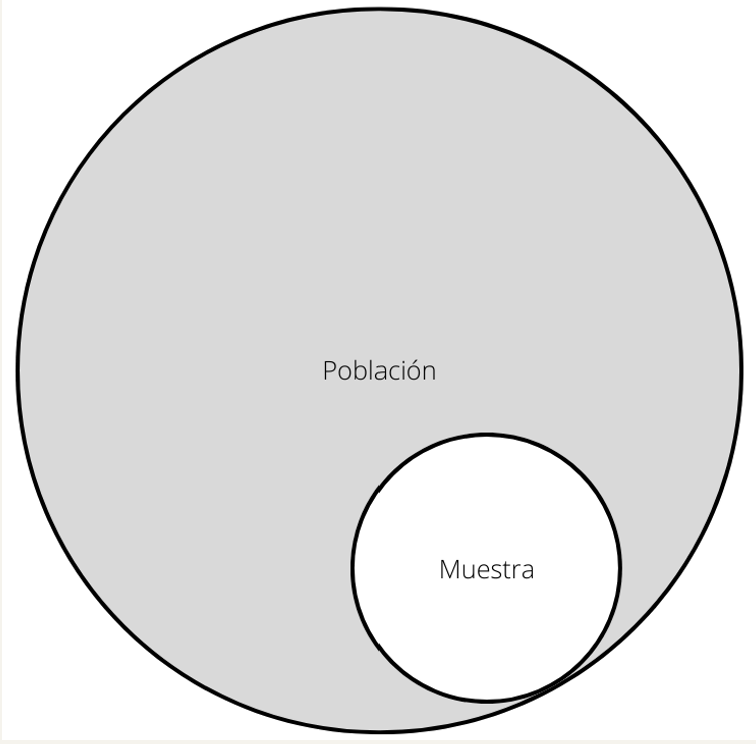]

---
class: slideInRight, fadeOutLeft, middle

### ¿Por qué estudiamos con **muestras** y no **poblaciones**?
- **Recursos**: estudiar una muestra es más rápido y económico.
- **Precisión**: Una muestra puede ser más precisa en la estimación de los valores poblacionales que un **[CENSO](https://censo2024.ine.gob.cl/wp-content/uploads/2025/03/D1_Poblacion-censada-por-sexo-y-edad-en-grupos-quinquenales.xlsx)**.
- ¿Cómo se explica esta paradoja?
  - Errores ajenos al muestreo 
  - Errores del muestreo 

---
background-image: url("img/temp/05.png") 
background-size: cover
class: slideInRight, fadeOutLeft, middle, inverse

1. <span style="color:gray; font-size: 1em;">Introducción</span>  
2. <span style="color:gray; font-size: 1em;">¿Qué es el muestreo?</span>  
3. <span style="font-size: 1.2em;">Conceptos claves del muestreo</span>  
4. <span style="color:gray; font-size: 1em;">¿Qué sustenta la idea de "representatividad"?</span>  
5. <span style="color:gray; font-size: 1em;">¿Cuáles son los errores del muestreo?</span>  
6. <span style="color:gray; font-size: 1em;">Elementos básicos de diseño de muestra</span>  
7. <span style="color:gray; font-size: 1em;">Tipos de muestreo</span>  


---
class: slideInRight, fadeOutLeft, middle


- Hay dos tipos de muestreos: **probabilísticos** y **no probabilísticos**.
- El fin de un **muestreo probabilístico** es utilizar información de una muestra representativa para explorar, describir o explicar las propiedades de la población origen de la muestra. 
- ¿Cómo logramos esto?....


---
background-image: url("img/temp/02.jpg") 
background-size: cover
class: slideInRight, fadeOutLeft, middle

.pull-left[
- **Estadística inferencial**: conjunto de procedimientos estadísticos que permiten generalizar los resultados de la muestra a la población origen de la muestra. 
- **Estimación**: procedimiento de inferencia que utiliza datos muestrales (estadísticos) para estimar un parámetro poblacional. 
- **Parámetro poblacional**: valor desconocido de la población que es estimado por un valor conocido de la muestra.
- **Estadístico**: valor calculado a partir de los valores muestrales con el propósito de estimar el valor de un parámetro en la población ]


.pull-right[
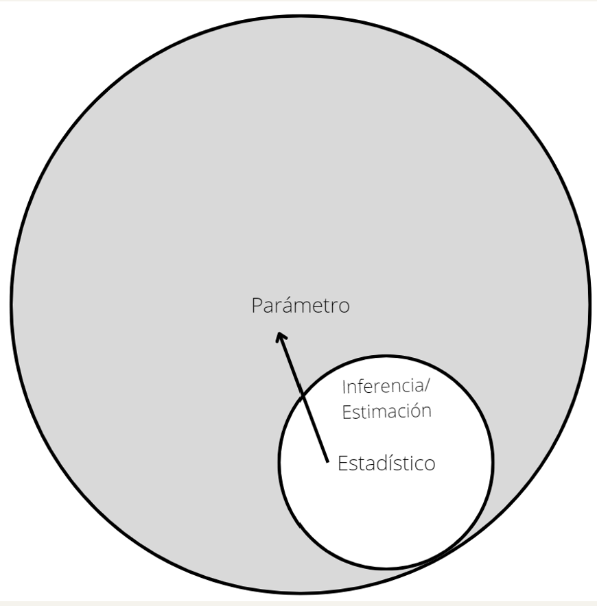]

---
background-image: url("img/maqueta.png")
background-size: cover

class: slideInRight, fadeOutLeft, middle

<style>
.bloque {
  border: 3px solid white;
  padding: 12px;
  background-color: rgba(0, 0, 0, 0.6);
  display: inline-block;
  border-radius: 10px;
  color: white;
  font-size: 0.8em; /* Tamaño de fuente más pequeño */
  text-align: left;
  position: absolute;
  bottom: 5%;
  left: 50%;
  transform: translateX(-50%);
  width: 80%;
}
.bloque h2, .bloque ul, .bloque li, .bloque em, .bloque strong {
  color: white; /* Asegura que todo el texto sea blanco */
}
.bloque h2 {
  font-size: 1em; /* Título más pequeño */
  margin-bottom: 8px;
}
</style>

<div class="bloque">
  <h2>Muestra:</h2>
  <ul>
    <li><em>“no es cualquier parte de la población”</em></li>
    <li>Metafóricamente: “es una maqueta de la población en las que están reproducidos sus atributos a una escala menor”.</li>
    <li><strong>Representatividad:</strong> la cualidad de reproducir a escala los atributos de la población y en consecuencia permitir inferir a la población origen de la muestra.</li>
  </ul>
</div>


---
background-image: url("img/temp/05.png") 
background-size: cover
class: slideInRight, fadeOutLeft, middle, inverse
1. <span style="color:gray; font-size: 1em;">Introducción</span>  
2. <span style="color:gray; font-size: 1em;">¿Qué es el muestreo?</span>  
3. <span style="color:gray; font-size: 1em;">Conceptos claves del muestreo</span>  
4. <span style="font-size: 1.2em;">¿Qué sustenta la idea de "representatividad"?</span>  
5. <span style="color:gray; font-size: 1em;">¿Cuáles son los errores del muestreo?</span>  
6. <span style="color:gray; font-size: 1em;">Elementos básicos de diseño de muestra</span>  
7. <span style="color:gray; font-size: 1em;">Tipos de muestreo</span>  


---
background-image: url("img/temp/02.jpg") 
background-size: cover

class: slideInRight, fadeOutLeft, middle


- El **teorema del límite central** → La distribución de medias muestrales extraídas de forma aleatoria de una población se aproxima a la **distribución normal** a medida que aumenta el tamaño de la muestra.
- La **ley de los grandes números** → la diferencia entre el estadístico muestral y el parámetro poblacional tiende a 0 cuando el tamaño de la muestra tiende al infinito.


---

class: slideInRight, fadeOutLeft, middle
background-image: url("img/7.png")
background-size: 65%


---
class: slideInRight, fadeOutLeft, middle

## Distribución Normal
- Saco aleatoriamente distintas muestras gran cantidad de esas muestras se acercarán a la curva normal.

.pull-left[
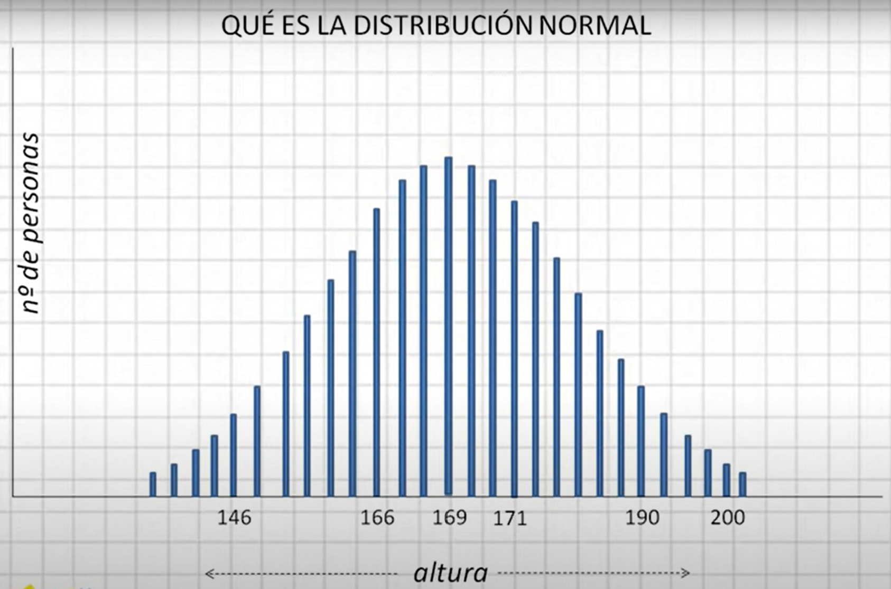]

.pull-right[
- Ej. 
  - Media de Altura muestra 1; 
  - Media altura muestra 2; 
  - Media muestra…
  - Media muestra N
  - Se organizarán en una curva normal]

---
class: slideInRight, fadeOutLeft, middle
background-image: url("img/9.png")
background-size: 80%


---
class: slideInRight, fadeOutLeft, middle


## Distribución teórica de variables continuas.
- Es una distribución **simétrica** (moda, mediana y media coinciden).
- Permite comparar otras distribuciones respecto a la forma de ésta.
- Casi todo el mundo está en el medio.


---
background-image: url("img/temp/02.jpg") 
background-size: cover
class: slideInRight, fadeOutLeft, middle

## Supuesto Normalidad
- La estadística paramétrica involucra supuestos de **normalidad en la distribución muestral** de los valores de interés (ej: la media).
- Esto es importante para calcular **áreas bajo la curva** → significación estadística (probabilidad de que la relación que se encuentra en la muestra se encuentra en la población).
- El supuesto de normalidad suele cumplirse cuando n>30 casos, aún si la distribución de la variable de interés no es normal en la muestra o la población.


---
background-image: url("img/10.png")
background-size: 70%


---
background-image: url("img/temp/05.png") 
background-size: cover
class: slideInRight, fadeOutLeft, middle, inverse

1. <span style="color:gray; font-size: 1em;">Introducción</span>  
2. <span style="color:gray; font-size: 1em;">¿Qué es el muestreo?</span>  
3. <span style="color:gray; font-size: 1em;">Conceptos claves del muestreo</span>  
4. <span style="font-size: 1.2em;">¿Qué sustenta la idea de "representatividad"?</span>  
5. <span style="color:gray; font-size: 1em;">¿Cuáles son los errores del muestreo?</span>  
6. <span style="color:gray; font-size: 1em;">Elementos básicos de diseño de muestra</span>  
7. <span style="color:gray; font-size: 1em;">Tipos de muestreo</span>  


---
class: slideInRight, fadeOutLeft, middle
### ¿Qué errores se imaginan más allá del estadístico?


<div style="display: flex; justify-content: center; margin-top: 20px;">
  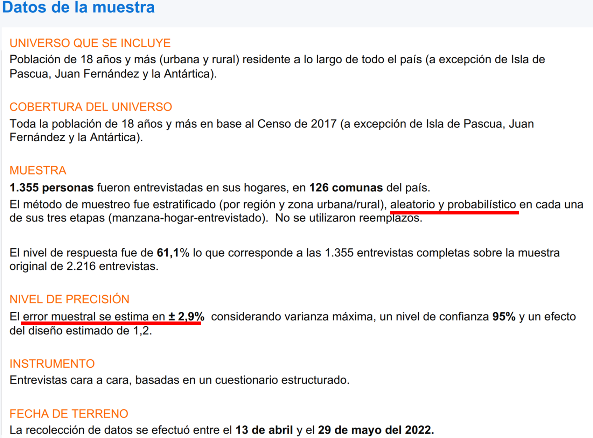
</div>

---
class: slideInRight, fadeOutLeft, middle

| Tipo de Error                | Descripción                                                                                           | Cómo Afecta la Investigación                                                                                   | Específico de |
|------------------------------|-------------------------------------------------------------------------------------------------------|---------------------------------------------------------------------------------------------------------------|---------------|
| Error de muestreo            | Se produce por la naturaleza de la inferencia. Es la diferencia entre el parámetro poblacional y el estadístico muestral al extraer una muestra aleatoria. | - Disminuye con muestras grandes.<br>- Aumenta con la dispersión de variables (poblaciones heterogéneas). | Muestreos     |
| Errores ajenos al muestreo (errores sistemáticos) | Se originan en el proceso de recogida y almacenamiento de información.                                  | - Errores por no observación: Unidades de la población objetivo no observadas completamente.<br>- Errores de medición: Pueden incluir errores de operacionalización y efecto del entrevistador. | Todas las etapas de la investigación |
---

class: center, middle

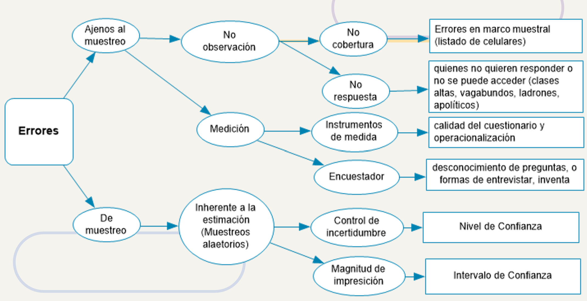


---
background-image: url("img/temp/05.png") 
background-size: cover
class: slideInRight, fadeOutLeft, middle, inverse

1. <span style="color:gray; font-size: 1em;">Introducción</span>  
2. <span style="color:gray; font-size: 1em;">¿Qué es el muestreo?</span>  
3. <span style="color:gray; font-size: 1em;">Conceptos claves del muestreo</span>  
4. <span style="color:gray; font-size: 1em;">¿Qué sustenta la idea de "representatividad"?</span>  
5. <span style="font-size: 1.2em;">¿Cuáles son los errores del muestreo?</span>  
6. <span style="color:gray; font-size: 1em;">Elementos básicos de diseño de muestra</span>  
7. <span style="color:gray; font-size: 1em;">Tipos de muestreo</span>  


---
class: slideInRight, fadeOutLeft, middle

### ¿Cómo se diseña una muestra?
- Primer paso: definición del **marco muestral**
    - El ‘marco muestral’ son los insumos utilizados para identificar cada una de las unidades de muestreo.
    - Permite **enumerar** las **unidades de muestreo** para su **posterior selección**.
    - Suelen ser: listados de individuos (clientes etc.); listados de manzanas, distritos, mapas y planos.


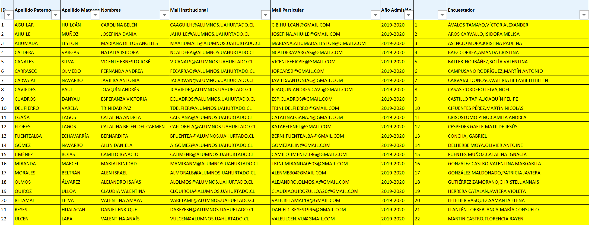

---
background-image: url("img/temp/02.jpg") 
background-size: cover
class: slideInRight, fadeOutLeft, middle

### En lo posible se busca que el marco:
  - Sea **completo**.
  - Esté **actualizado**.
  - **No** debe **incluir unidades que no correspondan** a la población que se analiza.
  - Debe **contener información suplementaria** que ayude a localizar a las unidades seleccionadas.
  - Debe ser **fácil** de utilizar.
  
> El marco muestral es CLAVE: la muestra recogida sólo podrá considerarse representativa de la población que está comprendida en el marco muestral.


---
class: slideInRight, fadeOutLeft, middle

### Definimos entonces:
- **Población/Universo**: agregado de elementos respecto del cual se recaba información.  
- **Población objetivo**: es una parte de la población, excluye elementos de difícil acceso o que son muy caros de encuestar.
- **Población marco**: es una parte de la población objetivo; se excluyen los elementos que no son encuestados por marco insuficiente o falta de cobertura.
- **Población de encuesta**: es una parte de la población marco; se excluyen los distintos tipos de no respuesta.


---
background-image: url("img/temp/02.jpg") 
background-size: cover
class: slideInRight, fadeOutLeft, middle


### ¿Cómo se calcula el tamaño de la muestra?

.pull-left[
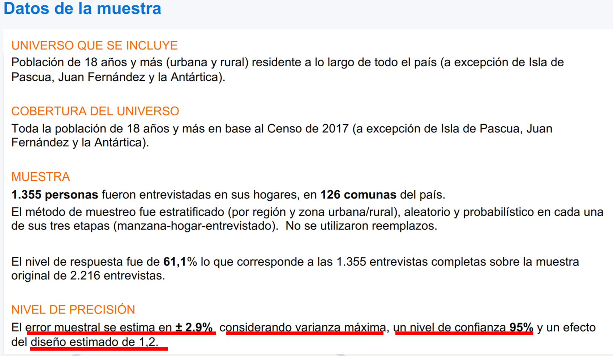]

.pull-right[
- Nivel de confianza de 95%
- Error de estimación +- 2.9%
- Varianza máxima: 0.5
- Efecto diseño: 1.2]

---
class: slideInRight, fadeOutLeft, middle

### Algunos conceptos claves:
- **Intervalo de Confianza (IC)**: Rango de valores que tiene una cierta probabilidad conocida de contener el verdadero valor del parámetro de la población (ej: {56; 67} o {35%; 52%}): valor se mueve entre X e Y.
- **Nivel de Confianza**: Es la probabilidad 1- α que es la proporción de veces que el intervalo de confianza realmente contiene el parámetro de población. Lo elige el/la investigador/a generalmente 90%, 95% o 99%: con cuánta confianza mi muestra está en el IC?
- **El error máximo de estimación**: Nos indica el mayor error que podemos cometer por predecir la proporción poblacional con una proporción muestral (ej: 2%): ¿cuánto error estoy dispuesto admitir?


---
background-image: url("img/temp/02.jpg") 
background-size: cover
class: slideInRight, fadeOutLeft, middle

### ¿Cuántos casos son necesarios?
- Cálculo del tamaño de la muestra mediante **MAS** (muestreo aleatorio simple).
- La fórmula incorpora el **tamaño de la población**, la **varianza** (de variable clave), el error máximo de estimación, y el nivel de confianza deseado.

---
class: slideInRight, fadeOutLeft, middle

.pull-left[
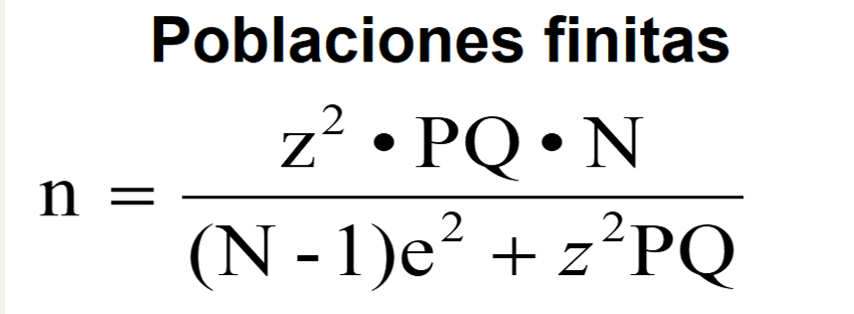]

.pull-right[
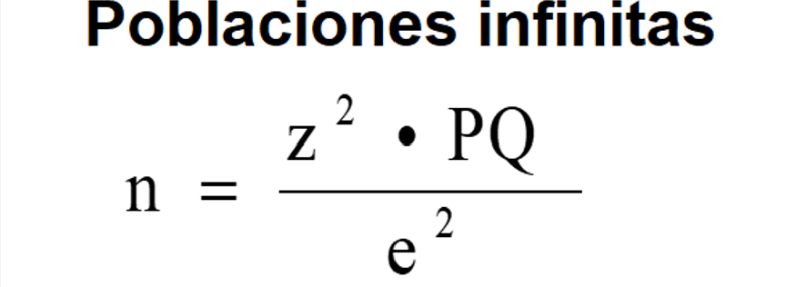]


- N: Tamaño de población
- e: Error máximo admisible (mitad de IC) 
- PQ: Variación poblacional (0.5 * 0.5; máxima)
- z: Coeficiente de confianza (asociado a NC, áreas bajo la curva normal) 

Lo infinito: Población/Universo mayor a 10.000

---
class: slideInRight, fadeOutLeft, middle

### Ejercicio: Considerando muestras infinitas
- a) ¿Cuántos casos se necesitan para una muestra aleatoria simple con un **error de 5%** y un **nivel de confianza de 90%** y una **varianza máxima**?
- b) ¿Cuántos casos se necesitan para una muestra aleatoria simple con un **error de 2%** y un **nivel de confianza de 95%** y una **varianza máxima**?

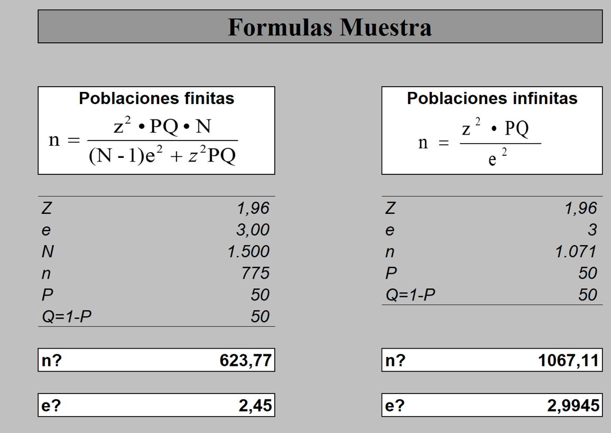

---
background-image: url("img/temp/05.png") 
background-size: cover
class: slideInRight, fadeOutLeft, middle, inverse

1. <span style="color:gray; font-size: 1em;">Introducción</span>  
2. <span style="color:gray; font-size: 1em;">¿Qué es el muestreo?</span>  
3. <span style="color:gray; font-size: 1em;">Conceptos claves del muestreo</span>  
4. <span style="color:gray; font-size: 1em;">¿Qué sustenta la idea de "representatividad"?</span>  
5. <span style="color:gray; font-size: 1em;">¿Cuáles son los errores del muestreo?</span>  
6. <span style="font-size: 1.2em;">Elementos básicos de diseño de muestra</span>  
7. <span style="color:gray; font-size: 1em;">Tipos de muestreo</span>  

---

#### Comparación entre Muestreo Probabilístico y No Probabilístico

| Característica                                  | Muestreo Probabilístico                                                                     | Muestreo No Probabilístico                                                                |
|-------------------------------------------------|---------------------------------------------------------------------------------------------|-------------------------------------------------------------------------------------------|
| Probabilidad de selección                       | Todos los elementos tienen una probabilidad conocida y distinta de 0 de ser seleccionados.  | Desigual probabilidad de selección entre las unidades de la población.                   |
| Permite inferencias                             | Sí, permite la inferencia estadística a la población general.                               | Limitado, no se prioriza para inferencia estadística directa a la población general.      |
| Costo y complejidad                             | Más caro y complejo debido al diseño y análisis necesario.                                  | Más barato y simple, ideal para estudios exploratorios o cuando los recursos son limitados.|
| Precisión                                       | Más preciso, gracias a la aleatoriedad y representatividad de la muestra.                  | Menos preciso, puede estar sesgado por la selección no aleatoria.                         |
| Uso                                             | Ideal cuando se busca generalizar los resultados a toda la población.                      | Utilizado por conveniencia, recursos limitados o cuando la inferencia no es lo central.   |


---
background-image: url("img/01.gif")
background-size: cover
class: slideInRight, fadeOutLeft, middle, inverse

## Muestreos Probabilísticos


---
class: slideInRight, fadeOutLeft, middle
### **Muestreo Aleatorio Simple (MAS)**
- La selección se realiza de un **listado de la población** asignándole **igual probabilidad a cada elemento**.
- Se caracteriza por:
    - Cada unidad tiene una probabilidad igual de participar en la selección.
    - La selección es totalmente aleatoria.
    - Todas las posibles muestras tienen igual probabilidad de ser elegidas.

---
class: slideInRight, fadeOutLeft, middle

#### Selección Aleatoria
- Por lo general, la selección aleatoria se hace computacionalmente. También existen tablas de números aleatorios.
- Como el MAS exige un listado exhaustivo, es imposible utilizarlo en poblaciones de magnitud elevada. Por ejemplo, es imposible hacer un MAS en todo Chile.

---
class: slideInRight, fadeOutLeft, middle
#### Listado de estudiantes de Antropología Universidad Alberto Hurtado: 220 personas


---
class: slideInRight, fadeOutLeft, middle


---
class: slideInRight, fadeOutLeft, middle

### Ventajas y Desventajas del Muestreo Aleatorio Simple

| Ventajas                                 | Desventajas                                                        |
|------------------------------------------|--------------------------------------------------------------------|
| Facilidad de los cálculos estadísticos   | Requiere listar y enumerar a todas las unidades de la población   |
| Elevada probabilidad de ser representativo | Resulta monótono y arduo en muestras grandes                      |
|                                          | La dispersión de la muestra hace que los costos sean elevados     |


---
background-image: url("img/temp/02.jpg") 
background-size: cover
class: slideInRight, fadeOutLeft, middle

### Muestreo Sistemático
- Es una variante del MAS. Se elige un **punto de arranque aleatorio** y se seleccionan casos en forma sucesiva según un intervalo numérico convencional.
- Sólo la **primera unidad de la muestra se elige al azar**.
- Los restantes elementos de la muestra se eligen sumando el coeficiente de elevación que es igual a N/n hasta llegar al n requerido.
- En trabajo en terreno es mucho más práctico que un MAS.

---
class: slideInRight, fadeOutLeft, middle


---
class: slideInRight, fadeOutLeft, middle

- ¿Alguién participó como **encuestador** en alguna encuesta?

---
class: slideInRight, fadeOutLeft, middle

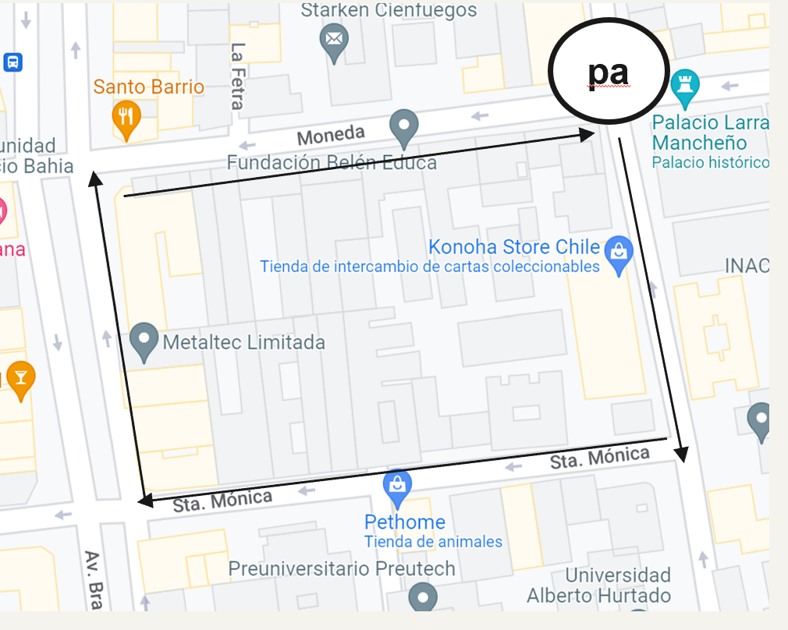

---
background-image: url("img/temp/02.jpg") 
background-size: cover
class: slideInRight, fadeOutLeft, middle

### Muestreo Estratificado
- Se caracteriza por la utilización de **información auxiliar** para **mejorar la eficiencia** en la **selección** de elementos y mejorar la **precisión de las estimaciones**.
- La información auxiliar corresponde a **variables de estratificación** que dividen a la población en estratos.
- Las variables de estratificaciones más utilizadas son edad, sexo, clase social, ocupación. Esto se debe a que tienden a estar recogidas en los marcos muestrales (como el CENSO).
- En nuestro caso realizaremos estratos según el **año de ingreso** a la carrera.  


---
class: slideInRight, fadeOutLeft, middle

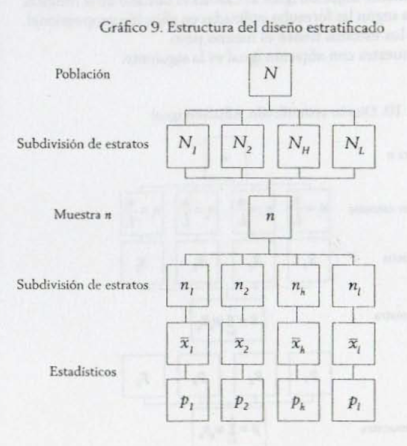

---
background-image: url("img/temp/02.jpg") 
background-size: cover
class: slideInRight, fadeOutLeft, middle
### Muestreo Estratificado (cont.)
- ¿Qué es un **estrato**? → Los estratos son grupos homogéneos de elementos por lo que no es preciso seleccionar un número elevado de casos para representar al estrato.
- Mientras **más homogéneo** sea el estrato, más precisa será la estimación.
- Las varianza entre los estratos es máxima y al interior de cada estrato es mínima.
- El fin es lograr que el estrato esté representado en la muestra.
- Logrará estimaciones más precisas siempre que:
    - Las variables de estratificación están relacionadas con los objetivos de la investigación.
    - De no ser así, no tendría sentido (se lograría una precisión similar a si no se hubiera estratificado).

---
class: slideInRight, fadeOutLeft, middle
- Ordeno por año de admisión


---
background-image: url("img/temp/02.jpg") 
background-size: cover
class: slideInRight, fadeOutLeft, middle
### Muestreo por Conglomerados

.pull-left[
- ¿Qué es un conglomerado? → conjunto de elementos con **valores diferentes entre sí** en la **variable medida**.
- Diferencias con el ME:
  - La lógica es inversa: El error disminuye en la medida que **aumenta la heterogeneidad** de cada uno de los conglomerados.
  - Se extrae una muestra aleatoria de conglomerados (no una muestra al interior de cada estrato).
  - La unidad de muestreo es el conglomerado y no el individuo.]

.pull-right[
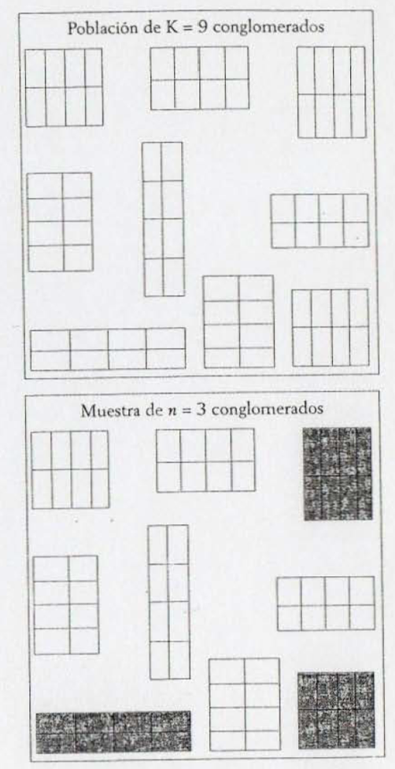]
---
class: slideInRight, fadeOutLeft, middle

### Muestreo Polietápico
- El MC da paso comúnmente a los muestreos polietápicos.
- Son **diseños complejos** caracterizados por la selección de muestras en etapas sucesivas.
- Cada etapa requiere su propio marco muestral. Hay así unidades primarias de muestreo (UPM), unidades secundarias de muestreo (USM), etc.
- La versión más sencilla tiene 2 etapas:
    - Se **seleccionan los conglomerados** (unidades de muestreo primarias).
    - Se elige mediante MAS a los miembros de la población a observar al interior de los conglomerados previamente seleccionados.
- Es el más típico muestreo nacional → por ejemplo, muestreo polietápico estratificado por conglomerados.

---
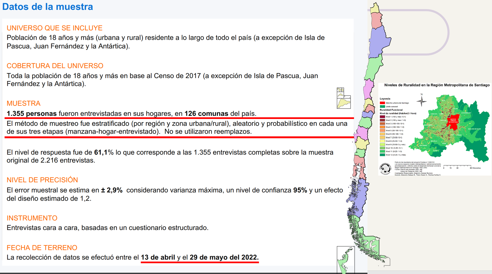


---

background-image: url("img/24.png")
background-size: 70%


---
class: slideInRight, fadeOutLeft, middle

#### Ejemplo 1: Encuesta Electoral para Santiago
- Paso 1: estratifico región y urbano/rural
- Paso 2: Selecciono Manzanas aleatoriamente
- Paso 3: Hago un listado de casas (construyo el marco muestra) y voy seleccionando Casas de una manzana de forma sistemática. Toco el timbre cada 3 casas
- Paso 4: 
 - Hago un listado de los miembros del hogar mayores de 18: Juan, Antonia, Carla, José.
 - Luego selecciono de forma aleatoria: Último que está de cumpleaños, Tabla kish

---
class: slideInRight, fadeOutLeft, middle

####Ejemplo 2:Percepciones sobre la desigualdad social en Santiago
Paso 1: estratifico manzanas por nivel socioeconómico
Paso 2: Selecciono Manzanas aleatoriamente
Paso 3: Hago un listado de casas (construyo el marco muestra) y voy seleccionando Casas de una manzana de forma sistemática. Toco el timbre cada 3 casas
Paso 4: 
 - Hago un listado de los miembros del hogar mayores de 18: José Pablo, María Ignacia, Trini, Jose Miguel.
- Luego selecciono de forma aleatoria: Último que está de cumpleaños, Tabla kish

---
class: slideInRight, fadeOutLeft, middle
### Muestreos No Probabilísticos

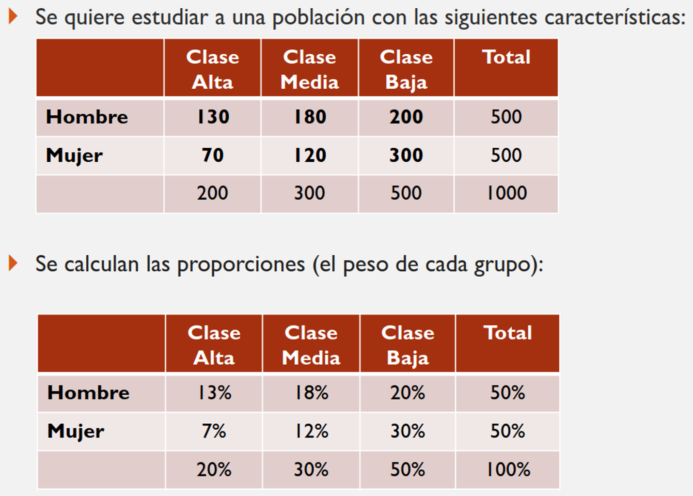

---
background-image: url("img/temp/02.jpg") 
background-size: cover
class: slideInRight, fadeOutLeft, middle


### Muestreo por Cuotas
- Es un muestreo no probabilístico muy utilizado. Intenta alcanzar grados mínimos de representatividad de un modo más simple.
- Procedimiento:
    - Se define una matriz con las características básicas de la población que interesa representar y se establece la proporción en que cada una de ellas existe.
    - Luego se determina el n total deseado (en base a criterios de factibilidad y estadísticos) y se distribuye entre cada una de las celdas (cuotas) de manera proporcional.
    - Finalmente, se le señala a los encuestadores que alcancen la cuota (es decir, que busquen un cierto número de encuestados que cumplan los requisitos de cada cuota).


---
background-image: url("img/temp/02.jpg") 
background-size: cover
class: slideInRight, fadeOutLeft, middle
### Ejercicio en clases


#### Instrucción
- Revise el marco muestral entregado y trate de identificar qué tipo de muestreo podría ser.

---
class: slideInRight, fadeOutLeft, middle
[kahoot](https://create.kahoot.it/share/mc2-muestreo/6e28a943-f161-4b49-ac6b-3e2c0a7f02ab)


