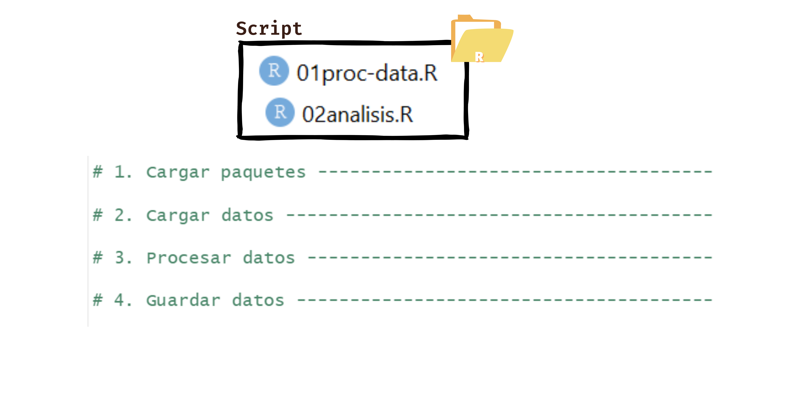
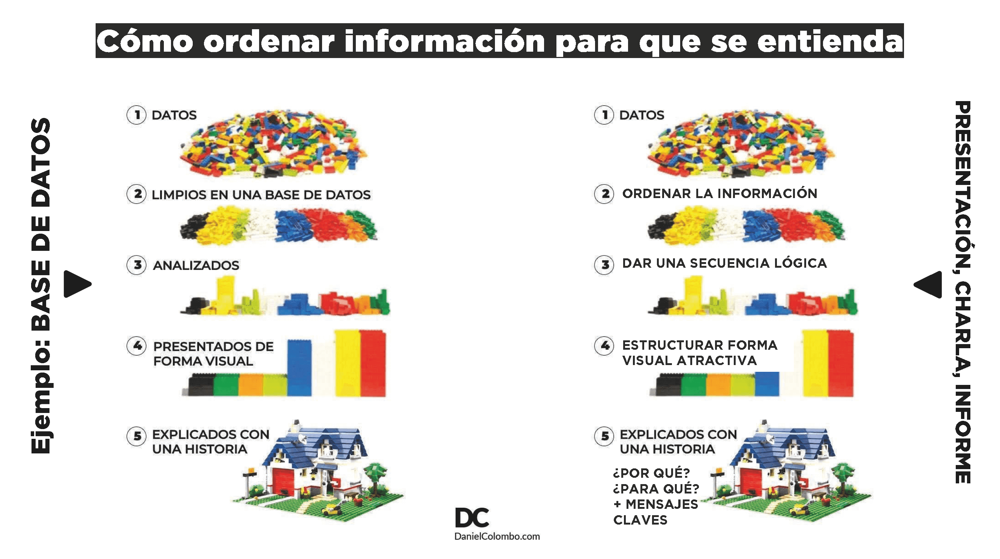
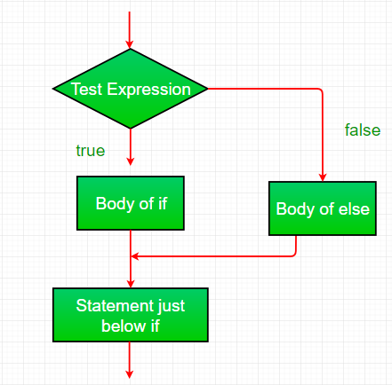

```{r setup, include=FALSE}
options(htmltools.dir.version = FALSE)
knitr::opts_chunk$set(
  fig.width=9, fig.height=3.5, fig.retina=3,
  out.width = "100%",
  cache = FALSE,
  echo = TRUE,
  message = FALSE, 
  warning = FALSE,
  hiline = TRUE
)
```

```{r xaringan-themer, include=FALSE, warning=FALSE}
library(xaringanthemer)
style_duo_accent(
  primary_color = "#1381B0",
  secondary_color = "#FF961C",
  inverse_header_color = "#FFFFFF"
)

pacman::p_load(tidyverse, gt,kableExtra )

```


### Flujo de trabajo


---
### Orden de script




---

## Tipos de datos


---
## Listas


---
class: center, middle

## pacman::p_load

- Resume las funciones library() e install.packages()
optimiza esta relación entre ambas pues solo las aplica cuando son necesarias (if requiere()), es decir, ¡no te reinicia R si ya está instalada la librería!


---

#Importación de bases de datos
A la hora de importar una base de datos nos podemos llegar a enfrentar a distintos tipos de archivos. En R contamos con **distintos paquetes y funciones** según el **tipo de extensión** del archivo:    

```{r echo=FALSE}

importacion <- tibble(
  "Tipo de archivo" = c("Texto Plano",
                        "Texto Plano",
                        "Texto Plano",
                        "Extension de R",
                        "Extension de R",
                         "Otros Softwares",
                         "Otros Softwares",
                         "Excel",
                         "Excel"),
           "Paquete" =c("readr",
                        "readr",
                        "readr",
                        "RBase",
                        "RBase",
                        "haven",
                        "haven",
                        "openxlsx",
                        "readxl"),
             "Extension" =c(".csv",
                          ".txt",
                          ".tsv",
                          ".RDS",
                          ".RDATA",
                          ".dta",
                          ".sav",
                          ".xlsx",
                          ".xls"),
         "Funciones" = c("read_csv()",
                           "read_txt()","read_tsv()",
                           "readRDS()", "open()",
                           "read_dta()","read_spss()",
                           "read.xlsx()","read_excel()")    
)  

kable(importacion, format = 'html') %>%
  kable_styling(bootstrap_options = c("striped", "hover")) %>% 
  collapse_rows(columns = 2)
```

---
#Importación de bases de datos

El primer y más importante parámetro de las funciones para importar datos suele llamarse  **`file`**. Allí debemos especificar la ruta hasta el archivo, incluyendo la extensión del mismo. 

Si tenemos abierto un proyecto, el punto de partida para la ruta a especificar será la carpeta del proyecto. Si queremos ir hacia atrás en las carpetas agregamos  **`../`**
```{r eval=FALSE, include=T}
base.vacunas<- read_csv(
  file = "../Fuentes/Covid19VacunasAgrupadas.csv",
  col_names = TRUE, # TRUE si la primera fila tiene nombres de columnas
  n_max = 100)      # Puedo especificar cuantas filas levantar

base.covid <- readRDS(file = "../Fuentes/base_covid_sample.RDS")
```
**IMPORTANTE**: Siempre que lean bases de datos asignarlas a un nuevo objeto. De lo contrario, las va a mostrar completas en consola y no va a guardarlas en el ambiente de trabajo (enviroment)


---

#Exportación de resultados
Por lo general, cada paquete que presenta funciones para importar bases de dato, tiene como complemento una función para exportar (guardar en el disco de nuestra PC) un objeto con la misma extensión. Ejemplos: 


 - el paquete **openxlsx** tiene una función denominada **`write.xlsx()`** que nos permite exportar un dataframe creando un archivo **.xslx**
 - En RBase la función **`saveRDS()`** nos permite exportar archivos de extensión **.RDS** (son menos pesados para trabajarlos luego desde R)

En general estas funciones tienen un primer parametro para especificar el objeto a exportar, y un segundo para especificar la ruta y el nombre de archivo a crear 

```{r eval=FALSE, include=T}
write.xlsx(x = objeto_resultados,file = "Resultados/cuadro1.xlsx")

saveRDS(object = objeto_resultados,file = "Resultados/base_nueva.RDS")
```

---

class: inverse, center, middle

# Data Wrangling

---

class: inverse, middle, center
background-image: url('img/caos_tidy.png')
background-size: cover
background-color: black


---
class:  middle, center

##"Todas las familias felices se parecen entre sí; pero cada familia infeliz tiene un motivo especial para sentirse desgraciada" - **Leon Tolstoi**

---
class:  middle, center

##“Tidy datasets are all alike, but every messy dataset is messy in its own way.” — **Hadley Wickham**.

---


---
#Data Wrangling

Es el proceso que más tiempo conlleva en el análisis de datos.


---
class: center, middle

##Tidyverse


---
class: center, middle

##Janitor


---
#Transformación

Mutate con if_else
class: center, middle

##if else


---

# Operadores lógicos

<table>
  <tr>
    <th><b>Operador</b></th>
    <th><b>Comparación</b></th>
    <th><b>Ejemplo</b></th>
    <th><b>Resultado</b></th>
  </tr>
  <tr>
    <td><code>x | y</code></td>
    <td>x Ó y es verdadero</td>
    <td><code>TRUE | FALSE</code></td>
    <td>TRUE</td>
  </tr>
  <tr>
    <td><code>x &amp; y</code></td>
    <td>x Y y son verdaderos</td>
    <td><code>TRUE &amp; FALSE</code></td>
    <td>FALSE</td>
  </tr>
  <tr>
    <td><code>!x</code></td>
    <td>x no es verdadero (negación)</td>
    <td><code>!TRUE</code></td>
    <td>FALSE</td>
  </tr>
  <tr>
    <td><code>isTRUE(x)</code></td>
    <td>x es verdadero (afirmación)</td>
    <td><code>isTRUE(TRUE)</code></td>
    <td>TRUE</td>
  </tr>
</table>
---
class: inverse, center, middle

#Vamos al código
