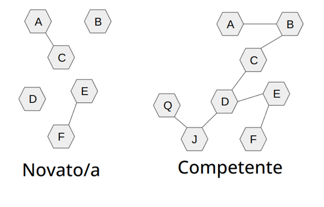
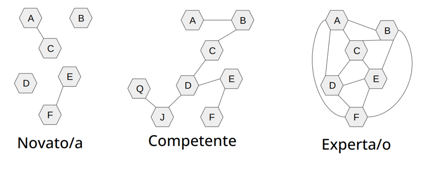
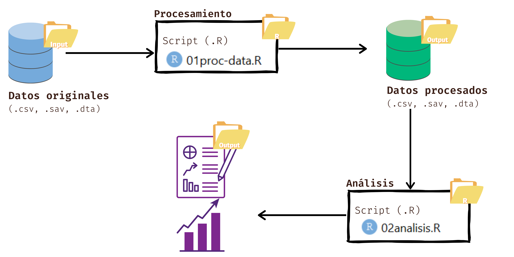
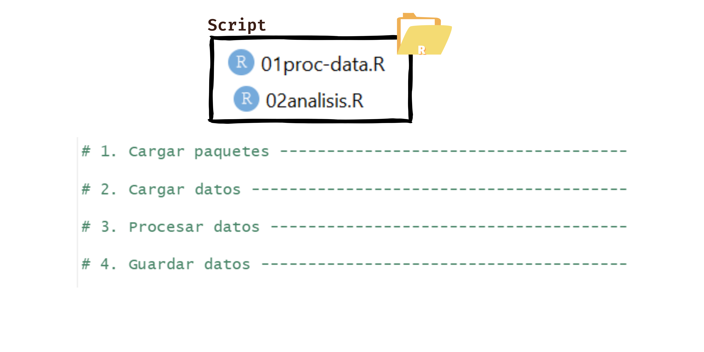
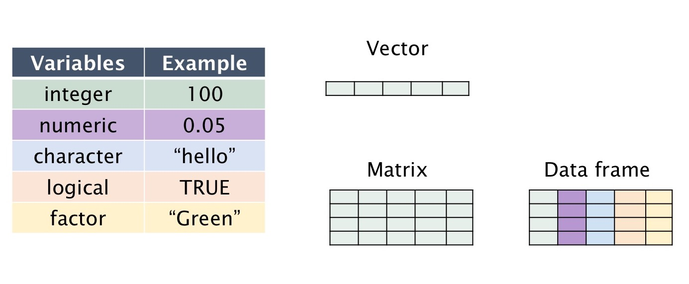
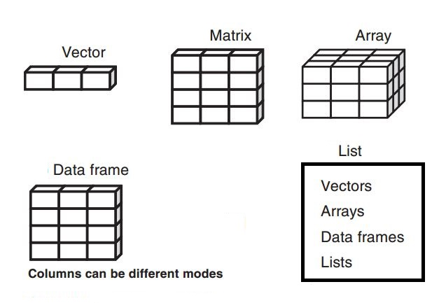
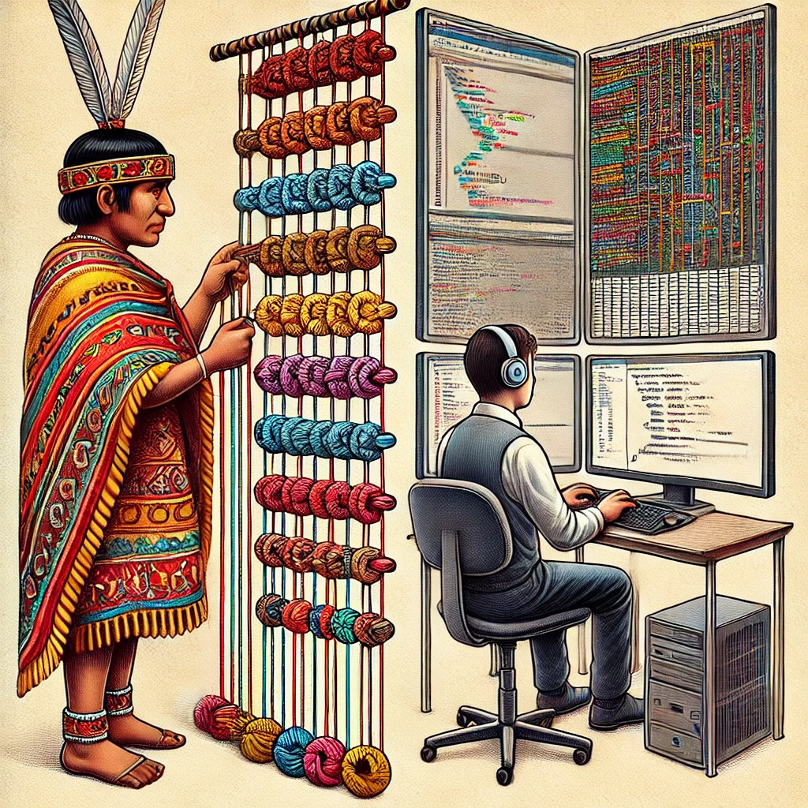

```{r setup, include=FALSE}
options(htmltools.dir.version = FALSE)
knitr::opts_chunk$set(
  fig.width=9, fig.height=3.5, fig.retina=3,
  out.width = "100%",
  cache = FALSE,
  echo = TRUE,
  message = FALSE, 
  warning = FALSE,
  hiline = TRUE
)
```

```{r xaringan-themer, include=FALSE, warning=FALSE}
library(xaringanthemer)
style_duo_accent(
  primary_color = "#1381B0",
  secondary_color = "#FF961C",
  inverse_header_color = "#FFFFFF"
)

pacman::p_load(tidyverse, gt,kableExtra, xaringan)

```


```{r xaringan-animate-css, echo=FALSE}
xaringanExtra::use_animate_css()
xaringanExtra::use_tachyons()
xaringanExtra::use_share_again()

```


## En esta clase


### 1. Repaso

### 2. Data Wrangling

#### 2.1 Limpieza de datos

#### 2.2 Transformación de variables

#### 2.3 Exportar

### 3. Gráficos con ggplot


---
class: inverse, center, middle

# 1. Repaso

---
# De persona novata a experta



---
# De persona novata a experta


---

background-size: contain
background-repeat: no-repeat
background-position: center center
background-image: url("img/quipu0.png")


---

### Flujo de trabajo



---
### Orden de script




---

## Tipos de datos



---
## Listas




---

#Importación de bases de datos
A la hora de importar una base de datos nos podemos llegar a enfrentar a distintos tipos de archivos. En R contamos con **distintos paquetes y funciones** según el **tipo de extensión** del archivo:    

```{r echo=FALSE}

importacion <- tibble(
  "Tipo de archivo" = c("Texto Plano",
                        "Texto Plano",
                        "Texto Plano",
                        "Extension de R",
                        "Extension de R",
                         "Otros Softwares",
                         "Otros Softwares",
                         "Excel",
                         "Excel"),
           "Paquete" =c("readr",
                        "readr",
                        "readr",
                        "RBase",
                        "RBase",
                        "haven",
                        "haven",
                        "openxlsx",
                        "readxl"),
             "Extension" =c(".csv",
                          ".txt",
                          ".tsv",
                          ".RDS",
                          ".RDATA",
                          ".dta",
                          ".sav",
                          ".xlsx",
                          ".xls"),
         "Funciones" = c("read_csv()",
                           "read_txt()","read_tsv()",
                           "readRDS()", "open()",
                           "read_dta()","read_spss()",
                           "read.xlsx()","read_excel()")    
)  

kable(importacion, format = 'html') %>%
  kable_styling(bootstrap_options = c("striped", "hover")) %>% 
  collapse_rows(columns = 2)
```

---
#Importación de bases de datos

El primer y más importante parámetro de las funciones para importar datos suele llamarse  **`file`**. Allí debemos especificar la ruta hasta el archivo, incluyendo la extensión del mismo. 

Si tenemos abierto un proyecto, el punto de partida para la ruta a especificar será la carpeta del proyecto. Si queremos ir hacia atrás en las carpetas agregamos  **`../`**
```{r eval=FALSE, include=T}
base.vacunas<- read_csv(
  file = "../Fuentes/Covid19VacunasAgrupadas.csv")    

base.covid <- readRDS(file = "../Fuentes/base_covid_sample.RDS")
```
**IMPORTANTE**: Siempre que lean bases de datos asignarlas a un nuevo objeto. De lo contrario, las va a mostrar completas en consola y no va a guardarlas en el ambiente de trabajo (enviroment)
---
#Exportación de resultados
Por lo general, cada paquete que presenta funciones para importar bases de dato, tiene como complemento una función para exportar (guardar en el disco de nuestra PC) un objeto con la misma extensión. Ejemplos: 


 - el paquete **openxlsx** tiene una función denominada **`write.xlsx()`** que nos permite exportar un dataframe creando un archivo **.xslx**
 - En RBase la función **`saveRDS()`** nos permite exportar archivos de extensión **.RDS** (son menos pesados para trabajarlos luego desde R)

En general estas funciones tienen un primer parametro para especificar el objeto a exportar, y un segundo para especificar la ruta y el nombre de archivo a crear ()

```{r eval=FALSE, include=T}
write.xlsx(x = objeto_resultados,file = "Resultados/cuadro1.xlsx")

saveRDS(object = objeto_resultados,file = "Resultados/base_nueva.RDS")
```


---

background-size: contain
background-repeat: no-repeat
background-position: center center
background-image: url("img/quipu.png")

---

## Definición de Términos

### Quipú
- Artefacto inca de cuerdas y nudos
- Función: registro de información económica, demográfica, histórica
- Operadores: quipucamayocs

### Base de Datos
- Sistema digital para almacenar y manipular información
- Estructura: tablas con filas y columnas
- Acceso mediante lenguajes de programación

---

## Analogías Funcionales

### Almacenamiento de Información
- **Quipú:** Posición y color de hilos, tipos de nudos
- **Base de Datos:** Registros digitales en estructuras predefinidas

### Sistematización y Orden
- **Quipú:** Orden físico y visual
- **Base de Datos:** Orden lógico definido por esquemas digitales

---

## Importancia Cultural y Tecnológica

.pull-left[

### Contexto Cultural
- **Quipú:** Reflejo de la cosmovisión inca, sin sistema de escritura
- **Base de Datos:** Reflejo de avances tecnológicos y manejo de información en la sociedad moderna

### Especialización del Conocimiento
- **Quipú:** Quipucamayocs, especialistas en su manejo
- **Base de Datos:** Programadores y analístas de datos]


.pull-right[
]


---

background-image: url("img/quipueg.jpg")
background-size: cover


---
class: inverse, center, middle


# 2. Data Wrangling


---
background-image: url("img/limpieza.png")
background-size: cover


---
background-image: url("img/herramientas.png")
background-size: cover

---

class: center, middle

# 2.1 Limpieza de datos
## Janitor


---
## Limpiar nombres de variables

En general los nombres de las variables de bases de datos (en bruto) tienen la forma 
```{r, eval=TRUE}
library(openxlsx)
datos <- read.xlsx(xlsxFile = "base/Encuesta Estudiantes Antropología 2023 (respuestas).xlsx", 
                   startRow = 2)
#extraigo el nombre de todas las variables y las observo
names (datos)
```


 

---

## Limpiar nombres de variables 1

```{r, eval=FALSE, include=TRUE}
# Janitor
#install.packages("janitor")
library(janitor)

datos <- janitor::clean_names(datos)# transformo todo a minúscula, quito tildes, saco signos, borro espacios
```
---

## Limpiar nombres de variables


```{r, eval=TRUE}
library(openxlsx)
datos <- read.xlsx(xlsxFile = "base/Encuesta Estudiantes Antropología 2023 (respuestas).xlsx", 
                   startRow = 2)
datos <- janitor::clean_names(datos)
names (datos)
```

---
background-size: contain
background-repeat: no-repeat
background-position: center center
background-image: url("img/limpieza2.png")


---
## Reducir nombres de variables 2

### Existen nombres de variables muy largos, los quiero acortar.


```{r, eval=FALSE, include=TRUE}
names(datos) <- substring(names(datos), 1, 5)
```

El operador de asignación <- asigna el vector resultante de substring(names(datos), 1, 5) de vuelta a names(datos), reemplazando los nombres originales por los truncados.


---
## Limpiar nombres de variables

### Asignar nuevos nombres

4. Renombro algunas variables en específico
Posibilidad de renombrar uno por uno las variables de interés. 

```{r, eval=FALSE}
libro_códigos <- read.xlsx(xlsxFile = "base/Encuesta Estudiantes Antropología 2023 (respuestas).xlsx", startRow = 2)
names(libro_códigos)

datos <- datos %>% dplyr::rename(  # primero nuevo nombre y luego nombre antiguo
                        edad = p02, 
                        genero = p03, 
                        annio = p04, 
                        comuna_actual = p05, 
                        comuna_pre= p06, 
                        tipo_colegio = p07, 
                        puntaje = p08, 
                        estudio_trabajo = p09, 
                        educacion_madre = p10, 
                        trabaja_madre =p11, 
                        empleo_madre =p12, 
                        educacion_padre =p13, 
                        trabaja_padre =p14, 
                        empleo_padre = p15, 
                        psdhogar = p17, 
                        clase_social_subjetiva = p18)
```
---
## Limpiar nombres de variables

Finalmente observo los nombres de mis nuevas variables

```{r, eval=FALSE}
names(datos)

```
 [1] "mar"                    "edad"                   "genero"                
 [4] "annio"                  "comuna_actual"          "comuna_pre"            
 [7] "tipo_colegio"           "puntaje"                "estudio_trabajo" 
---
class: center, middle

# 2.2 Transformación de contenido de casos

---
## Transformaciones/limpieza en variables numéricas

Limpieza inicial de variables numéricas

```{r, eval=FALSE}
table(datos$edad) # vemos el ingreso de una variable que dice "años"
class (datos$edad) # Se considera "character"
```
> table(datos$edad) # vemos que hay un caso que dice "años"

     19      20      21      22      23 24 años      30 
      1       8       4       3       3       1       1 
> class (datos$edad) # Se considera "character"
[1] "character"

Lee la variable como `character` porque existe una observación que dice años

---
## Transformaciones/limpieza en variables numéricas

Limpieza inicial de variables numéricas

Eliminamos todo lo que no sea número de la variable numérica
```{r, eval=FALSE}
datos$edad <- as.numeric(gsub("[^0-9]+", "", datos$edad)) # elimino todo lo que no es número
```
## Explicación: 
* **[^0-9]** busca cualquier secuencia de caracteres que no sean dígitos (0-9)
  + los reemplaza con una cadena vacía "". 
  + elimina cualquier carácter que no sea numérico de la columna "edad"
  + as.numeric: transforma en numérico. 
---

background-size: contain
background-repeat: no-repeat
background-position: center center
background-image: url("img/asnumeric.png")


---
## Transformaciones/limpieza en variables numéricas

Limpieza inicial de variables numéricas

Finalmente se comprueba si la transformación resulta correctamente

```{r, eval=FALSE}
class (datos$edad) # compruebo si es numérico
table(datos$edad) # observo como quedó variable
```
.pull-left[
* class (datos$edad) # compruebo si es numérico
* table(datos$edad) # observo como quedó variable

]
.pull-right[ 
| Edad | Frecuencia |
|-------------- | -------------- |
| 19           | 1              |
| 20           | 8              |
| 21           | 4              |
| 22           | 3              |
| 23           | 3              |
| 24           | 1              |
| 30           | 1              |
]
 
---
# Recodificación de variables

Recodificación de tipo de medición de variable: paso de `numérica` a `ordinal`

Existen 2 funciones que usamos de manera combinada, `mutate` y `case_when`

```{r, eval=FALSE}
datos <- datos %>% 
  mutate (edadr= case_when (edad %in% c(18:20) ~ "18 a 20", 
                            edad %in% c(21:23) ~ "21 a 23", 
                            edad >= 24 ~ "24 o más"))
```

+ **mutate**: función para modificar/crear variables
+ **edadr**: variable nueva
+ **case_when**: argumumento al interior de mutate para decir, cuando se da "x" transformalo en "y"
+ **edad**: variable vieja
+ **~**: indica la modificación


---
# Recordemos los operadores lógicos

.pull-left[

| Operador | Descripción             | Ejemplo                              |
|----------|-------------------------|--------------------------------------|
| ==       | Igual a                 | `edad == 5`                          |
| !=       | No es igual a           | `sexo != "F"`                        |
| <        | Menor que               | `edad < 18`                          |
| >        | Mayor que               | `edad > 18`                          |
| <=       | Menor o igual que       | `edad <= 18`                         |
| >=       | Mayor o igual que       | `edad >= 65`                         |
| &        | Y lógico (AND)          | `sexo != "M" & edad <= 18`            |
]

.pull-left[
+ **&**:  AND: Cuando se cumplen ambas condiciones
+ **|**:  OR: Cuando se cumple una u otra condición
+ **%in%**: Incluye. Lo que está a la izquierda está incluido en lo q está a la derecha
]


---
# Transformación de variables

Recodificación de tipo de medición de variable: paso de `numérica` a `ordinal`.
Comparamos:

```{r, eval=FALSE}
table(datos$edad)
table(datos$edadr)
```


.pull-left[
> table(datos$edad)

| Edad | Frecuencia |
|-------------- | -------------- |
| 19           | 1              |
| 20           | 8              |
| 21           | 4              |
| 22           | 3              |
| 23           | 3              |
| 24           | 1              |
| 30           | 1              |
]
 
.pull-right[

> table(datos$edadr)

| Edad recodificada    | Frecuencia |
|----------------- | -------------- |
| 18 a 20          | 9              |
| 21 a 23          | 10             |
| 24 o más         | 2              |

+ entonces: **¿Qué es recodificar?**

] 
 
---
background-size: contain
background-repeat: no-repeat
background-position: center center
background-image: url("img/recode.png")
 
 
 
---
## Transformaciones/limpieza en variables cualitativas

En las variables categóricas de pregunta abierta cada uno responde como quiere, por lo tanto exite el problema de homogeneizar las respuestas a estas variables para poder analizar posteriormente
```{r, eval=FALSE}
table(datos$genero)
table(datos$annio)
table(datos$comuna_actual) #que cosa rara observa? 
table(datos$comuna_pre) #que cosa rara observa? 
```
* ¿Cómo homogeneizo los valores escritos?
+ Algunos tienen mayúsculas y minusculas en diversas letras
+ Algunos usan tildes y otros no
+ Uno escribe `Santiago` y otro `Santiago centro`
---
## Transformaciones/limpieza en variables cualitativas

Homogeinizo categorías de respuesta, sin tildes, en minúsculas y cambio espacios por guión bajo (_)
```{r, eval=FALSE}
#saco caracteres típicos del español (ñ), elimino comas y espacios y pongo todo en minuscula

datos <- datos %>%
  mutate(comuna_actual = stringi::stri_trans_general(comuna_actual, "Latin-ASCII"), 
         comuna_actual = tolower (comuna_actual), 
         comuna_actual = gsub(" ", "_", comuna_actual)) 

#Observo
table(datos$comuna_actual) 
```

+ **mutate**: modifica o crea una variable
+ **comuna_actual**: variable nueva
+ **stri_trans_general(comuna_actual, "Latin-ASCII")**:  borra tildes y ñ
+ **tolower (comuna_actual)**: transforma todo en minúscula
+ **comuna_actual = gsub(" ", "_", comuna_actual)**: cambia espacios a _

---
## Transformaciones/limpieza en variables cualitativas

Recodificar con `recode` permite recodificar de manera personalizada las categorías de la variable 
```{r, eval=FALSE}
#recodifico
datos <- datos %>%
  mutate(comuna_actual = recode(comuna_actual,
                             "puente_alto_" = "puente_alto",
                             "santiago_centro" = "santiago",
                             "san_felipe,_v_region" = "san felipe", 
                             "paine_" = "paine"))
table(datos$comuna_actual) 
```

+ **mutate**: modifica o crea una variable
+ **comuna_actual**: variable nueva
+ **recode**: función para recodificar
+ **comuna_actual**: variable vieja (se pisan)
+ **la coma**: va separando las distintas recodificaciones
+ **valores viejos** = valores nuevos


---
background-size: contain
background-repeat: no-repeat
background-position: center center
background-image: url("img/Data_Wrangling.png")


---
# Finalmente guardo mi base

```{r, eval=FALSE}
dir.create(path = "output")
write.xlsx(x = datos,file = "output/Encuesta_Antropología_Limpia")
```

+ **dir.create**: crea un directorio nuevo
+ **write.xlsx**: crea una base de datos con las modificaciones realizadas


---


background-size: contain
background-repeat: no-repeat
background-position: center center
background-image: url("img/datos.png")


---


---

class: inverse, center, middle

# Vamos a la sintaxis...