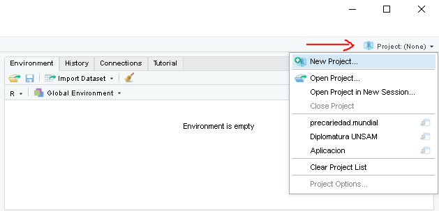
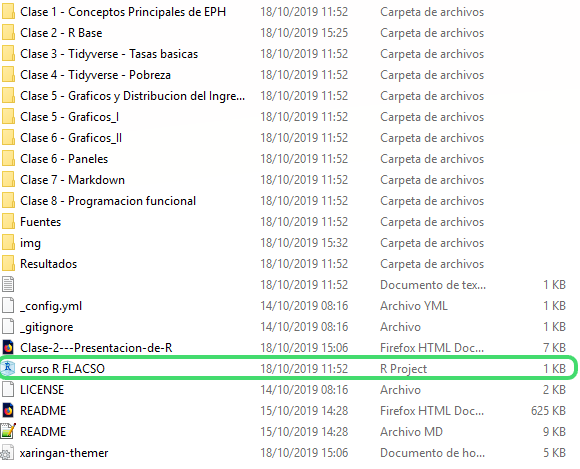

---
output:
  html_document:
    df_print: paged
pdf_document: default
keep_yaml: no
---

# Nivelación R: Repaso R base y {tidyverse}
### Metodos Cuantitativos 2 - 2023


```{r, include = F}
library(tidyverse)
library(kableExtra)

```

*Instrucciones: Seleccione la alternativa correcta*


1. ¿Qué significa asignar objetos al “environment” y que signo utiliza?
    a. Significa concatenar valores en un vector y utiliza el signo **%>%**
    b. Significa guardar los objetos (valores, vectores, bases de datos, etc.) en el “environment” y utiliza el signo **<-**
    c. Significa ejecutar los comandos del script para que los lea la “consola” y se realiza con ctrl+enter. 


2. Para la siguente expresión `X <- Y` ¿Qué representa lo que está a la izquierda (X) y lo que está a la derecha (Y) del operador `<-`?
    a. Lo que está a la izquierda (X) da el nombre al objeto de lo que quiero guardar en el “environment” y lo que está a la derecha (Y) es lo que efectivamente guardo (valor, vector, base de datos) 
    b. Lo que está a la derecha (Y) da el nombre al objeto de lo que quiero guardar en el “environment” y lo que está a la derecha (X) es lo que efectivamente guardo (valor, vector, base de datos) 


3. Seleccione el orden correcto de los siguientes objetos considerando la cantidad de dimensiones e información de MAYOR a MENOR (¿Cuál tiene más dimensiones y más información? ¿Cuáles le siguen?)  
    a. Categorías de variable, Vector (Variable), Base de datos
    b. Vector (Variable), Categorías de variable, Base de datos
    c. Base de datos, Vector (Variable), Categorías de variable


4. ¿Qué representan tradicionalmente las filas y las columnas en una Base de datos?
    a. Filas son las variables y columnas son los casos
    b. Filas son los casos y columnas las variables
  
5. ¿Qué es un caso?
    a. Son los elementos que caracterizan según su variación a una persona, institución, hogar, etcétera. 
    b. Es una unidad de análisis (personas, instituciones, hogares, países) en particular a la que se le identifican una serie de características, identificadas como variables (edad, género, notas en la universidad) 


6. ¿Qué es y cuáles son las partes de una función en R? Considere los siguientes elementos: `f(x,y,z)`
    a. Es un procedimiento para realizar distintas operaciones, donde f es la función, se abre paréntesis y al interior van los distintos argumentos separados por coma. 
    b. Es la característica de una variable a resumir, donde f es la base, se abre paréntesis y al interior van las distintas características separadas por coma. 


7. ¿Para qué sirve crear **proyectos** en R Studio? (puede seleccionar más de una alternativa)
    a. Permite abrir una base de datos y script
    b. Permite decirle a R que **lea** todos los archivos (por ejemplo: script, bases de datos) desde la carpeta en particular donde se sitúa el proyecto. 
    c. Permite asegurar que al enviar mi proyecto a otra persona, las rutas (por ejemplo, las que permiten abrir bases de datos) sean correctamente ejecutadas pues son leídas desde donde se sitúa el proyecto.
    d. Asegura que funcione {tidyverse}







8. Para abrir una base de datos: ¿qué orden ÓPTIMO de procesos es el más recomendable?

a. 
```{r eval=FALSE}
# 1. Utilizar una función que permita abrir esa base
# 2. Observar donde se sitúa la base en el proyecto (por ejemplo, subcarpeta BASES)
# 3. Guardar la base en mi entorno de trabajo.

```


b. 
```{r eval=FALSE}
# 1. Crear una carpeta en mi disco duro
# 2. Generar un proyecto al interior de la carpeta creada 
# 3. Generar una subcarpeta que contenga la base (por ejemplo, poniéndole el nombre Bases)
# 4. Considerar el formato (extensión) en que está la base: .xls (Excel), .rds (R), .cvs, .sav (SPSS)
# 5. Utilizar una función específica que permita abrir la base considerando su formato.
# 6. Observar la RUTA, donde se sitúa la base en el proyecto (siguiendo ejemplo, en la subcarpeta BASES)
# 6.1. El argumento suele ser (file = "ruta/archivo"); aunque depende del paquete
# 7. Guardar la base en mi entorno de trabajo, poniendole un nombre y asignandola (<-)
```


### Tabla de tipos de archivos, paquetes, extensión y función

```{r echo=FALSE}
importacion <- tibble(
  "Tipo de archivo" = c("Texto Plano",
                        "Texto Plano",
                        "Texto Plano",
                        "Extension de R",
                        "Extension de R",
                         "Otros Softwares",
                         "Otros Softwares",
                         "Excel",
                         "Excel"),
           "Paquete" =c("readr",
                        "readr",
                        "readr",
                        "RBase",
                        "RBase",
                        "haven",
                        "haven",
                        "openxlsx",
                        "readxl"),
             "Extension" =c(".csv",
                          ".txt",
                          ".tsv",
                          ".RDS",
                          ".RDATA",
                          ".dta",
                          ".sav",
                          ".xlsx",
                          ".xls"),
         "Funciones" = c("read_csv()",
                           "read_txt()","read_tsv()",
                           "readRDS()", "open()",
                           "read_dta()","read_spss()",
                           "read.xlsx()","read_excel()")    
)  

kable(importacion, format = 'html') %>%
  kable_styling(bootstrap_options = c("striped", "hover")) %>% 
  collapse_rows(columns = 2)
```


9. ¿Para qué sirve la función `names()` y cómo se utiliza?
    a. Para conocer las categorías únicas de una variable en particular; se utiliza así `names(base$variable)`
    b. Para conocer las variables de una base de datos en particular; se utiliza así `names(base)`
    c. Para conocer los estadísticos descriptivos de una base en particular; se utiliza así `names(base)`

10. ¿Para qué sirve la función `unique()` y cómo se utiliza?
    a. Permite identificar las variables de una base de datos; se utiliza así: `unique (base)`
    b. Permite identificar las categorías de una variable de una base de datos; se utiliza así: `unique (base)`
    c. Permite identificar las categorías únicas de una variable de una base de datos; se utiliza así: `unique (base$variable)`

11. ¿Qué es un paquete o librería en R?
    a. Es una operación a realizar en R
    b. Es conjunto de funciones, datos y documentación que amplían la funcionalidad del lenguaje R (R base). Se están continuamente creando por usuarios en todo el mundo. Se deben instalar y luego abrir. 
    c. Son programas estadísticos

12. ¿Qué es {tidyverse}, cómo lo instalo y cómo hago que funcione en mi sesión de trabajo?
    a. Es un paquete de R; lo instalo con `install.packages(tidyverse)`; lo abro con `library(tidyverse)`
    b. Es un paquete de R; lo instalo con `install.packages(“tidyverse”)`; lo abro con `library(tidyverse)`
    c. Es un conjunto de paquetes de R; lo instalo con `install.packages(“tidyverse”)`; lo abro con `library(tidyverse)`


13. Para seleccionar un conjunto de variables de una base de datos, puedo hacerlo con el R Base o con tidyverse, ¿Cómo lo hago?

a. 
```{r eval=FALSE}
#Con R Base
base[, c(“variable1”, “variable2”, “variable3)] 

#Con tidyverse
base %>% 
  filter (variable1, variable2, variable3)
```

b. 
```{r eval=FALSE}
#Con R Base
base[ c(“variable1”, “variable2”, “variable3), ]  

#Con tidyverse
base %>% 
  select (variable1, variable2, variable3)
```

c. 
```{r eval=FALSE}
#Con R Base
base[,c(“variable1”, “variable2”, “variable3) ] 

#Con tidyverse
base %>% 
  select (variable1, variable2, variable3)

```


14. ¿Para que sirve `mutate ()` de tidyverse y cómo se recodifica una variable cuantitativa a rangos de la misma a través de esa función? 

a. Sirve para crear o modificar variables a partir de variables que ya tenemos en nuestra base de datos; una variable cuantitativa se recodifica de la siguiente forma: 
```{r eval=FALSE}
base %>% 
  mutate(variable_nueva = case_when(variable_vieja %in% c(desde:hasta) ~ "desde a hasta", 
                                    variable_vieja %in% c(desde:hasta) ~ "desde a hasta")
```

b. Sirve para recodificar variables a partir de variables que ya tenemos en nuestra base de datos; una variable cuantitativa se recodifica de la siguiente forma:
    
```{r eval=FALSE}
base %>% 
  mutate(variable_nueva = case_when(variable_vieja %in% c(desde:hasta) ~ "desde a hasta", 
                                    variable_vieja %in% c(desde:hasta) ~ "desde a hasta")
```

c. Sirve para  seleccionar variables a partir de variables que ya tenemos en nuestra base de datos; una variable cuantitativa se recodifica de la siguiente forma: 
```{r eval=FALSE}
base %>% 
  mutate(variable_nueva = case_when(variable_vieja %in% c(desde:hasta) ~ "desde a hasta",
                                           variable_vieja %in% c(desde:hasta) ~ "desde a hasta")
```


14. ¿Cómo interpretaría la siguiente instrucción y que estaría indicando el operador %>%?

```{r eval=FALSE}
base_r <- base %>% 
  select(1, sexo, starts_with("hogar")) %>% 
  filter (sexo %in% c("Femenino", "No binario")) %>% 
  mutate(ingresos_r = case_when(ingresos %in% c(1:999)~ "Ingresos medios",
                                  ingresos >= 1000 ~ "Ingesos altos")) 
```

a. Se está efectuando una **selección** de variables por posición (1), por el nombre de una variable (sexo), y si parte con "hogar"; luego se realiza un **filtro** para elegir en la variable sexo sólo los resultados "Femenino" y "No binario"; para finalizar se realiza una recodificación que crea la variable ingresos_r a partir de la variable ingresos. El operador %>% permite hacer espacios entre procesos.

b. Se está creando una nueva base (base_r) y guardando en el ambiente de trabajo a partir de una base anterior (base); se está efectuando una **selección** de variables por posición (1), por el nombre de una variable (sexo), y si parte con "hogar"; luego se realiza un **filtro** para elegir en la variable sexo sólo los resultados "Femenino" y "No binario"; para finalizar se realiza una recodificación que crea la variable ingresos_r a partir de la variable ingresos. El operador %>% permite realizar un procedimiento a partir de un elemento anterior, concatenando varios procedimientos. 

c. Se está creando una nueva base (base_r) y guardando en el ambiente de trabajo a partir de una base anterior (base); se está efectuando una **filtro** de variables por posición (1), por el nombre de una variable (sexo), y si parte con "hogar"; luego se realiza un **selección** para elegir en la variable sexo sólo los resultados "Femenino" y "No binario"; para finalizar se realiza una recodificación que crea la variable ingresos a partir de la variable ingresos_r. El operador %>% resume procesos.  