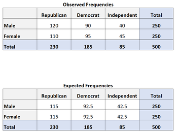

```{r xaringan-themer, include=FALSE, warning=FALSE}
library(xaringanthemer)
style_duo_accent(primary_color = "#035AA6", secondary_color = "#03A696")

```


## Pruebas de hipótesis

- Herramientas utilizadas en la investigación científica y la toma de decisiones para determinar si una afirmación **sobre una población** es **estadísticamente significativa**. 
- Se basan en la comparación de los datos observados con los que se esperarían si la afirmación fuera verdadera.

**Pasos**:
- Formulación de la hipótesis nula (H0) y la hipótesis alternativa (Ha).
- Selección del nivel de significancia, que determina la probabilidad de cometer un error de tipo I (rechazar H0 cuando es verdadera): el p-value (en Ciencias Sociales se utiliza en general un 95%)
- Selección de la prueba estadística apropiada y el cálculo del valor de la prueba.
-Comparación del valor de la prueba con un valor crítico o el intervalo de confianza para determinar si se rechaza o no la hipótesis nula.

---


#P-Valor

- Pregunta: 
  + ¿Hay relación entre raza y orientación política?
  + H nula: no existe relación entre raza y política
  + H alternativa: si existe relación entre raza y política
- Prueba de hipótesis: 
  + Se observa si el p-valor es inferior o no a 0,05
  + Si es inferior a ese valor se puede decir con un 95% de confianza que se rechaza la hipotesis nula y se acepta la hipótesis alternativa


---

## Chi cuadrado

- Prueba estadística utilizada para determinar si hay una asociación significativa entre dos variables categóricas. - Compara si hay diferencia significativa entre distribución observada y distribución esperada bajo un modelo de independencia.

El proceso implica los siguientes pasos:

- Formular la hipótesis nula [no hay relación] y la hipótesis alternativa [si hay relación]
- Construir una tabla de contingencia: frecuencias observadas para cada combinación de categorías de las dos variables.
- Calcular el estadístico de prueba de chi cuadrado a partir de la tabla de contingencia.
- Comparar el valor de la prueba con un valor crítico de chi cuadrado o calcular el p-valor para determinar si se rechaza o no la hipótesis nula.


---

# Frecuencias esperadas y observadas

.pull-left[

]

.pull-rigth[


].

- **Frecuencias esperadas**: número de observaciones que se esperarían en cada categoría o grupo si no hubiera una relación entre las variables.

```{r results='hide'}
230*250/500
```

---
## Distribución Chi cuadrado

.pull-left[


- veo el resultado
- veo ni n: número de casos
- veo mi nivel de confianza
- el cruce un valor que debe ser superior al que me dio en mi resultado
- si es así es significativo
].

.pull-right[

].

---
```{r include=FALSE}
pacman::p_load(tidyverse, openxlsx, readxl,readr,janitor, forcats, writexl, DataExplorer, 
               datos,  knitr, gt, summarytools, ggthemes, hrbrthemes)

datos <- datos::encuesta
datos$raza <- datos$raza %>% fct_relevel(c("Blanca", "Negra", "Otra")) %>% 
  fct_drop("No aplica") #ordeno los resultados según raza y elimino la categoría no aplica

datos$religion <- datos$religion %>% fct_relevel(c("Protestante", 
                                                   "Católica", 
                                                   "Ninguna", 
                                                   "Cristiana",
                                                   "Judía", 
                                                   "Budismo", 
                                                   "Inter o no confesional", 
                                                   "Musulmana/Islam", 
                                                   "Cristiana ortodoxa", 
                                                   "Hinduismo", 
                                                   "Otra religión oriental", 
                                                   "Nativa americana", 
                                                   "Otra", 
                                                   "No sabe", 
                                                   "No aplica", 
                                                   "Sin respuesta"
)) %>% 
  fct_drop("No aplica")


```

```{r warning=FALSE}
datos %>% 
  select(religion, raza) %>% 
  table() %>% 
  chisq.test()

```


```{r include=FALSE}
ctable( x = datos$religion, y = datos$raza, prop = "c", justify = "l", 
        chisq = T)
```


---

## Test de Fisher

- Prueba estadística no paramétrica utilizada para evaluar la independencia entre dos variables categóricas. 
- Similar al  chi-cuadrado, pero se utiliza cuando los tamaños de muestra son pequeños o cuando algunas celdas de la tabla de contingencia tienen valores esperados muy pequeños.
- Se aplica cuando se tienen dos variables categóricas y se desea determinar si hay una asociación significativa entre ellas. 

.pull-left[
- **chi-cuadrado**: se utilizacuando se tienen grandes tamaños de muestra y cuando el valor esperado en cada celda de la tabla de contingencia es mayor a 5
] 


.pull-right[  
- **test de Fisher**: se utiliza cuando se tienen tamaños de muestra pequeños y/o cuando algunas celdas de la tabla de contingencia tienen valores esperados muy pequeños ( menos de 5)
] 


---

## Pruebas paramétricas y no-paramétricas

.pull-left[
- **Pruebas estadísticas paramétricas**:
  + Asumen que los datos siguen una distribución normal y se utilizan para probar hipótesis sobre los parámetros poblacionales, como la media y la desviación estándar. Estas pruebas requieren que los datos sean numéricos y continuos.
] 


.pull-right[  
- **Pruebas estadísticas no paramétricas**: 
  + Se utilizan cuando no se cumplen las suposiciones de normalidad o cuando los datos son categóricos o nominales en lugar de numéricos.
]

---

class: center, middle

## Pruebas paramétricas y no-paramétricas

.pull-left[
```{r echo=FALSE}
datos <- rnorm(10000, mean = 0, sd = 1)
hist(datos, freq = FALSE, main = "Distribución normal simulada")
curve(dnorm(x, mean = mean(datos), sd = sd(datos)), add = TRUE, col = "blue")


```
]

.pull-right[  
```{r echo=FALSE}
datos <- rchisq(10000, df = 5)
hist(datos)
```
]

---