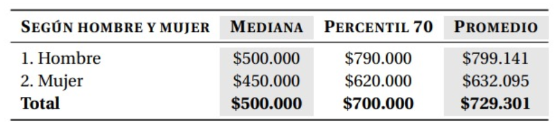
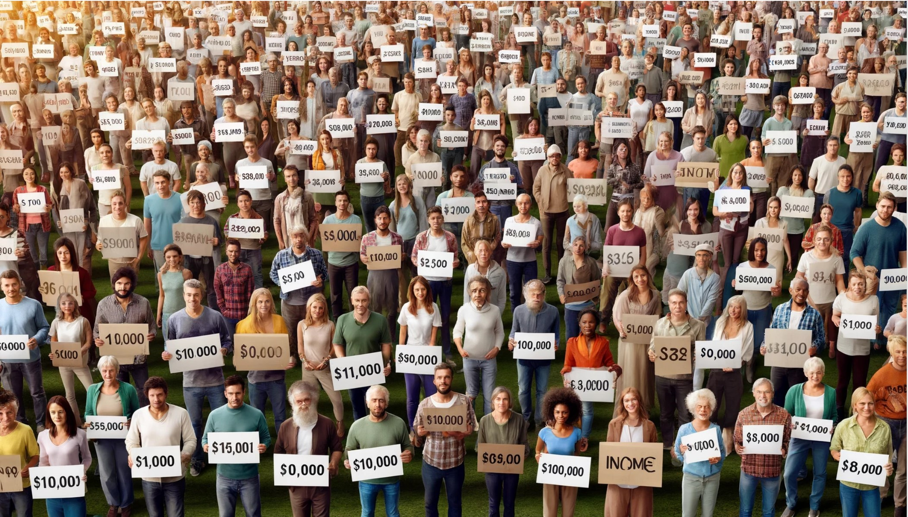
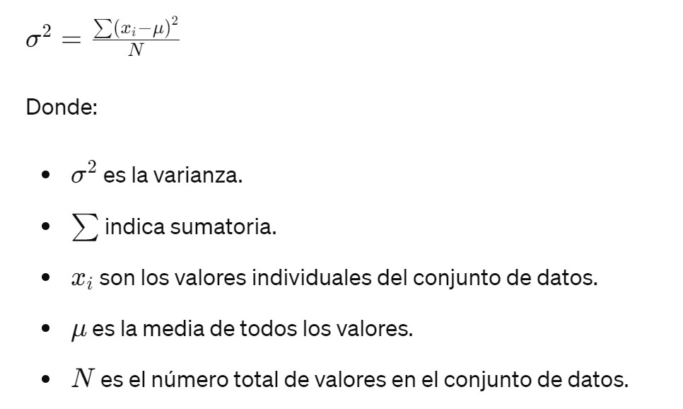
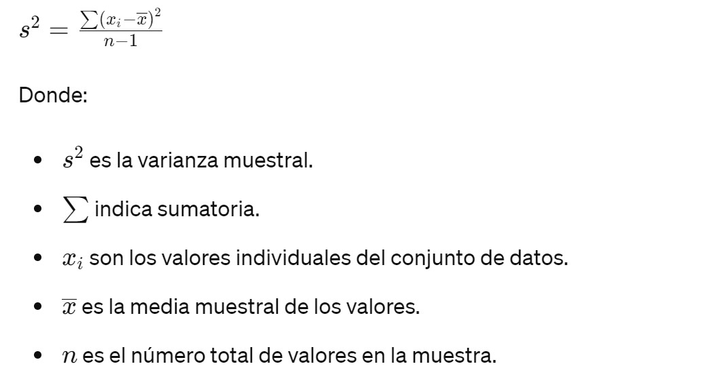
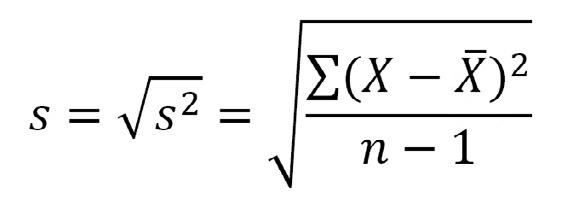

```{r xaringan-themer, include=FALSE, warning=FALSE}
library(xaringanthemer)
style_duo_accent(primary_color = "#035AA6", secondary_color = "#FF961C")

```


class: inverse, center, middle

# Medidas de tendencia central
### ¿¿¿Qué valor "representa" al grupo???


---
## Medidas de tendencia central 

- Conjunto de herramientas estadísticas utilizadas para encontrar un valor representativo de un conjunto de datos,las medidas más comunes son:

- **Media**: 
  + Promedio de un conjunto de datos.
  + Calculo: suma de todos los valores y divididos por el número total de observaciones.  
  + Es una medida es *sensible a valores extremos* y puede ser afectada por ellos.

- **Mediana**: 
  + Valor central de un conjunto de datos ordenados. 
  + Cálculo: se ordenan los datos de menor a mayor y se ve el valor que se encuentra en el medio. Si número de observaciones es par, la mediana es el promedio de los dos valores centrales. 
  


---
## Medidas de tendencia central

- ¿Cuándo media y cuándo mediana?
  + **Media**: cuando datos se distribuyen de forma normal, no hay tantos valores atípicos, se busca obtener una medida sensible a todos los datos. 
  + **Mediana**: cuando se desea obtener un valor que sea representativo del centro de la distribución de los datos, sin verse afectado por valores extremos que pueden distorsionar la medida.
  
- **Moda**: 
  + Es el valor que aparece con mayor frecuencia en un conjunto de datos. 
  + Por ejemplo, si tienes los siguientes números: 2, 4, 4, 6, 8 y 10, la moda sería 4. Si hay más de un valor que aparece con la misma frecuencia máxima, entonces el conjunto de datos tiene múltiples modas.
  + De las tres medidas de tendencia central es la única que funciona para variables categóricas (nominales u ordinales)

---
## Medidas de tendencia central


### ¿Media o mediana?



---

class: middle, center

```{r echo=FALSE}


library(ggplot2)

# Generar datos de una distribución normal
set.seed(123)
datos <- rnorm(1000, mean = 10, sd = 2)

# Calcular la media y la mediana
media <- mean(datos)
mediana <- median(datos)

# Crear el gráfico
ggplot(data = data.frame(x = datos), aes(x = x)) +
  geom_histogram(binwidth = 0.5, aes(y = after_stat(density)), fill = "#36dafa", color = "black") +
  geom_density(alpha = 0.2, fill = "#FF961C", color = "black") +
  geom_vline(xintercept = media, linetype = "dashed", color = "red", linewidth = 1) +
  geom_vline(xintercept = mediana, linetype = "dotted", color = "blue", linewidth = 1) +
  labs(title = "Distribución normal con media y mediana",
       x = "Valor",
       y = "Densidad") +
  theme_minimal()


```

---

class: inverse, center, middle

# Medidas de dispersión
### ¿Cómo entender las diferencias entre los datos?



---

## Medidas de dispersión

- Estadísticos de centro se quedan cortos en capacidad descriptiva en cuanto al análisis de variables cuantitativas.
- Grupos con igual media se diferencian mucho entre sí
- Es necesario conocer el grado de dispersión
- *Grado de parecido entre los datos  en el sentido de concentración o alejamiento entre ellos*.


---

### Varianza
- Medida de variabilidad de los datos, lo que nos indica cuánto se dispersan los datos de un conjunto respecto a su media. 
  + Si los **datos están muy dispersos**, la **varianza será grande**. 
  + Si los **datos están muy cerca del valor medio**, la **varianza será pequeña**.

- Ejemplo: Queremos saber cuánto varía el ingreso de los trabajadores de una empresa, podemos calcular la varianza de los salarios. 
  + Si los **salarios** de los trabajadores son **muy diferentes** entre sí, la **varianza será grande**. 
  + Si los **salarios** son más **similares**, la **varianza será menor**.

---
##Ejemplo

- Supongamos que tenemos el siguiente conjunto de ingresos en miles de pesos mensuales de 5 personas: 
  + 10, 20, 30, 40, 50. 
  + La media de estos ingresos es 30. 
  + La varianza nos indica cuánto se dispersan estos ingresos respecto a la media. 


---
  
###¿Cómo se calcula? 

.pull-left[ 
1. Restamos cada ingreso de la media: 
  + 10-30 = **-20**, 20-30 = -**10**, 30-30 = **0**, 40-30 = **10**, 50-30 = **20**.
2. Elevamos al cuadrado cada diferencia: (-20)^2 = **400**, (-10)^2 = **100**, 0^2 = **0**, 10^2 = **100**, 20^2 = **400**.
3. Sumamos los cuadrados de las diferencias: 400 + 100 + 0 + 100 + 400 = **1000**.
4. Dividimos entre la cantidad casos 5  = **200**.]

.pull-rigth[

 

- Interpretación: la varianza de los ingresos es 200 mil pesos **al cuadrado**, entre esas 5 personas (para sacar las diferencias respecto a la media tuvimos que elevar al cuadrado) 
]

---
class: center, middle
### Cuando es en una muestra es n-1


 

---
### Desviación estándar 

- Medida de la dispersión de los datos alrededor de su media. 
  + Raíz cuadrada positiva de la varianza. 
  + Nos indica cuánto se alejan los datos de la media, en promedio. 
  + Nos permite entender la variabilidad de los datos de una manera más intuitiva que la varianza, pues tiene las mismas unidades que la variable que se está analizando.
  
 


---

### Continuando con ejemplo anterior: 
  + Varianza de los ingresos fue de 200 mil dólares **al cuadrado**. 
  + Para obtener la desviación estándar, solo necesitamos calcular la raíz cuadrada de la varianza: 
  + sqrt(200) = 14
  + o con función sd()
  
-  Interpretación 
  + En promedio los ingresos se alejan en 14 de la media. 
  
---

##Cuartiles
- Forma de dividir un conjunto de datos en cuatro partes iguales. 
- Dividen los datos en cuatro grupos que contienen el mismo número de observaciones.
- Primer cuartil (Q1) es el valor que separa el 25% de los datos más bajos del 75% de los datos más altos. 
- Segundo cuartil (Q2) es la mediana, es decir, el valor que separa el 50% de los datos más bajos del 50% de los datos más altos. 
- Tercer cuartil (Q3) es el valor que separa el 75% de los datos más bajos del 25% de los datos más altos.


---

##Deciles y percentiles
- Deciles: 
  + Dividen un conjunto de datos en 10 partes iguales.
  + Primer decil (D1) es el valor que separa el 10% de los datos más bajos del 90% de los datos más altos. 
  + Segundo decil (D2) es el valor que separa el 20% de los datos más bajos del 80% de los datos más altos
  + Decimo decil(D10),  separa el 90% de los datos más bajos del 10% de los datos más altos.
- Percentiles: 
  + Dividen un conjunto de datos en 100 partes iguales. 
  + El percentil 25 es el valor que separa el 25% de los datos más bajos del 75% de los datos más altos. El percentil 50 es la mediana, que separa el 50% de los datos más bajos del 50% de los datos más altos.

---
#Medidas de desigualdad
## Coeficiente de Gini

- Se utiliza para evaluar la distribución de una variable en una población determinada.
- Varía entre 0 y 1: 
  + 0 representa una distribución completamente igualitaria (cada persona tiene la misma cantidad de la variable) 
  + 1 representa una distribución completamente desigual (una persona tiene toda la variable y los demás no tienen nada).
  + Implica la comparación de la curva de Lorenz, que muestra la distribución acumulada de los datos, con la línea de equidad, que indica una distribución igualitaria. 


---
class: middle, center

```{r echo=FALSE, warning=TRUE, error=FALSE, eval=TRUE}
# Cargar la librería ggplot2
library(ggplot2)

# Crear un vector con los datos de ingresos o riqueza ordenados de manera ascendente
x <- c(100, 150, 200, 300, 500)

# Calcular la fracción acumulada de la población y del ingreso o la riqueza
cum_frac_pop <- cumsum(rep(1, length(x))) / length(x)
cum_frac_income <- cumsum(x) / sum(x)

# Crear un data frame con las fracciones acumuladas
df <- data.frame(cum_frac_pop, cum_frac_income)

# Agregar las columnas de la fracción acumulada de la población y del ingreso o la riqueza que se distribuiría si la población tuviera una distribución perfectamente igualitaria
df$perfect_pop <- 1:length(x) / length(x)
df$perfect_income <- 1:length(x) / sum(x)

# Crear un gráfico de la curva de Lorenz con la línea de equidad
ggplot(df, aes(x = perfect_pop, y = cum_frac_income)) +
  geom_line(color = "blue") +
  geom_abline(intercept = 0, slope = 1, color = "red", linetype = "dashed") +
  labs(x = "Fracción acumulada de la población",
       y = "Fracción acumulada del ingreso o la riqueza",
       title = "Curva de Lorenz con la línea de equidad")+
  theme_minimal()


```

---
### Ejemplo "riqueza de un país": 
  + En una población de 100 personas, cada persona tiene una cantidad diferente de riqueza. 
  + Si la distribución de la riqueza es completamente igualitaria, cada persona tendría exactamente la misma cantidad de riqueza, por lo que el coeficiente de Gini sería 0. 
  + Si una sola persona tiene toda la riqueza y el resto de las personas no tienen nada, el coeficiente de Gini sería 1.

---

# Graficar. Caja y bigotes o *boxplot*

.pull-left[ 
```{r echo=FALSE}
# Cargar la librería ggplot2
library(ggplot2)

# Crear un data frame con algunos datos de ejemplo
df <- data.frame(
  grupo = rep(c("Grupo 1", "Grupo 2"), each = 20),
  valor = c(rnorm(20, 10, 3), rnorm(20, 15, 4))
)

# Crear el gráfico de caja y bigotes
ggplot(df, aes(x = grupo, y = valor)) +
  geom_boxplot(fill = "#FF961C", color = "black") +
  labs(x = "Grupo", y = "Valor", title = "Diagrama de caja y bigotes")+
  theme_minimal()

```
]

.pull-right[
- línea central: representa la mediana 
- la caja: representa el rango intercuartílico (IQR). Va desdeel primer cuartil (25%) y el tercer cuartil (75%), abarcando un 50% de los datos. 
- los "bigotes": representan valores fuera de la caja, sin considerar los valores atípicos. 
- puntos:  por encima o por debajo de los bigotes se consideran valores atípicos o "outliers".
]
