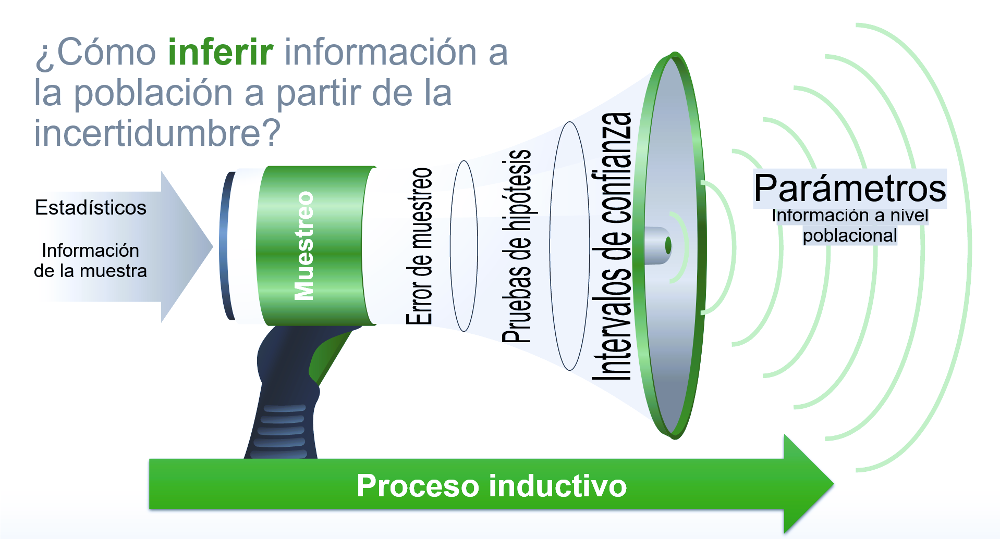
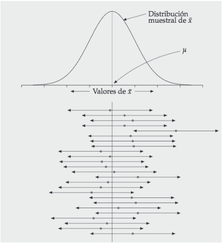
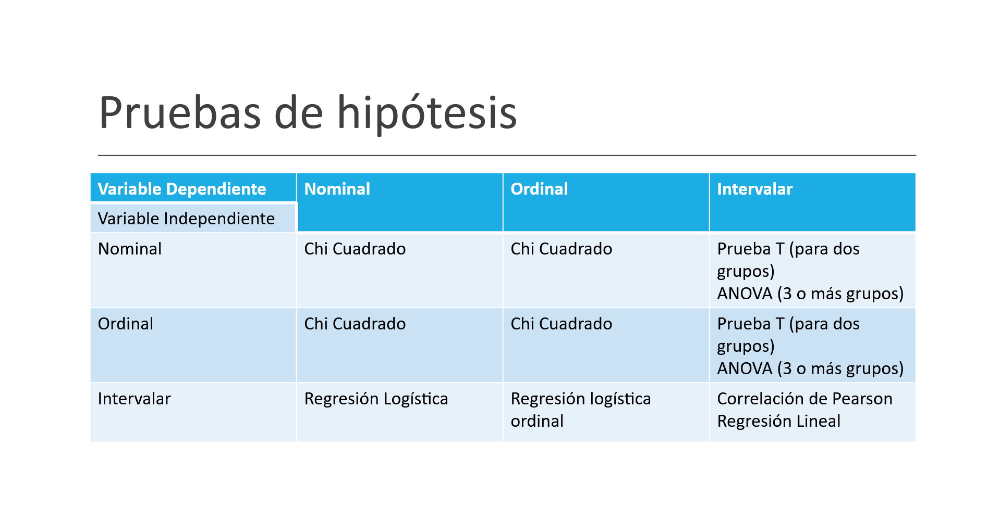

```{r xaringan-themer, include=FALSE, warning=FALSE}
library(xaringanthemer)
style_duo_accent(primary_color = "#035AA6", secondary_color = "#00dd72")

```

class: inverse, center, middle

# Pruebas de hipótesis

---
class: inverse, center, middle

# Pruebas de hipótesis
### y qué es una prueba de hipótesis??!!

---
### Pruebas de hipótesis

Parte importante del método en que opera la ciencia

Hipótesis nula

$$
H_0: \mu_t = \mu_c
$$
Hipótesis Alternativa
$$
H_1: \mu_t \neq \mu_c
$$

---
## Pruebas de hipótesis



---
## Error muestral

Apartir de una muestra hacemos uso de la probabilidad para hacer inferencias sobre la población.
Necesitamos una muestra representativa.

* Podemos calcular la probabilidad de cometer un determinado error.

* En general, el tamaño de la muestra determina la probabilida de que el resultado muestral sea lo más parecido a la verdad poblacional. (Lógica inductiva). 

* Este error se estima con el estadístico de **error estándar**: Cuánto se desvía tipicamente la estimación de la muestra del tamaño poblacional

Error estándar: 
$$
SE = \frac{\sigma}{\sqrt{n}}
$$
donde $\sigma$ es la desviación estándar de la población y  $n$ es el tamaño de la muestra.

---

### Error Muestral

Considera una muestra con media muestral $\bar{x}$ y desviación estándar muestral $s$. El error muestral se calcula como:

$$
SE = \frac{s}{\sqrt{n}}
$$

El intervalo de confianza para la media poblacional $mu$ se puede calcular como:

$$
\mu_x=\bar{x} \pm Z \cdot SE
$$
donde $Z$ es el valor crítico de la distribución normal estándar correspondiente al nivel de confianza deseado.


---
### Prueba de Hipótesis

* Estrategia diseñada para decidir si una proposición acerca de una población puede ser mantenida o debe ser rechazada (Lógica inductiva).

Hipótesis científica o de investigación: afirmación directamente verificable (falseable) mediante contraste de hipótesis.


---
### Contraste de hipótesis  


1.- Redacción de hipótesis estadísticas: Hipótesis nula (H0) es aquella que pondremos a prueba y la hipótesis alternativa (H1) es la negación de H0.

2.- Evidencia empírica

3.- Regla de decisión en términos de probabilidad: Si, suponiendo cierta la hipótesis, el resultado muestral observado es improbable, se considerará que la hipótesis es incompatible con los datos; por el contrario, si, suponiendo cierta la hipótesis, el resultado muestral observado es probable, se considerará que la hipótesis es compatible con los datos. 

4.- Toma de decisión: rechazar o mantener H0


---
class: inverse, center, middle

# Pruebas de hipótesis
### Prueba T

---
### Prueba T

Es una prueba de hipótesis utilizada cuando contamos con:

* Una variable cuantitativa (Prueba T para una muestra)
* Una variable cuantitativa y una variable dicotómica (Prueba T para muestras independientes)


---
### Intervalos de Confianza




---
### Ejemplo de prueba T para diferencia de medias

```{r,  echo=FALSE, eval=TRUE, warning=FALSE, error=FALSE}
#Cargar paquetes
pacman::p_load(haven, tidyverse, janitor,sjmisc,kableExtra,plm, stargazer)
#cargar datos
bbdd<-read_dta("data_analysis.dta")

bbdd <- janitor::clean_names(bbdd) #minusculas

#seleccionar variables para tabla 2
bbdd <- bbdd %>%  select("lb_edad_post",
                         "lb_ingpercap_post",
                         "lb_ing_laboral",
                         "lb_participa",
                         "lb_desempleo",
                         "lb_ocupadas",
                         "lb_hrs_trabaja",
                         "lb_mes_trabaja",
                         "lb_contrato",
                         "lb_edu_anos",
                         "lb_edu_max1",
                         "lb_edu_max2",
                         "lb_edu_max3",
                         "lb_edu_max4",
                         "lb_asiste_post",
                         "stress",
                         "lb_bebe",
                         "lb_n_kids",
                         "lb_cuida_infantil",
                         "est1",
                         "est2",
                         "est3",
                         "est4",
                         "treatment",
                         "seg")

#filtrar por seguimiento (seg)
bbdd <- bbdd %>% filter( seg==1 )


## Cálculo de la diferencia de medias y estadístico t por cada variable de interés
  
#crear un vector con los nombres de las variables
variables_interes <- names(bbdd)


# quitar nombres de variables del tratamiento
nombres_tratamiento <- c("treatment","seg")
variables_interes <- variables_interes[!(variables_interes %in% nombres_tratamiento)]


#Creo una grilla vacía (formato dataframe) que luego se llenará con los valores del loop
resultados <- data.frame(Variable = character(),
                         Media_Tratado = numeric(),
                         Media_Control = numeric(),
                         Estadistico_t = numeric(),
                         stringsAsFactors = FALSE)

#loop
for (var in variables_interes) {
  #creo 2 subconjuntos con las categorías de treatment
  subset_tratado <- subset(bbdd, treatment == 1, select = var)
  subset_tratado <- subset_tratado[complete.cases(subset_tratado), ]
  subset_control <- subset(bbdd, treatment == 0, select = var)
  subset_control <- subset_control[complete.cases(subset_control), ]

  #Cálculo de las medias y el valor p del estadístico t de igualdad de medias.
  mean_tratado <- mean(subset_tratado[[var]], na.rm = T)#media de tratado
  mean_control <- mean(subset_control[[var]], na.rm = T)#media de control
  t_test_result <- t.test(subset_tratado[[var]], subset_control[[var]])#t
  p_valor <- t_test_result$p.value#p-value
  
  #Se almacenan los resultados en la grilla formato dataframe
  resultados <- rbind(resultados, data.frame(Variable = var,
                                             Tratado = round(mean_tratado,2),
                                             Control = round(mean_control,2),
                                             p = round(p_valor,3)))#valor p está con 3 decimales
}

# tabla cruzada de todas las variables con treatment (tratado y control) y su valor p
resultados <- resultados %>% select(-Variable)

#Tabla descriptivos
bbdd<-bbdd %>% select(-c("treatment","seg"))
descriptivos<-sjmisc::descr(bbdd,
      show = c("mean","sd","n"))
descriptivos <- descriptivos %>% select(c("mean", "sd", "n"))
descriptivos<-round(descriptivos,2)

#Fusión de ambas tablas
tabla2 <-cbind(descriptivos,resultados)

#Poner nombre a las filas 
rownames(tabla2)<- c("Applicant age",
         "Household per capita income",
         "Applicant monthly income",
         "Labor force participation rate",
         "Unemployment Rate",
         "Occupation Rate",
         "Hours of work (daily)",
         "Months Worked in 2011",
         "Have employment contract",
         "Years of Education",
         "Proportion without education",
         "Primary school proportion",
         "Secondary school proportion",
         "College (and/or further) education proportion",
         "Attending an educational institution",
         "Stress Index",
         "Applicants with children less than 5 years old",
         "Children signed up to the program by applicants",
         "Proportion that receives childcare support",
         "Strata 1: works and has children < 5 (N=369)",
         "Strata 2: does not work and has children < 5 (N=109)",
         "Strata 3: works and has children > 5 (N=1141)",
         "Strata 4: does not work and has children > 5 (N=215)")


#tabla2

#ahora con Kable, queda una tabla fancy

kable(tabla2,
      caption = "Table 2. Balance between treatment and control group at baseline",
      col.names = c("Average", "SD", "N°", "Treatment", "Control", "P-value T=C"),
      position = "center") %>% 
  kable_classic(full_width = F,
                html_font = "Cambria") %>% #Definimos fuente
  footnote(" ",#Especificamos la nota al pie
           general_title = "Fuente: Elaboración propia en base a Martinez y Perticará (2017): Childcare effects on maternal
employment: Evidence from Chile. ")

```
---
class: inverse, center, middle

# ANOVA
### Analysis of Variance
---
### ANOVA

• El procedimiento ANOVA de un factor genera un análisis de varianza de un factor para
una variable dependiente cuantitativa respecto a una única variable de factor (la
variable independiente). El análisis de varianza se utiliza para contrastar la hipótesis
de que varias medias son iguales. Esta técnica es una extensión de la prueba t para
dos muestras.

• Es una prueba paramétrica

• Es una prueba omnibus: no se sabe bien entre qué grupos están las diferencias (para
eso se ocupan pruebas post-hoc)

• La variable dependiente es cuantitativa u ordinal tratada como cuantitativa (ej:
escalas likert de 1 a 7)

• La variable independiente debe ser categórica de más de 2 grupos, independientes
entre sí


---
### Resumen

¿Cuándo usar Chi-Cuadrado?: Chi cuadrado se utiliza cuando contamos con dos variables categóricas (nominales u ordinales).

¿Cuándo usar Prueba T?: Prueba T se utiliza cuando contamos con una variable cuantitativa y otra categórica (variable de agrupación). Esta última debe diferencia únicamente en dos grupos (ejemplo: variable sexo con categorías de respuesta hombre y mujer).

¿Cuándo usar Anova?: Anova se utiliza cuando contamos con una variable cuantitativa y otra categórica (variable de agrupación). Esta última debe diferencia desde tres grupos (ejemplo: variable posición política con categorías de respuesta derecha, centro e izquierda).

---
### Resumen



---

class: inverse, center, middle

# Vamos al código