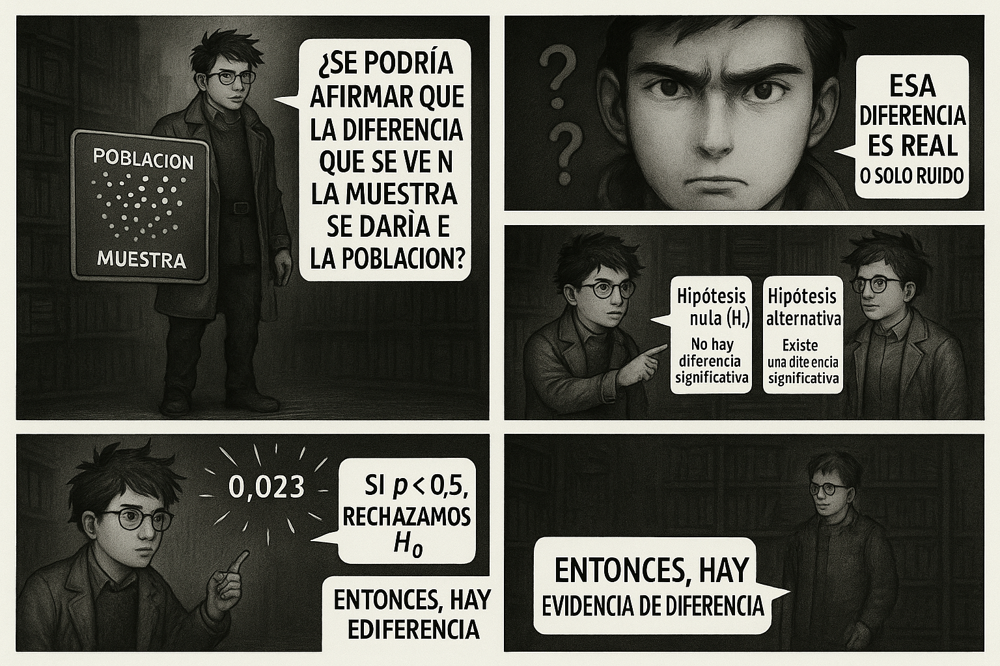
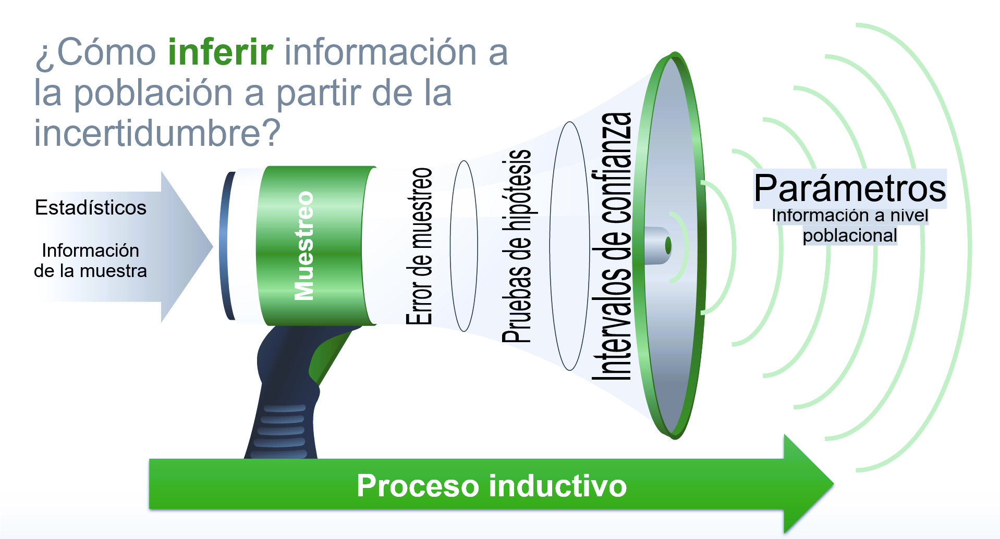
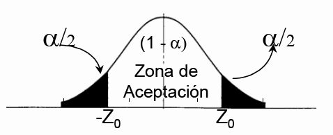
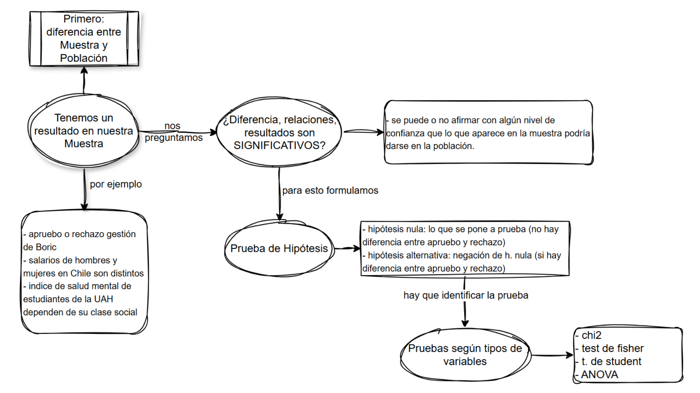
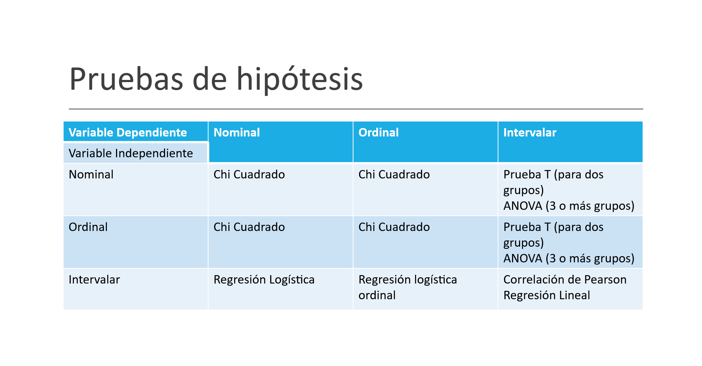
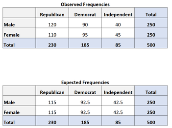
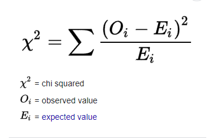
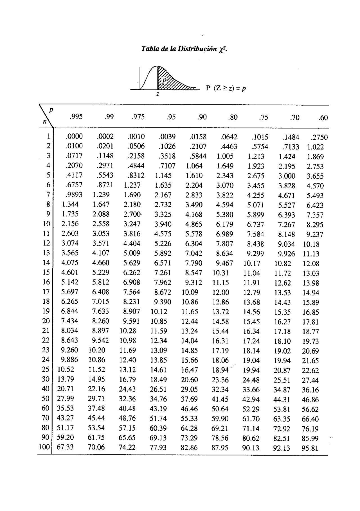
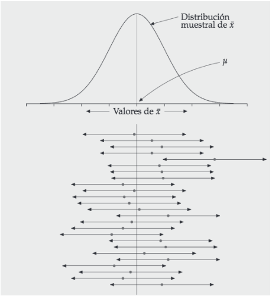

---
output:
  xaringan::moon_reader:
    css: xaringan-themer.css
    lib_dir: libs
    nature:
      highlightStyle: github
      highlightLines: true
      countIncrementalSlides: false
      
---

```{r xaringan-themer, include=FALSE, warning=FALSE}
library(xaringanthemer)
style_duo_accent(primary_color = "#035AA6", secondary_color = "#00dd72")

```
background-image: url("tablas/1.gif")
background-size: cover

---
class: inverse, middle


# Pruebas de hipótesis

- Sebastián Muñoz-Tapia
- Antropología UAH


---
class: middle




---
class: middle
### Pruebas de hipótesis

Parte importante del método en que opera la ciencia

Hipótesis nula

$$
H_0: \mu_t = \mu_c
$$
Hipótesis Alternativa
$$
H_1: \mu_t \neq \mu_c
$$

---
class: middle

## Pruebas de hipótesis



---
class: middle

## Error muestral

A partir de una muestra hacemos uso de la probabilidad para hacer inferencias sobre la población.
Necesitamos una muestra representativa.

* Podemos calcular la probabilidad de cometer un determinado error.

* En general, el tamaño de la muestra determina la probabilida de que el resultado muestral sea lo más parecido a la verdad poblacional. (Lógica inductiva). 

* Este error se estima con el estadístico de **error estándar**: Cuánto se desvía tipicamente la estimación de la muestra del tamaño poblacional

Error estándar: 
$$
SE = \frac{\sigma}{\sqrt{n}}
$$
donde $\sigma$ es la desviación estándar de la población y  $n$ es el tamaño de la muestra.

---

### Error Muestral

Considera una muestra con media muestral $\bar{x}$ y desviación estándar muestral $s$. El error muestral se calcula como:

$$
SE = \frac{s}{\sqrt{n}}
$$

El intervalo de confianza para la media poblacional $mu$ se puede calcular como:

$$
\mu_x=\bar{x} \pm Z \cdot SE
$$
donde $Z$ es el valor crítico de la distribución normal estándar correspondiente al nivel de confianza deseado.


---
class: middle

### Prueba de Hipótesis

* Estrategia diseñada para decidir si una proposición acerca de una población puede ser mantenida o debe ser rechazada (Lógica inductiva).

Hipótesis científica o de investigación: afirmación directamente verificable (falseable) mediante contraste de hipótesis.


---
class: middle

### Contraste de hipótesis  


1.- Redacción de hipótesis estadísticas: Hipótesis nula (H0) es aquella que pondremos a prueba y la hipótesis alternativa (H1) es la negación de H0.

2.- Evidencia empírica

3.- Regla de decisión en términos de probabilidad: Si, suponiendo cierta la hipótesis, el resultado muestral observado es improbable, se considerará que la hipótesis es incompatible con los datos; por el contrario, si, suponiendo cierta la hipótesis, el resultado muestral observado es probable, se considerará que la hipótesis es compatible con los datos. 

4.- Toma de decisión: rechazar o mantener H0


---
class: middle

## Pasos Pruebas de hipótesis

- Formulación de la hipótesis nula (H0) y la hipótesis alternativa (Ha).
- Selección del nivel de significancia, que determina la probabilidad de cometer un error de tipo I (rechazar H0 cuando es verdadera): el p-value (en Ciencias Sociales se utiliza en general un 95%)
- Selección de la prueba estadística apropiada y el cálculo del valor de la prueba.
-Comparación del valor de la prueba con un valor crítico o el intervalo de confianza para determinar si se rechaza o no la hipótesis nula.

---
class: middle

##P-Valor

- Pregunta: 
  + ¿Hay relación entre raza y orientación política?
  + H nula: no existe relación entre raza y política
  + H alternativa: si existe relación entre raza y política
- Prueba de hipótesis: 
  + Se observa si el p-valor es inferior o no a 0,05
  + Si es inferior a ese valor se puede decir con un 95% de confianza que se rechaza la hipotesis nula y se acepta la hipótesis alternativa





---
class: middle



---
### Resumen




---
class: inverse, center, middle

# Pruebas de hipótesis
### Chi cuadrado


---
class: middle

## Chi cuadrado

- Prueba estadística utilizada para determinar si hay una asociación significativa entre dos variables categóricas. 
- Compara si hay diferencia significativa entre distribución observada y distribución esperada bajo un modelo de independencia.

El proceso implica los siguientes pasos:

- Formular la hipótesis nula [no hay relación] y la hipótesis alternativa [si hay relación]
- Construir una tabla de contingencia: frecuencias observadas para cada combinación de categorías de las dos variables.
- Calcular el estadístico de prueba de chi cuadrado a partir de la tabla de contingencia.
- Comparar el valor de la prueba con un valor crítico de chi cuadrado o calcular el p-valor para determinar si se rechaza o no la hipótesis nula.


---
class: middle

# Frecuencias esperadas y observadas

.pull-left[

]

.pull-rigth[



].

- **Frecuencias esperadas**: número de observaciones que se esperarían en cada categoría o grupo si no hubiera una relación entre las variables.

```{r results='hide'}
230*250/500
```

---
class: middle

## Distribución Chi cuadrado

.pull-left[


- veo el resultado
- veo ni n: número de casos
- veo mi nivel de confianza
- el cruce un valor que debe ser superior al que me dio en mi resultado
- si es así es significativo
].

.pull-right[

].

---
class: middle

```{r include=FALSE}
pacman::p_load(tidyverse, openxlsx, readxl,readr,janitor, forcats, writexl, DataExplorer, 
               datos,  knitr, gt, summarytools, ggthemes, hrbrthemes)

datos <- datos::encuesta
datos$raza <- datos$raza %>% fct_relevel(c("Blanca", "Negra", "Otra")) %>% 
  fct_drop("No aplica") #ordeno los resultados según raza y elimino la categoría no aplica

datos$religion <- datos$religion %>% fct_relevel(c("Protestante", 
                                                   "Católica", 
                                                   "Ninguna", 
                                                   "Cristiana",
                                                   "Judía", 
                                                   "Budismo", 
                                                   "Inter o no confesional", 
                                                   "Musulmana/Islam", 
                                                   "Cristiana ortodoxa", 
                                                   "Hinduismo", 
                                                   "Otra religión oriental", 
                                                   "Nativa americana", 
                                                   "Otra", 
                                                   "No sabe", 
                                                   "No aplica", 
                                                   "Sin respuesta"
)) %>% 
  fct_drop("No aplica")


```

```{r warning=FALSE}
datos %>% 
  select(religion, raza) %>% 
  table() %>% 
  chisq.test()

```


```{r include=FALSE}
ctable( x = datos$religion, y = datos$raza, prop = "c", justify = "l", 
        chisq = T)
```


---
class: middle

## Test de Fisher

- Prueba estadística **no paramétrica** utilizada para evaluar la independencia entre dos variables categóricas. 
- Similar al  chi-cuadrado, pero se utiliza cuando los tamaños de muestra son pequeños o cuando algunas celdas de la tabla de contingencia tienen valores esperados muy pequeños.
- Se aplica cuando se tienen dos variables categóricas y se desea determinar si hay una asociación significativa entre ellas. 

---
class: middle

.pull-left[
- **chi-cuadrado**: se utiliza cuando se tienen grandes tamaños de muestra y cuando el valor esperado en cada celda de la tabla de contingencia es mayor a 5
] 


.pull-right[  
- **test de Fisher**: se utiliza cuando se tienen tamaños de muestra pequeños y/o cuando algunas celdas de la tabla de contingencia tienen valores esperados muy pequeños ( menos de 5)
] 


---
class: middle

## Pruebas paramétricas y no-paramétricas

.pull-left[
- **Pruebas estadísticas paramétricas**:
  + Asumen que los datos siguen una distribución normal y se utilizan para probar hipótesis sobre los parámetros poblacionales, como la media y la desviación estándar. Estas pruebas requieren que los datos sean numéricos y continuos.
] 


.pull-right[  
- **Pruebas estadísticas no paramétricas**: 
  + Se utilizan cuando no se cumplen las suposiciones de normalidad o cuando los datos son categóricos o nominales en lugar de numéricos.
]

---
class: center, middle

## Pruebas paramétricas y no-paramétricas

.pull-left[
```{r echo=FALSE}
datos <- rnorm(10000, mean = 0, sd = 1)
hist(datos, freq = FALSE, main = "Distribución normal simulada")
curve(dnorm(x, mean = mean(datos), sd = sd(datos)), add = TRUE, col = "blue")


```
]

.pull-right[  
```{r echo=FALSE}
datos <- rchisq(10000, df = 5)
hist(datos)
```
]


---
class: inverse, center, middle

# Pruebas de hipótesis
### Prueba T

---
class: middle

### Prueba T

Es una prueba de hipótesis utilizada cuando contamos con:

* Una variable cuantitativa (Prueba T para una muestra)
* Una variable cuantitativa y una variable dicotómica (Prueba T para muestras independientes)


---
class: middle

### Intervalos de Confianza





---
class: center, middle


#### 🎯 Prueba *t* de Student — Supuestos con ejemplos prácticos  
| Supuesto | ¿Qué significa? | Ejemplo práctico |
|-----------|-----------------|------------------|
| **Independencia** | Cada valor proviene de casos que no se influyen mutuamente. | Pesas **20 manzanas** de un huerto A y **20 manzanas** de un huerto B; cada manzana se recoge de distinto árbol al azar, de modo que el peso de una no afecta al de otra. |
| **Normalidad** | Los valores (o las diferencias, si la prueba es pareada) forman una “panza” de campana. | Al trazar un histograma del peso de las manzanas de cada huerto, la mayoría de los pesos se agrupan cerca del promedio (≈ 180 g) y muy pocas manzanas son extremadamente ligeras o pesadas. |
| **Homogeneidad de varianzas** | Los grupos presentan una dispersión similar alrededor de su media. | La variabilidad de pesos en el huerto A (desviación estándar ≈ 20 g) y en el huerto B (≈ 22 g) es parecida; ninguno muestra pesos mucho más dispersos que el otro. |

---
class: center, middle

## 1️⃣ Independencia  
- Asegúrate de que **cada fila** sea un sujeto distinto y elegido al azar.  
- No existe un test automático; depende del diseño del muestreo.  

---
class: center, middle

## 2️⃣ Normalidad por grupo  
```r
# QQ-plot
library(ggplot2)
ggplot(datos, aes(sample = y)) +
  stat_qq() + stat_qq_line() +
  facet_wrap(~ grupo)

# Shapiro-Wilk (solo si n < 50)
by(datos$y, datos$grupo, shapiro.test)

```

---
class: center, middle

## 3️⃣ Igualdad de varianzas


```r

library(car)              # instalar si es necesario
leveneTest(y ~ grupo, datos)   # p > 0.05 ⇒ varianzas iguales

```
Si p ≤ 0,05, usa la versión de Welch.

---
class: center, middle

##4️⃣ Elección de la prueba

| Situación                                               | Código en R                                      |
| ------------------------------------------------------- | ------------------------------------------------ |
| Normalidad OK **y** varianzas iguales                   | `t.test(y ~ grupo, datos, var.equal = TRUE)`     |
| Varianzas desiguales **o** normalidad dudosa con n ≥ 20 | `t.test(y ~ grupo, datos)` *(Welch por defecto)* |
| Normalidad mala **y** n < 20                            | `wilcox.test(y ~ grupo, datos)`                  |
---
class: center, middle
##  5️⃣ Interpretar el resultado


- p < 0,05 → diferencia significativa entre grupos.
- p ≥ 0,05 → no se detecta diferencia.

---
class: center, middle

##  6️⃣ Reportar
“Se realizó una prueba t de Welch, t(gl = …), p = …, mostrando que el grupo A presentó una media significativamente mayor que el grupo B.”

---

class: inverse, center, middle

# ANOVA
### Analysis of Variance

---
class: middle
### ANOVA

• El procedimiento ANOVA de un factor genera un análisis de varianza de un factor para
una variable dependiente cuantitativa respecto a una única variable de factor (la
variable independiente). El análisis de varianza se utiliza para contrastar la hipótesis
de que varias medias son iguales. Esta técnica es una extensión de la prueba t para
dos muestras.

• Es una prueba paramétrica

• Es una prueba omnibus: no se sabe bien entre qué grupos están las diferencias (para
eso se ocupan pruebas post-hoc)

• La variable dependiente es cuantitativa u ordinal tratada como cuantitativa (ej:
escalas likert de 1 a 7)

• La variable independiente debe ser categórica de más de 2 grupos, independientes
entre sí


---
class: middle
### Resumen

¿Cuándo usar Chi-Cuadrado?: Chi cuadrado se utiliza cuando contamos con dos variables categóricas (nominales u ordinales).

¿Cuándo usar Prueba T?: Prueba T se utiliza cuando contamos con una variable cuantitativa y otra categórica (variable de agrupación). Esta última debe diferencia únicamente en dos grupos (ejemplo: variable sexo con categorías de respuesta hombre y mujer).

¿Cuándo usar Anova?: Anova se utiliza cuando contamos con una variable cuantitativa y otra categórica (variable de agrupación). Esta última debe diferencia desde tres grupos (ejemplo: variable posición política con categorías de respuesta derecha, centro e izquierda).

---
class: middle
### Resumen


---

class: inverse, center, middle

# Vamos al código