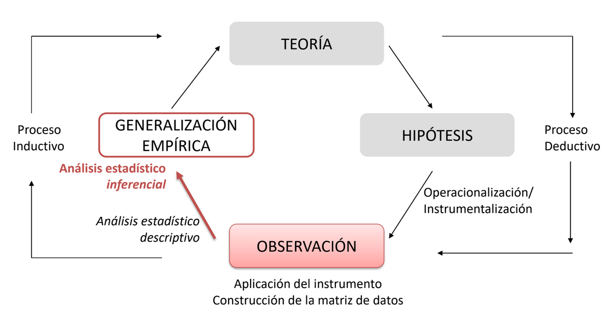
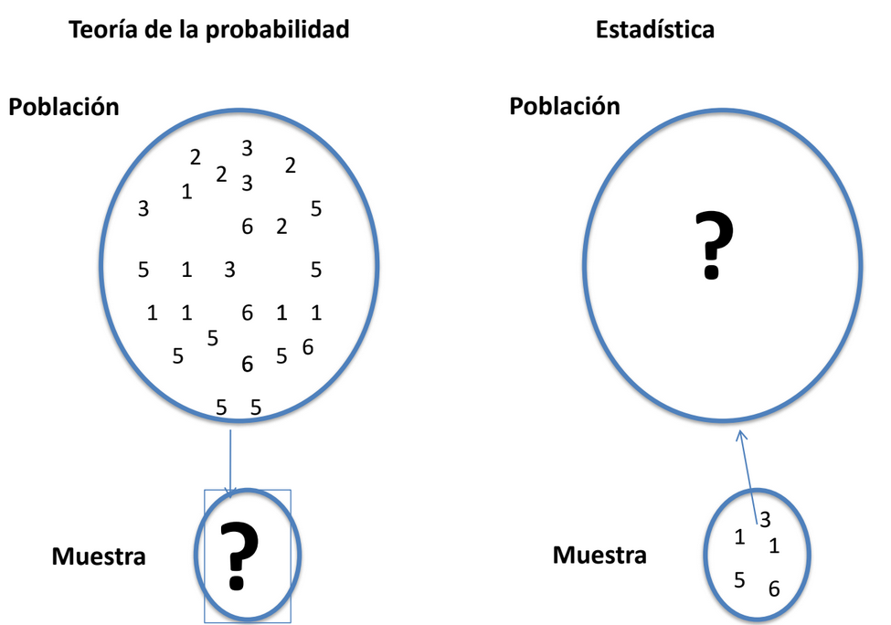
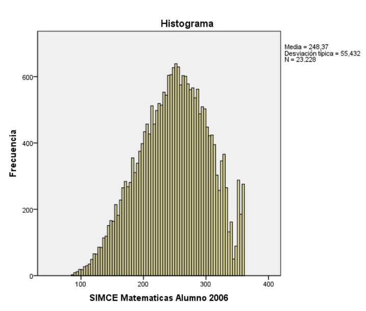
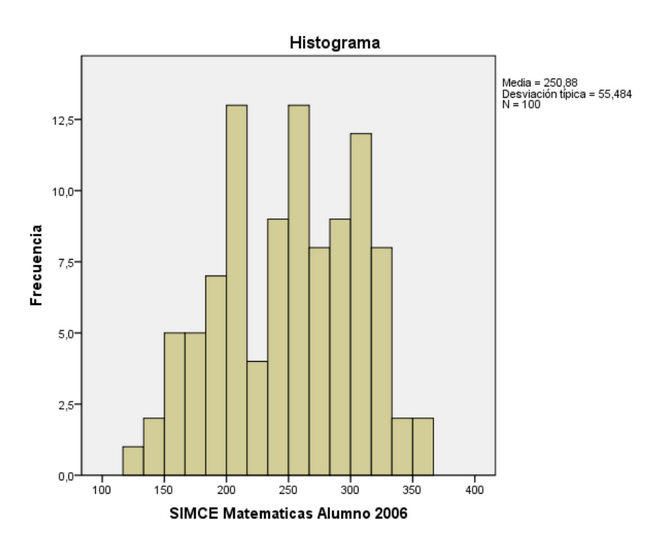
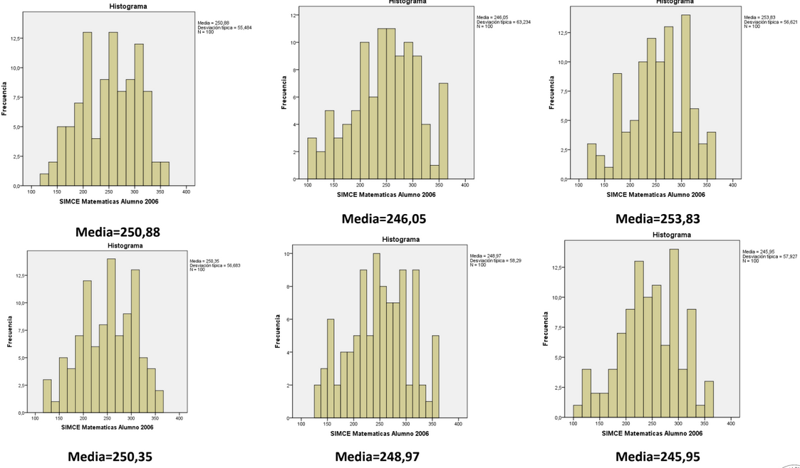
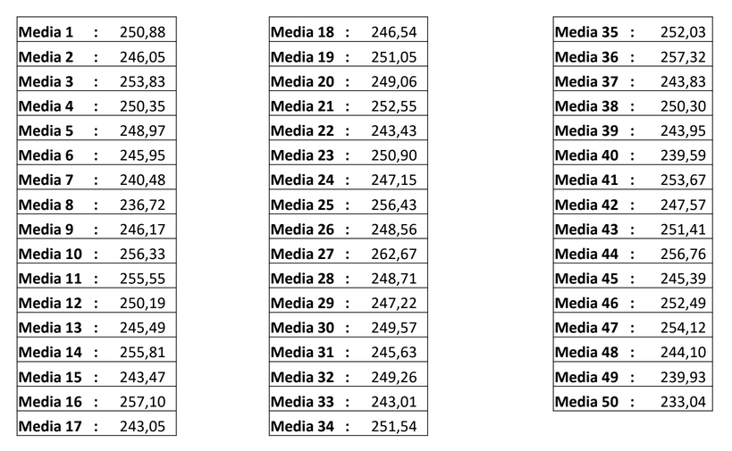
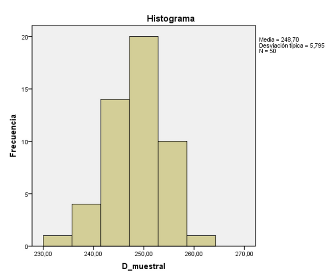
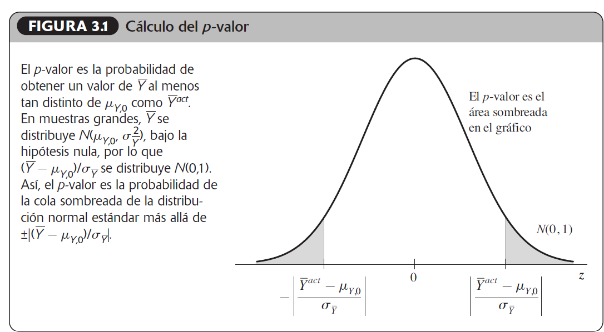
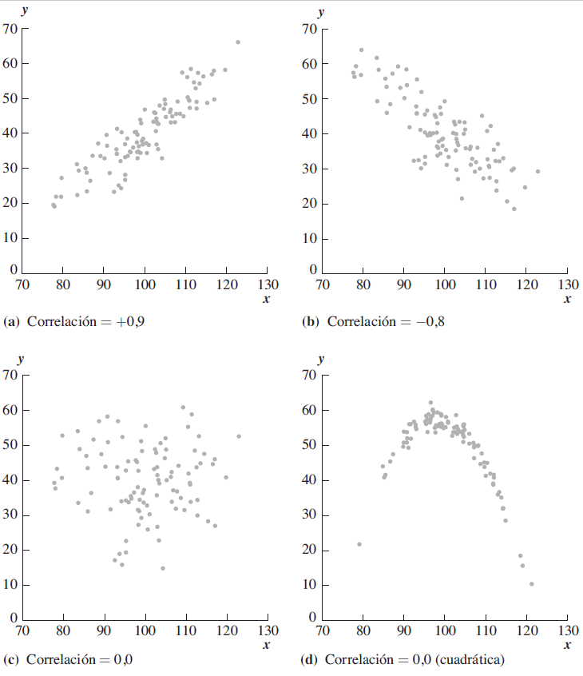
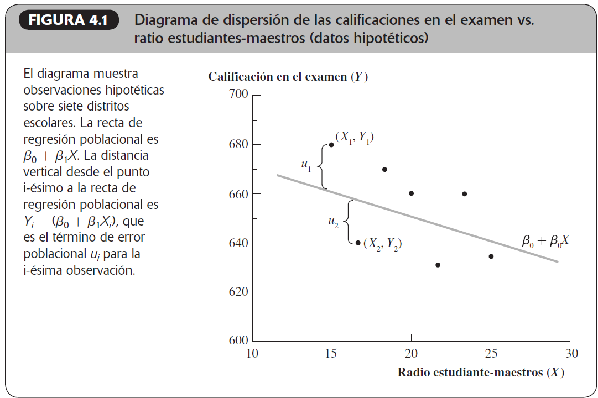

## En esta clase

Repaso de estadística inferencial y regresión lineal

### 1. Inferencia estadística

### 2. Correlación

### 3. Regresión

---

```{r setup, include=FALSE}
options(htmltools.dir.version = FALSE)
```


```{r  echo = FALSE, warning = FALSE, message = FALSE}

pacman::p_load(tidyverse,
               sjmisc,#tablas
               sjlabelled,
               kableExtra,#tablas
               sjPlot,
               stargazer,#tablas
               texreg,
               performance,
               patchwork,
               car,
               leaflet,
               ggplot2,
               forcats,
               plotly,
               gganimate)

```


### Estadística descriptiva

- Medidas de tendencia central (**Media**, mediana, moda)

- Medidas de dispersión (desviación estándar, **varianza**, rango)

- Relación entre variables categóricas: Pruebas de hipótesis "cualitativa" (Chi cuadrado) 

---
class: inverse, center, middle

# Inferencia estadística

---

# Inferencia Estadística




---

### Repaso

Las probabilidades son el vehículo de la estadística, por ello su comprensión es clave

¿En qué se distinguen?

1. La Teoría de la Probabilidad se pregunta por la *ocurrencia* de algo cuando conoce
las características de la población o los resultados de un experimento. Esto implica
que:

a. Con las probabilidades se hacen predicciones sobre lo que va a pasar.

b. Estas probabilidades son conjeturas, *no hechos.*

c. Se asocia a una pregunta del tipo: “si saco una muestra al azar, ¿cómo será
ésta?”

2. En la Estadística, se desconoce la población.

a. Se saca una muestra, se describe esa muestra (estadística descriptiva) y se
infiere cómo es la población a partir de ella (estadística inferencial)

b. Se asocia a la pregunta del tipo: “si tengo esta muestra, ¿cómo es la
población?


---
### Probabilidad vs estadística



---
### Distribución poblacional y muestral
<br>
--
    Distribución poblacional



Observo toda la población, en general, tener los datos de toda la población es muy díficil.

---
### Distribución poblacional y muestral
<br>
--
    Distribución de la muestra



Si se extrae una **muestra aleatoria** de la población, se puede calcular su media y graficar su distribución

---
### Distribución poblacional y muestral
<br>
--
    Distribuciones de las muestras




Se pueden extraer continuamente muestras del mismo tamaño (e.g. n=100) y calcular su media

---
### Distribución poblacional y muestral
<br>
--
**Distribución muestral**

Cálculo de medias de diferentes muestras, pero del mismo tamaño, extraídas aleatoriamente:



Cada muestra extraída tiene asociada una media. Esta “media de la muestra” cambia de muestra en muestra, según lo que se puede ver en la tabla de arriba. En este caso, hemos extraído 50 muestras de forma aleatoria y hemos calculado su media respectiva.
---
### Distribución muestral
<br>
Ahora la media de cada muestra es en sí una variable aleatoria.



Se puede graficar la distribución de un conjunto de medias tomadas de diferentes muestras
aleatorias. Por ejemplo, 50 muestras de tamaño 100, calculamos su media y graficamos su
distribución. Esto se denomina **DISTRIBUCIÓN MUESTRAL**


---
### Estimadores

La media muestral $\bar{Y}$ es la manera natural de estimar $\mu_y$, pero no es el único método. Por ejemplo, otra forma de estimar $\mu_y$ es simplemente utilizar la primera observación. Tanto $\bar{Y}$ como $Y_1$ son funciones de los datos diseñadas para estimar $\mu_y$.

Si se calculan para muestras repetidas, $\bar{Y}$ e $Y_1$ toman valores diferentes (proporcionan
estimaciones diferentes) de una muestra a otra. Así, los estimadores $\bar{Y}$ e $Y_1$ poseen ambos distribuciones
muestrales. Existen, de hecho, muchos estimadores de $\mu_y$, de los cuales $\bar{Y}$ e $Y_1$ son dos ejemplos.

---

### ¿cuáles son las características deseables de la distribución muestral de un estimador?

Nos gustaría que la distribución muestral de un estimador estuviera tan estrechamente centrada sobre el valor desconocido como fuera posible. Esta observación nos conduce a las tres características específicas deseables de un estimador: insesgadez (ausencia de **sesgo**), **consistencia** y **eficiencia**.

---
class: inverse, center, middle

# Contraste de hipótesis
---
### Contraste de hipótesis
<br>
--
Muchas hipótesis acerca del mundo que nos rodea pueden expresarse en forma de preguntas con respuesta
sí/no. 

* *¿La media de los ingresos salariales por hora de los recién titulados en la universidad es de $20000 la hora? *

* *¿Son los ingresos salariales medios los mismos para los titulados universitarios de sexo masculino y femenino?* 

Ambas preguntas incluyen hipótesis específicas acerca de la distribución poblacional de los ingresos. El desafío estadístico consiste en responder estas preguntas en base a la evidencia *muestral*.
---
### Contraste de hipótesis
<br>
--
Los contrastes de hipótesis se refieren a

- una *población*: ¿La *media* de los ingresos salariales por hora de los recién titulados en la universidad es de $20.000 la hora?

- a *dos poblaciones diferentes*: ¿Es la *media* de ingresos la misma para *hombres* y *mujeres*?

---
### Hipótesis nula y alternativa
<br>

El punto de partida para la contrastación estadística de hipótesis consiste en especificar la hipótesis a contrastar, denominada **hipótesis nula**. El contraste de hipótesis implica la utilización de **datos** para comparar la hipótesis nula con una segunda hipótesis, denominada **hipótesis alternativa**, que se cumple si la nula no lo hace.

---
### Hipótesis nula
<br>
--
La hipótesis nula consiste en que la media poblacional, $E(Y)$, toma un valor específico, denominado $\mu_{Y,0}$.
$$H_0: E(Y)=\mu_{Y,0}$$
Por ejemplo, la conjetura de que, en promedio de la población, los titulados universitarios tienen ingresos por $20.000 la hora es una hipótesis nula acerca de la distribución poblacional de los ingresos por hora. 

---
### Hipótesis alternativa
<br>
La hipótesis alternativa especifica qué es cierto si la hipótesis nula no lo es. La hipótesis alternativa más general es que $E(Y)≠\mu_{Y,0}$, lo que se denomina hipótesis alternativa bilateral porque permite que E(Y) pueda ser tanto menor como mayor que $\mu_{Y,0}$.

$$H_1:E(Y)≠\mu_{Y,0}$$

El problema al que se enfrenta el estadístico es el de utilizar la evidencia que proporciona una muestra de datos seleccionada aleatoriamente con el fin de decidir si aceptar la hipótesis nula $H_0$ o rechazarla en favor de la hipótesis alternativa $H_1$. 

Si la hipótesis nula es «aceptada», esto no significa que el estadístico declare que es cierta; sino que es aceptada provisionalmente reconociendo que puede ser rechazada más tarde en base a la evidencia adicional. Por esta razón, **el contraste estadístico de hipótesis puede plantearse en términos tanto de rechazar la hipótesis nula como de no hacerlo**.
---
### p valor
<br>
--
Aunque una muestra de datos no pueda proporcionar evidencia concluyente acerca de la hipótesis nula, es posible realizar un cálculo probabilístico que permita contrastar la hipótesis nula de modo que se tenga en cuenta la incertidumbre del muestreo. Este cálculo implica la utilización de datos para obtener el **p-valor** de la hipótesis nula.

El **p valor** es la probabilidad de obtener un valor del estadístico al menos tan adverso para la hipótesis nula como el calculado en la muestra, suponiendo que la hipótesis nula es cierta. En el caso que nos ocupa, el p-valor es la probabilidad de obtener una $\bar{Y}$ al menos tan alejada en lo que respecta a las colas de su distribución, bajo la hipótesis nula, como la media muestral calculada realmente.

Para calcular el p-valor, es necesario conocer la **distribución muestral** de $\bar{Y}$ bajo la hipótesis nula.
---
### p valor

Sin embargo, de acuerdo con el teorema central del límite, cuando el tamaño muestral es grande la distribución muestral de $\bar{Y}$ se aproxima correctamente mediante una **distribución normal**. Bajo la hipótesis nula la media de esta distribución normal es $\mu_{y,0}$ , por lo que bajo la hipótesis nula $\bar{Y}$  se distribuye Normal $(\mu_{y,0}$, $\sigma$ $_\bar{Y})$

Esta **aproximación normal** para grandes muestras hace posible calcular el **p-valor** sin necesidad de conocer la distribución poblacional de Y, en tanto el tamaño muestral sea elevado.


---
### Valor-p
<br>
• Medida de lo inusual de un resultado cuando la hipótesis nula es verdadera.

• Que tan frecuente es que en el muestreo repetido se obtenga la diferencia observada entre el resultado muestral observado y los resultados muestrales esperados

• Valor-p va de 0 a 1

• Muestra probabilidad de que un suceso ocurra al azar


En el caso de ser verdadera la $H_0$, sólo en un 5% de las veces (o menos) las
diferencias observadas serán lo suficientemente grandes como para conducirnos erróneamente a la conclusión de H1.
---
### Intervalos de confianza

Debido al error de muestreo aleatorio, es imposible saber el valor exacto de la media poblacional de Y utilizando solo la información de una muestra. Sin embargo, es posible utilizar los datos de una muestra aleatoria para construir un conjunto de valores que contengan la verdadera media poblacional $\mu_{Y}$ con una cierta probabilidad preestablecida.

Este conjunto de valores se denomina **intervalo de confianza**, y la probabilidad preestablecida de que $\mu_{Y}$ esté contenida en este conjunto se denomina **nivel de confianza**.


---
### El estadístico t

La media muestral estandarizada $\frac{\bar{Y}-\mu_{y,0}}{SE(\bar{Y})}$ desempeña un papel central en el contraste de hipótesis y tiene un nombre concreto, estadístico t o t-ratio.
$$t=\frac{\bar{Y}-\mu_{y,0}}{SE(\bar{Y})}$$

En general, un **estadístico de contraste** es un estadístico utilizado para llevar a cabo un contraste de
hipótesis. El estadístico t es un ejemplo importante de un contraste de hipótesis. Cuando n es grande la distribución del estadístico t se aproxima bien mediante la distribución normal. Por tanto, bajo la hipótesis nula, t se distribuye aproximadamente N(0,1) para n grande.

Finalmente, se calcula el *valor-p* del asociado al estadístico t encontrado y se calcula un intervalo de confianza para el valor desconocido de la población. Todos estos cálculos los realiza el software estadístico.
---
### Resumen
<br>
--
El contraste de hipótesis consiste en la formulación de una hipótesis específica acerca de la población, y a continuación, utilizando la **evidencia muestral**, decidir si es cierta. Los intervalos de confianza utilizan un conjunto de datos con el fin de estimar un intervalo o rango para una característica desconocida de la población.

El valor p, es la probabilidad de que se haya producido un resultado por casualidad. El valor de significación $(\alpha)$ se compara con un corte predeterminado (el nivel de significación) para determinar si una prueba es estadísticamente significativa.

El estadístico t se utiliza para contrastar la hipótesis nula de que la media poblacional toma un valor en
concreto. Si n es grande, el estadístico t tiene una distribución muestral normal estándar cuando la hipótesis nula es verdadera.

El estadístico t se puede utilizar para calcular el p-valor asociado con la hipótesis nula. Un p-valor
pequeño evidencia que la hipótesis nula es falsa.

Un intervalo de confianza del 95 % para $\mu_{y}$ es un intervalo construido de manera que contenga el verdadero valor de  $\mu_{y}$ en el 95% de todas las muestras posibles.
---
class: inverse, center, middle

# Covarianza y correlación
---
### Covarianza y correlación
<br>
--
*Covarianza*: Una medida del grado al que dos variables aleatorias evolucionan conjuntamente es su covarianza.

$cov(X,Y) = \sigma_{xy}$ = $\sum_{i=1}^{k} (x - \mu_x)(y - \mu_y)* Pr(X=x_j,Y=y_i)$

Interpretación, si tanto $x_j$ como $y_i$ disminuyen o aumentan en conjunto la covarianza será positiva.

En cambio, si $x_j$ aumenta (o disminuye) cuando $y_i$ disminuye (o aumenta), la covarianza será negativa.

Finalmente, si X e Y son independientes, entonces la covarianza es cero.
---
### Correlación
<br>
--
Debido a que la *covarianza* es el producto de X e Y, en desviaciones respecto de sus medias,
sus unidades son, desafortunadamente, las unidades de X multiplicadas por las unidades de Y. Este
problema de «unidades» puede ocasionar que los resultados numéricos de la covarianza sean difíciles de interpretar.

<br>
--
La *correlación* es una medida alternativa de la dependencia entre X e Y que resuelve el problema de las «unidades» de la covarianza. En concreto, la *correlación* entre X e Y es la covarianza entre X e Y dividida por sus desviaciones típicas.
---
### Correlación
<br>
--

$$Corr(X,Y) = \frac{cov(X,Y)}{\sqrt{var(X)var(Y)}} = \frac{\sigma_{xy}}{\sigma_{x}\sigma_{y}}$$
Al ser las unidades del numerador de la Ecuación (2.25) las mismas que las del denominador, las unidades se cancelan y la correlación no tiene unidades. Las variables aleatorias X e Y se dice que están incorrelacionadas si $corr(X, Y) = 0$.

La correlación siempre toma valores *entre -1 y 1*
---
### Correlación



---
#### Base de datos Teaching Ratings

TeachingRatings contiene datos de evaluaciones docentes, características del profesor y del curso para 463 cursos dentro de los años 2000-2002 en la University of Texas en Austin. Estos datos fueron usados en un paper con Amy Parker, “Beauty in the Classroom: Instructors’ Pulchritude and Putative Pedagogical Productivity”.

```{r, echo=FALSE, eval=TRUE, warning=FALSE, error=FALSE}
               
#cargar datos
data <-read.csv("TeachingRatings.xls - TeachingRatings.csv")

#----2. Procesamiento----
#Como las variables beauty y course_val son "chr" hay que cambiarlas a "numeric" para obtener sus descriptivos.

#Cambiar comas por puntos
data$beauty <- gsub(pattern = ",", replacement = ".", x=data$beauty)
data$course_eval <- gsub(pattern = ",", replacement = ".", x=data$course_eval)

#Coercionar a factor
data$beauty <-as.factor(data$beauty)
data$course_eval <-as.factor(data$course_eval)

#Coercionar a numeric
data$beauty <- as.numeric(as.character(data$beauty)) 
data$course_eval <- as.numeric(as.character(data$course_eval)) 

#Etiquetar variables
data$minority <- set_label(data$minority, "Minority")
data$age <- set_label(data$age, "Age")
data$female <- set_label(data$female, "Female")
data$onecredit <- set_label(data$onecredit, "One Credit")
data$beauty = set_label(data$beauty, "Beauty")
data$course_eval = set_label(data$course_eval, "Course eval")
data$intro = set_label(data$intro, "Intro")
data$nnenglish = set_label(data$nnenglish, "NNenglish")

#----3.Tabla de descriptivos----
data %>% 
  descr(show = c("label", "n", "mean", "sd", "md", "range")) %>% 
  kable(format = "html", #Especificamos output en HTML
        caption = "Tabla 1. Estadísticos descriptivos", 
        col.names = c("Variable", #Asignamos nombres a las columnas
                      "Etiqueta",
                      "n", "Media",
                      "D. estandar",
                      "Mediana", "Rango"),
        position = "center") %>% #Especificamos que la tabla se muestre al centro
  kable_classic(full_width = F, #Especificamos que el ancho de la tabla no se ajuste 
                html_font = "Cambria") %>% #Definimos fuente
  footnote("Elaboración propia en base a TeachingRatings",#Nota al pie
           general_title = "Fuente: ")
```
---
### Correlación, ejemplo 

```{r, echo=FALSE, eval=TRUE, warning=FALSE, error=FALSE}

plot_scatter(data, 
             beauty,course_eval,
             title = "Figura 3. Scatterplot del Puntaje evaluación docente por Nivel de Belleza")+
  labs(y= "Puntaje evaluación docente",
      x= "Valoración del aspecto físico del docente",
    title = "Dispersión del Puntaje evaluación docente por Indicador de Belleza",
    caption = "Fuente: Elaboración propia en base a TeachingRatings")+
  theme_classic()

cor(data$beauty,data$course_eval)
```

---
class: inverse, center, middle

# Regresión
---
### Regresión
<br>
--
La regresión es una relación entre variables cuantitativas, al igual que la correlación, pero los estimadores en la regresión corresponden a los coeficientes que acompañan a las variables explicativas (independientes) en la recta de regresión. Estos coeficientes de regresión corresponden a la pendiente de la variable dependiente, es decir, cuanto afecta un predictor(v.i.) sobre una variable dependiente. **Tiene por objetivo último establecer relaciones causales entre una variable independiente sobre una dependiente**

Sirve para responder preguntas del tipo

Si estudio una hora más todos los días, ¿cuánto mejorará mi promedio? 

¿cómo afecta la belleza de un(@) profesor(@) su evaluación docente?

¿Cuánto afecta la presencia de sindicatos la probabilidad de conflicto laboral?
---
### Ecuación de regresión lineal
<br>
La siguiente ecuación es el modelo de regresión lineal con regresor único, en el que Y es la variable
dependiente y X es la variable independiente o regresor

$$Y_i=\beta_0+\beta_1X_i+u_i$$
Donde

- $\beta_0$ es el término constante o intercepto de esta recta
- $\beta_1$ es la pendiente
- $u_i$ es el termino de error, recoge todos los factores responsables de la diferencia entre los valores de Y observados en los datos y el valor predicho por la recta poblacional.

 $\beta_0$ y $\beta_1$ son los coeficientes de la recta de regresión poblacional 
 Esta es la relación entre Y y X que se cumple en promedio para la población. Por lo que $\beta_0$ y $\beta_1$ son conocidos como los parámetros de regresión poblacional.
 
---
### Recta de regresión


 
---
### Regresión lineal
<br>
El método más utilizado para estimar los coeficientes de regresión lineal se obtienen por medio del método de Mínimos Cuadrados Ordinarios (MCO) u OLS (*Ordinary Least Squares*).

$\beta_{HorasEstudio}$ = $\frac{Variaciónnotas}{Variaciónhorasestudio}$ = $\frac{\triangle{notas}}{\triangle{Horasestudio}}$

<br>
--

$\triangle{notas}$ =  $\beta_{HorasEstudio}$ x $Horas Estudio$

--
<br>
$notas$ = $\beta_{0}$ + $\beta_{HorasEstudio}$ x $Horas Estudio$

--

$Evaluacion Docente$ = $\beta_{0}$ + $\beta_{Belleza}$ x $Belleza$

$Pr(Conflicto Laboral)$ = $\beta_{0}$ + $\beta_{Sindicato}$ x $Sindicato$

---

background-image: 
background-position: 50% 50%
class: center, bottom, inverse

## Ahora vamos con un ejemplo en R!

---
## Ejemplo de ejercicio

```{r, echo=FALSE, eval=TRUE, warning=FALSE, error=FALSE,message=FALSE,results='asis'}

#00. Cargar paquetes

pacman::p_load(openxlsx,tidyverse,readxl, fastDummies, purrr, stargazer)

#01. Cargar datos

muni<-read_xlsx("IMS.xlsx")

#0.2 Recodificaciones-------------

#Tipo de vivienda

muni$TIPODEVIVIENDA <- factor(muni$TIPODEVIVIENDA, levels = c("1", "2", "3"), labels = c("Casa", "Departamento", "Pieza en casa"))

#Territorio

muni$TERRITORIO <- factor(muni$TERRITORIO, levels = c("1","2","3","4","5","6"), labels = c("Nororiente",
                                                                                           "Norponiente",
                                                                                           "Centro oriente",
                                                                                           "Centro poniente",
                                                                                           "Suroriente",
                                                                                           "Surponiente"))
#Sexo
muni$SEXO<- factor(muni$SEXO, levels = c("1","2"), labels = c("Mujer","Hombre"))

#p1. Tramo de edad

muni$P1 <- factor(muni$P1, levels = c("1","2","3","4","5"), labels = c("18 a 29 años",
                                                                       "30 a 44 años",
                                                                       "45 a 59 años",
                                                                       "60 a 74 años",
                                                                       "75 años o más"))
#p2. Nacionalidad

muni$P2 <- factor(muni$P2, levels = c("1","2"), labels=c("Chilena (exclusivamente)","Otra"))


#Correlación

cor(muni$ÍND_PROBLEMASAMBIENTALES,muni$ÍND_BSPERSONA)


#Regresión lineal--------------


#Filtro: Nororiente
muni_nororiente<-muni %>% filter(TERRITORIO=="Nororiente") 
muni_norponiente <- muni %>%   filter(TERRITORIO=="Norponiente")
muni_centroriente <- muni %>%  filter(TERRITORIO=="Centro oriente")
muni_centroponiente <- muni %>%  filter(TERRITORIO == "Centro poniente")
muni_suroriente <- muni %>%  filter(TERRITORIO == "Suroriente")
muni_surponiente <- muni %>%  filter(TERRITORIO == "Surponiente")

#Regresiones ÍND_BSPERSONA


m11<-lm(ÍND_BSPERSONA ~ TIPODEVIVIENDA+SEXO+P1+P2, weights= `FACTOR 1`, data= muni_nororiente)
m12<-lm(ÍND_BSPERSONA ~ TIPODEVIVIENDA+SEXO+P1+P2, weights= `FACTOR 1`, data= muni_norponiente)
m13<-lm(ÍND_BSPERSONA ~ TIPODEVIVIENDA+SEXO+P1+P2, weights= `FACTOR 1`, data= muni_centroriente)
m14<-lm(ÍND_BSPERSONA ~ TIPODEVIVIENDA+SEXO+P1+P2, weights= `FACTOR 1`, data= muni_centroponiente)
m15<-lm(ÍND_BSPERSONA ~ TIPODEVIVIENDA+SEXO+P1+P2, weights= `FACTOR 1`, data= muni_suroriente)
m16<-lm(ÍND_BSPERSONA ~ TIPODEVIVIENDA+SEXO+P1+P2, weights= `FACTOR 1`, data= muni_surponiente)


#Ver resultados

# summary(m11)
# summary(m12)
# summary(m13)
# summary(m14)
# summary(m15)

#Tabla fancy con stargazer

models_list <- list(m11,
                    m12,
                    m13,
                    m14,
                    m15,
                    m16)


stargazer(models_list,
          type = "html",
          intercept.bottom = TRUE,
          intercept.top = FALSE,
          ci = FALSE,
          digits = 3,
          notes = "*** p < 0.001; ** p < 0.01; * p < 0.05",
          model.names = TRUE,
          single.row = TRUE,
          column.labels = c("Nororiente", "Norponiente", "Centro Oriente", "Centro Poniente", "Sur Oriente", "Sur Poniente"),
          dep.var.labels = c("Índice de Bienestar Persona"),
          covariate.labels = c("Intercepto (constante)","Tipo de vivienda Departamento ","Tipo de vivienda Pieza en casa ", "Sexo Hombre", "30 a 44 años","45 a 59 años", "60 a 74 años", "75 años o más", "Nacionalidad Extranjera"))

```

